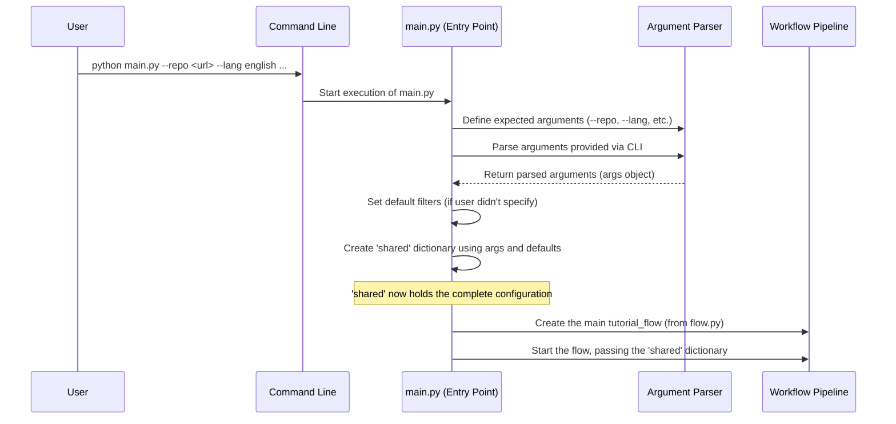

# Chapter 1: Configuration & Entry Point

Welcome to the Tutorial-Codebase-Knowledge project! Ever wondered how a complex tool knows exactly *what* you want it to do? How do you tell it which code to look at, what language you prefer for the output, or where to save the final tutorial? This chapter explains the very first step: telling the tool your specific needs.

Think of our tutorial generator like a custom tailor. Before they can make you a suit, you need to provide measurements, choose the fabric, style, and color. Similarly, before our tool can generate a tutorial, you need to give it instructions. This chapter is all about that initial "order form" or "control panel."

**Our Goal:** Understand how the tool starts up and how you provide the necessary instructions (configuration) to generate the tutorial you want.

**Use Case Example:** Let's say you want to generate a tutorial for a small Python project hosted on GitHub. You want the tutorial written in English, you only care about the `.py` files, and you want the output saved in a folder called `my_python_tutorial`. How do you tell the tool all of this?

## What's the "Entry Point"?

Every program needs a starting line, a place where execution begins. In our project, this starting line is a Python script called `main.py`.

Think of `main.py` as the main entrance or reception desk of our "tutorial factory." When you run the tool from your command line, you're essentially knocking on this door.

```python
# --- File: main.py ---

# (Import statements let us use code written by others)
import argparse
import os
from flow import create_tutorial_flow # We'll learn about flow later!

# ... (other setup code like default filters) ...

# This is the main function where everything starts
def main():
    print("Starting tutorial generation...")
    # ... more code here ...

# This standard Python line makes sure main() runs when you execute the script
if __name__ == "__main__":
    main()
```

This simple structure is common in Python. The `main()` function holds the core logic for starting the process, and the `if __name__ == "__main__":` line ensures `main()` is called when you run `python main.py`.

## Giving Instructions: Command-Line Arguments

Okay, we've found the entrance (`main.py`). Now, how do we place our order? We use **command-line arguments**. These are like options or instructions you type directly into your terminal after the command to run the script.

Our tool uses a standard Python library called `argparse` to define and understand these instructions. Think of `argparse` as the friendly receptionist who knows what questions to ask you (what repository? what language?) and understands your answers.

Let's look at how `main.py` sets up some of these questions:

```python
# --- File: main.py --- (Inside the main() function)

# Create the 'receptionist' object
parser = argparse.ArgumentParser(description="Generate a tutorial...")

# Ask: Where is the code? (GitHub repo OR local directory?)
# 'required=True' means you MUST provide one of these
source_group = parser.add_mutually_exclusive_group(required=True)
source_group.add_argument("--repo", help="URL of the public GitHub repository.")
source_group.add_argument("--dir", help="Path to local directory.")

# Ask: What language for the tutorial? (Defaults to English)
parser.add_argument("--language", default="english", help="Language for the tutorial")

# Ask: Where should I save the output? (Defaults to './output')
parser.add_argument("-o", "--output", default="output", help="Base directory for output")

# ... (other arguments for filtering, etc.) ...
```

This code defines flags like `--repo`, `--dir`, `--language`, and `-o` (short for `--output`). When you run the script, you can use these flags to provide your specific details.

## Gathering the Configuration

Once `argparse` has collected your answers (the arguments you provided), the `main` function gathers everything into a single, organized place. In our project, this is a Python dictionary called `shared`.

Think of the `shared` dictionary as the final order sheet that the receptionist hands over to the factory workers. It contains all the details needed for the entire tutorial generation process.

```python
# --- File: main.py --- (Inside the main() function, after parsing args)

# args contains the arguments collected by argparse
args = parser.parse_args()

# Initialize the 'order sheet' (shared dictionary)
shared = {
    "repo_url": args.repo,      # From --repo flag
    "local_dir": args.dir,     # From --dir flag
    "language": args.language, # From --language flag
    "output_dir": args.output,   # From --output flag

    # Include/exclude file patterns (using defaults if not provided)
    "include_patterns": set(args.include) if args.include else DEFAULT_INCLUDE_PATTERNS,
    "exclude_patterns": set(args.exclude) if args.exclude else DEFAULT_EXCLUDE_PATTERNS,

    # ... other configuration details ...
    "files": [], # Placeholders for results from later steps
    "chapters": [], # Placeholders for results from later steps
}

print(f"Starting tutorial generation for: {args.repo or args.dir} in {args.language.capitalize()} language")
```

This `shared` dictionary is crucial because it will be passed along through the entire process. Each step of the tutorial generation will read the configuration it needs from this dictionary and add its results back into it.

## Solving the Use Case

Remember our example? We wanted a tutorial for a GitHub repo, in English, only for `.py` files, saved in `my_python_tutorial`. Here's how you'd run the tool using command-line arguments:

```bash
python main.py --repo https://github.com/someuser/someproject --language english --include "*.py" --output my_python_tutorial
```

Let's break this down:
*   `python main.py`: Tells your computer to run the `main.py` script using Python.
*   `--repo https://...`: Specifies the source code location (a GitHub URL).
*   `--language english`: Sets the desired output language.
*   `--include "*.py"`: Tells the tool to *only* consider files ending with `.py`. (Note: We use quotes around `*.py` so the terminal doesn't try to expand it itself).
*   `--output my_python_tutorial`: Specifies the folder where the final tutorial should be saved.

When you run this command:
1.  `main.py` starts.
2.  `argparse` reads these flags and their values.
3.  The `shared` dictionary gets filled like this (simplified):
    ```
    shared = {
        "repo_url": "https://github.com/someuser/someproject",
        "local_dir": None, # Because we used --repo
        "language": "english",
        "output_dir": "my_python_tutorial",
        "include_patterns": {"*.py"}, # Only include python files
        "exclude_patterns": { ... default exclude patterns ... },
        # ... other settings ...
    }
    ```
4.  This `shared` dictionary is then passed on to start the actual tutorial generation.

## Under the Hood: How it Flows

Let's visualize the startup process:



1.  **You run the command:** You type `python main.py ...` in your terminal.
2.  **`main.py` starts:** The Python interpreter begins executing the script.
3.  **Arguments Defined:** `argparse` is set up to expect flags like `--repo`, `--language`, etc.
4.  **Arguments Parsed:** `argparse` reads the flags you actually typed and stores their values.
5.  **Defaults Applied:** If you didn't specify things like `--include` or `--exclude`, the default patterns are loaded.
6.  **Configuration Created:** The `shared` dictionary is populated with your choices and the defaults.
7.  **Hand-off:** The `shared` dictionary is passed to the main [Workflow Pipeline](03_workflow_pipeline_.md), which coordinates the rest of the tutorial generation tasks.

The last two lines in `main()` handle this hand-off:

```python
# --- File: main.py --- (End of the main() function)

    # Create the flow instance (we'll learn about this later)
    tutorial_flow = create_tutorial_flow()

    # Run the flow, giving it the configuration 'order sheet'
    tutorial_flow.run(shared)
```

This is where the entry point's job ends. It has successfully gathered your requirements and passed them on to the next stage of the factory.

## Conclusion

In this chapter, we learned about the starting point of our application (`main.py`) and how it acts as a control panel. We saw how command-line arguments allow you, the user, to specify exactly what kind of tutorial you want – which code to analyze, in what language, with what filters, and where to save the result. This configuration is neatly packaged into the `shared` dictionary, ready for the next steps.

Now that we've told the tool *where* the code is (either a GitHub repository URL or a local directory path), the very next logical step is to actually get that code onto our machine so we can start analyzing it.

Ready to see how the code is retrieved? Let's move on to [Chapter 2: Code Fetching](02_code_fetching_.md)!

---

Generated by [AI Codebase Knowledge Builder](https://github.com/The-Pocket/Tutorial-Codebase-Knowledge)