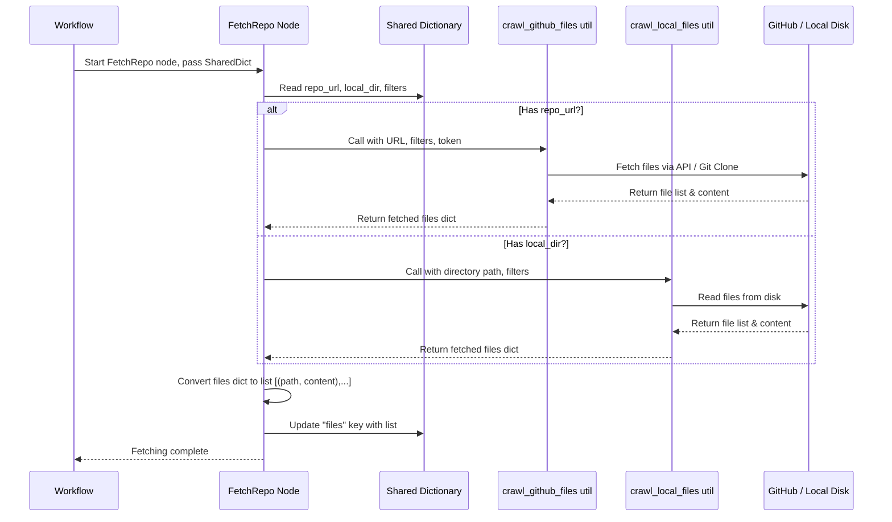

# Chapter 2: Code Fetching


```markdown
# Chapter 2: Code Fetching

Welcome to Chapter 2! In the [previous chapter (Configuration & Entry Point)](01_configuration___entry_point_.md), we learned how to tell our tutorial generator *what* we want: which code to analyze (using `--repo` or `--dir`), what language to use, and where to save the output. We packaged all these instructions into a handy "order sheet" called the `shared` dictionary.

Now that we have the instructions, what's the next step? We need to actually *get* the code!

**Our Goal:** Understand how the tool retrieves the source code, whether it's from a website like GitHub or directly from your computer.

**Use Case Example:** Remember our example from Chapter 1? We ran the command:
```bash
python main.py --repo https://github.com/someuser/someproject --include "*.py" --output my_python_tutorial
```
This command told the tool *where* the code is (`--repo ...`) and *which* files we care about (`--include "*.py"`). Now, the tool needs to go to that GitHub URL, download all the files, but *only* keep the ones ending in `.py`. How does it do that?

## The Librarian: Fetching the Code

Think back to our tailor analogy. After you give the tailor your measurements and fabric choice, someone needs to actually go get the fabric roll from the warehouse. In our project, the **Code Fetching** part is like a librarian. You give the librarian a request (the configuration from Chapter 1), and they go to the shelves (GitHub or your local disk) to retrieve the specific books (code files) you asked for.

This "librarian" needs to know two main things:
1.  **Where to look:** Is the code on the internet (GitHub) or on your computer (a local directory)?
2.  **What to grab:** Are there specific types of files you want (like only `.py` files)? Are there files you definitely *don't* want (like images or temporary files)? Are some files too big to bother with?

## Key Concepts: Where and What

### 1. Two Sources: GitHub vs. Local Directory

Our tool is flexible. It can get code from two places:

*   **GitHub:** If you used the `--repo` flag in your command, the tool knows it needs to connect to the internet, go to the specified GitHub repository URL, and download the code from there. It's smart enough to handle different kinds of GitHub URLs (like ones specifying a particular branch or subfolder). For private repositories, it can even use a special password (a GitHub token) if you provide one.
*   **Local Directory:** If you used the `--dir` flag, the tool knows the code is already somewhere on your computer. It just needs to read the files directly from the folder path you provided.

### 2. Filtering: Getting Only What Matters

Codebases can contain lots of files we don't need for a tutorial – images, configuration files, build outputs, large data files, test code, etc. Including everything would waste time and make the tutorial confusing.

Our "librarian" can filter the files based on the instructions you provided in Chapter 1:

*   `--include`: Tells the librarian *only* to get files matching these patterns (e.g., `*.py` for Python files, `*.js` for JavaScript). Think of this as asking for books only on a specific topic.
*   `--exclude`: Tells the librarian to *ignore* files matching these patterns (e.g., `*test*.py` to skip test files, `*.tmp` to skip temporary files). This is like saying, "Don't bring me any magazines."
*   `--max-file-size` (configured internally): Tells the librarian to skip any file that's too large. This prevents the tool from getting stuck on huge files that aren't usually helpful for understanding the core concepts.

These filters ensure we only work with the relevant source code files.

## How It Works: The `FetchRepo` Node

Inside our "tutorial factory," the specific worker responsible for fetching code is called the `FetchRepo` node. Nodes are steps in our overall process (we'll learn more about them in Chapter 4). The `FetchRepo` node takes the `shared` dictionary (our order sheet) and performs the fetching task.

Let's peek inside `nodes.py` to see how `FetchRepo` works conceptually:

```python
# --- File: nodes.py ---
# (Import necessary tools like crawl_github_files and crawl_local_files)
# ...

class FetchRepo(Node): # The 'librarian' node
    def prep(self, shared):
        # 1. Read the order sheet (shared dictionary)
        repo_url = shared.get("repo_url") # Get GitHub URL, if any
        local_dir = shared.get("local_dir") # Get local path, if any
        include_patterns = shared["include_patterns"] # Get include filters
        exclude_patterns = shared["exclude_patterns"] # Get exclude filters
        max_file_size = shared["max_file_size"] # Get size limit
        # ... other preparations ...

        # Prepare the arguments needed for the actual fetching
        return {
            "repo_url": repo_url,
            "local_dir": local_dir,
            "include_patterns": include_patterns,
            # ... other necessary details ...
        }

    def exec(self, prep_res):
        # 2. Decide where to fetch from based on prepared info
        if prep_res["repo_url"]:
            print(f"Crawling repository: {prep_res['repo_url']}...")
            # Use the GitHub helper function
            result = crawl_github_files(...) # Pass filters, etc.
        else:
            print(f"Crawling directory: {prep_res['local_dir']}...")
            # Use the Local Directory helper function
            result = crawl_local_files(...) # Pass filters, etc.

        # Convert the result (which is a dictionary) into a list format
        files_list = list(result.get("files", {}).items()) # [(path1, content1), (path2, content2)]
        print(f"Fetched {len(files_list)} files.")
        return files_list

    def post(self, shared, prep_res, exec_res):
        # 3. Update the order sheet with the results
        # exec_res is the files_list returned by exec()
        shared["files"] = exec_res # Add the list of fetched files to 'shared'
```

Let's break down the `FetchRepo` node's job:

1.  **`prep` (Prepare):** Reads the `shared` dictionary to understand the request: Are we using `--repo` or `--dir`? What are the include/exclude patterns? It gathers all the necessary information.
2.  **`exec` (Execute):** This is where the real work happens. Based on whether a `repo_url` or `local_dir` was provided, it calls one of two helper functions:
    *   `crawl_github_files`: If a `--repo` URL was given. This helper handles connecting to GitHub, navigating the repository, and downloading files that match the filters.
    *   `crawl_local_files`: If a `--dir` path was given. This helper reads files from the specified local folder, applying the filters.
    It then takes the dictionary of files returned by the helper (`{path: content, ...}`) and converts it into a list of pairs `[(path, content), ...]`.
3.  **`post` (Post-process):** Takes the list of fetched files (the result of `exec`) and adds it back into the `shared` dictionary under the key `"files"`. Now, the `shared` dictionary not only contains the initial configuration but also the actual code content fetched by this step!

## Under the Hood: The Crawlers

The `FetchRepo` node delegates the actual fetching to utility functions: `crawl_github_files` and `crawl_local_files`. Let's briefly see how they work.

**Fetching Flow:**



**1. `crawl_github_files` (in `utils/crawl_github_files.py`)**

This utility is quite sophisticated.
*   It parses the GitHub URL to figure out the owner, repository name, branch/commit, and any specific subfolder.
*   It uses the GitHub API (or sometimes `git clone` for SSH URLs) to list files and directories.
*   For each file, it checks:
    *   Does it match `--include` patterns?
    *   Does it match `--exclude` patterns?
    *   Is its size below `max_file_size`?
*   If a file passes all checks, it downloads the content.
*   It might need a GitHub Token (`GITHUB_TOKEN`) especially for private repos or to avoid hitting API rate limits on public repos.

Here's a tiny glimpse (simplified) of how it might check filters using `fnmatch` (a standard Python tool for matching Unix-style filename patterns like `*.py`):

```python
# --- Simplified concept from utils/crawl_github_files.py ---
import fnmatch

def should_include_file(file_path, file_name, include_patterns, exclude_patterns):
    # Default to include if no specific includes given
    include_ok = not include_patterns or \
                 any(fnmatch.fnmatch(file_name, pattern) for pattern in include_patterns)

    # Default to not exclude if no specific excludes given
    exclude_ok = not exclude_patterns or not \
                 any(fnmatch.fnmatch(file_path, pattern) for pattern in exclude_patterns)

    return include_ok and exclude_ok # Must pass both checks
```

**2. `crawl_local_files` (in `utils/crawl_local_files.py`)**

This one is simpler as it deals with files already on your computer.
*   It uses Python's built-in `os.walk` to go through every file and folder within the specified directory.
*   For each file, it performs the same filtering checks as the GitHub crawler: include patterns, exclude patterns, and maximum file size.
*   If a file passes the checks, it reads its content directly from the disk.

Here's a simplified view of how it might walk the directory:

```python
# --- Simplified concept from utils/crawl_local_files.py ---
import os
import fnmatch # For filtering

def crawl_local_files(directory, include_patterns, exclude_patterns, ...):
    files_dict = {}
    for root, _, files in os.walk(directory): # Go through all folders and files
        for filename in files:
            filepath = os.path.join(root, filename)
            relpath = os.path.relpath(filepath, directory) # Get relative path

            # Check include/exclude patterns using fnmatch (like above)
            # Check file size using os.path.getsize(filepath)
            if file_passes_filters(relpath, filename, filepath, ...):
                try:
                    with open(filepath, 'r', encoding='utf-8') as f:
                        content = f.read()
                    files_dict[relpath] = content # Store path: content
                except Exception as e:
                    print(f"Could not read {filepath}: {e}")
    return {"files": files_dict}
```

Both utilities return a dictionary where keys are file paths and values are the file contents. The `FetchRepo` node then stores this information (as a list) in the `shared` dictionary.

## Conclusion

In this chapter, we saw how our "librarian" – the `FetchRepo` node and its helper utilities (`crawl_github_files`, `crawl_local_files`) – goes out and gets the source code based on the instructions we provided in Chapter 1. It knows whether to look on GitHub or your local disk, and it carefully filters the files based on type and size, just like a librarian finding the specific books you requested.

The result of this chapter is crucial: the `shared` dictionary now contains not just the configuration, but also the actual content of the relevant source code files, stored under the `"files"` key as a list like `[('path/to/file1.py', 'print("Hello")'), ('src/main.js', 'console.log("Hi");')]`.

With the code fetched and ready, we need a way to manage the next steps of analysis – identifying key concepts, understanding relationships, and finally writing the tutorial chapters. How are all these steps coordinated? That's the job of the **Workflow Pipeline**.

Ready to see how the factory floor is organized? Let's move on to [Chapter 3: Workflow Pipeline](03_workflow_pipeline_.md)!
```

---

Generated by [AI Codebase Knowledge Builder](https://github.com/The-Pocket/Tutorial-Codebase-Knowledge)