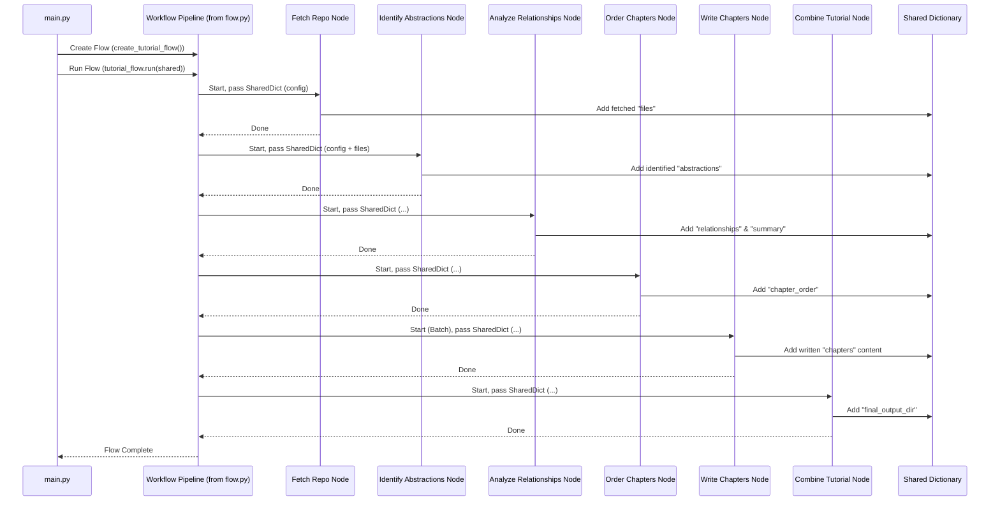

# Chapter 3: Workflow Pipeline


```markdown
# Chapter 3: Workflow Pipeline

Welcome back! In [Chapter 1 (Configuration & Entry Point)](01_configuration___entry_point_.md), we learned how to give instructions to our tutorial generator using command-line arguments, which were neatly stored in the `shared` dictionary. Then, in [Chapter 2 (Code Fetching)](02_code_fetching_.md), we saw how the `FetchRepo` "librarian" used those instructions to retrieve the actual source code files, adding them to our `shared` dictionary.

So, we have our configuration and the raw code. Great! But how do we get from raw code files to a finished, human-readable tutorial? There are many steps involved: figuring out the main ideas in the code, understanding how they relate, deciding the best order to explain them, writing each explanation, and finally putting it all together.

**Our Goal:** Understand how the application organizes and executes these multiple steps in a logical sequence to create the tutorial.

**Use Case Example:** We've fetched all the `.py` files for our Python project. Now, the tool needs to:
1.  Analyze these files to find the most important concepts (like classes or key functions).
2.  Figure out how these concepts interact (e.g., does function A call function B?).
3.  Decide the best order to present these concepts in a tutorial.
4.  Write a separate explanation (chapter) for each concept.
5.  Combine these chapters into a single tutorial document.

How does the application ensure these steps happen in exactly this order?

## The Recipe: Defining the Steps

Imagine you're baking a cake. You can't frost it before you bake it, and you can't bake it before you mix the ingredients. A recipe provides the exact sequence of steps you need to follow.

Our **Workflow Pipeline** is like that recipe for generating the tutorial. It defines the overall sequence of tasks the application performs, ensuring a logical progression from fetching the code to outputting the final tutorial. It dictates which task runs after another.

Without a clear workflow, it would be like trying to bake a cake by randomly doing steps – you might end up with a mess! The pipeline ensures we mix, then bake, then frost, in the correct order.

## Key Concepts: Assembly Line Thinking

Think of our tutorial generator as a small factory assembly line:

1.  **Sequence:** The pipeline defines the order of stations on the assembly line. Raw materials (code) come in one end, go through various processing stations in order, and a finished product (tutorial) comes out the other end.
2.  **Nodes (Workers/Stations):** Each specific task or step in the pipeline is performed by a dedicated "worker" or "station". We call these **Processing Nodes**. We've already met one: `FetchRepo`. Others might be responsible for analyzing code, writing chapters, etc. We'll learn much more about these nodes in [Chapter 4: Processing Nodes](04_processing_nodes_.md).
3.  **Data Flow (The Conveyor Belt):** How does the work-in-progress move from one station to the next? Our `shared` dictionary acts like the item moving along the conveyor belt. Each node (station) receives the `shared` dictionary, reads the information it needs (like configuration or results from previous steps), performs its task, and potentially adds its own results back into the `shared` dictionary before passing it along to the next node.

## How It's Implemented: `flow.py`

In our project, the definition of this assembly line sequence lives in the `flow.py` file. We use a helpful Python library called `pocketflow` that makes defining these pipelines easier. It provides tools like `Flow` and `Node` and a simple way to link nodes together.

Let's look at the core part of `flow.py` where the sequence is defined in the `create_tutorial_flow` function:

```python
# --- File: flow.py ---
from pocketflow import Flow
# Import all node classes from nodes.py
from nodes import (
    FetchRepo, IdentifyAbstractions, AnalyzeRelationships,
    OrderChapters, WriteChapters, CombineTutorial
)

def create_tutorial_flow():
    """Creates and returns the codebase tutorial generation flow."""

    # 1. Create an instance of each 'worker' node
    fetch_repo = FetchRepo()
    identify_abstractions = IdentifyAbstractions(...) # Finds key concepts
    analyze_relationships = AnalyzeRelationships(...) # Finds connections
    order_chapters = OrderChapters(...)           # Decides chapter order
    write_chapters = WriteChapters(...)             # Writes each chapter
    combine_tutorial = CombineTutorial()        # Puts it all together

    # 2. Define the sequence using the '>>' operator
    fetch_repo >> identify_abstractions
    identify_abstractions >> analyze_relationships
    analyze_relationships >> order_chapters
    order_chapters >> write_chapters
    write_chapters >> combine_tutorial

    # 3. Create the Flow object, starting with the first node
    tutorial_flow = Flow(start=fetch_repo)

    return tutorial_flow
```

Let's break this down:

1.  **Instantiate Nodes:** First, we create an instance (a working copy) of each "worker" node defined in `nodes.py`. Think of this as assigning specific workers to their stations on the assembly line. Notice we have nodes for fetching, identifying concepts (`IdentifyAbstractions`), analyzing connections (`AnalyzeRelationships`), ordering chapters, writing them, and combining the final result.
2.  **Define Sequence:** The `>>` operator is the magic that defines the order. The line `fetch_repo >> identify_abstractions` means: "After the `fetch_repo` node finishes its job, the `identify_abstractions` node should run next." Pocketflow ensures that the output (implicitly, the updated `shared` dictionary) from the node on the left is available to the node on the right. We chain these together to create the full assembly line sequence.
3.  **Create Flow:** Finally, `Flow(start=fetch_repo)` creates the actual pipeline object, telling it which node is the very first step (`FetchRepo`).

## Connecting Back to the Start (`main.py`)

Remember the end of `main.py` from Chapter 1?

```python
# --- File: main.py --- (End of the main() function)

    # Create the flow instance using our 'recipe' function
    tutorial_flow = create_tutorial_flow() # Calls the function in flow.py

    # Run the entire assembly line, passing the initial 'order sheet'
    tutorial_flow.run(shared)
```

This is where everything connects!
1.  `main.py` calls `create_tutorial_flow()` from `flow.py` to get the fully defined pipeline (our "recipe").
2.  `tutorial_flow.run(shared)` kicks off the entire process. It starts with the `fetch_repo` node, passing it the initial `shared` dictionary (containing our command-line configuration).
3.  Each node in the sequence runs, reads from `shared`, does its work, updates `shared`, and passes it along to the next node defined by the `>>` connections.

## Visualizing the Flow

Let's visualize the sequence defined in `flow.py`:



This diagram shows:
1.  `main.py` starts the pipeline.
2.  The pipeline executes the nodes one after another, in the order defined by `>>` in `flow.py`.
3.  Each node receives the `shared` dictionary, performs its specific task (like fetching, identifying, analyzing, ordering, writing, or combining), and updates the `shared` dictionary with its results before the next node takes over.

## Conclusion

The Workflow Pipeline is the backbone of our tutorial generator. It acts like a recipe or an assembly line manager, ensuring that all the necessary steps – from getting the code to writing the final output – happen in the correct, logical order. It uses the `flow.py` file and the `pocketflow` library to define this sequence, connecting individual **Processing Nodes** (the workers) together. The `shared` dictionary acts as the carrier, passing information along the line from one node to the next.

Now that we understand how the overall process is structured, let's zoom in on the individual workers on this assembly line. What exactly do nodes like `IdentifyAbstractions` or `WriteChapters` do?

Ready to meet the workers? Let's move on to [Chapter 4: Processing Nodes](04_processing_nodes_.md)!
```

---

Generated by [AI Codebase Knowledge Builder](https://github.com/The-Pocket/Tutorial-Codebase-Knowledge)