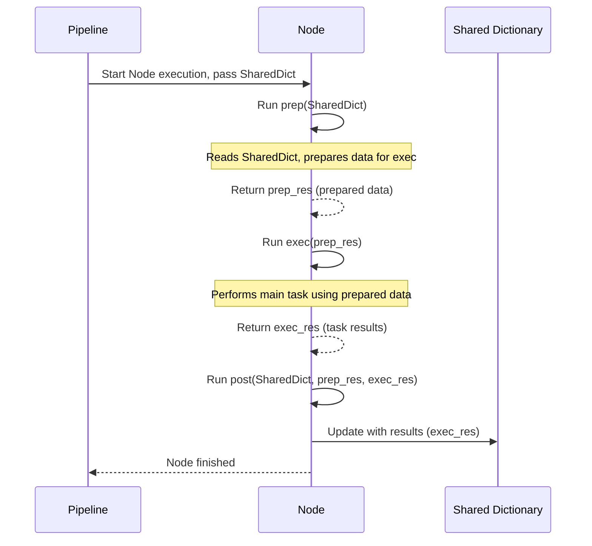

# Chapter 4: Processing Nodes


```markdown
# Chapter 4: Processing Nodes

Welcome to Chapter 4! In the [previous chapter (Workflow Pipeline)](03_workflow_pipeline_.md), we learned how the project uses a workflow pipeline, like an assembly line recipe (`flow.py`), to define the sequence of steps needed to generate our tutorial. We saw how nodes like `FetchRepo`, `IdentifyAbstractions`, and `WriteChapters` are chained together using `>>` to ensure they run in the correct order.

But knowing the *order* isn't the whole story. How does each specific step, like identifying the core concepts in the code or writing an individual chapter, actually *get done*? What's inside those boxes in our assembly line diagram?

**Our Goal:** Understand the individual "workers" or "stations" on our assembly line – the Processing Nodes. We'll see what they are, how they work, and how they contribute to the overall tutorial generation.

**Use Case Example:** Think back to our Python project. The pipeline dictates that after `FetchRepo` gets the code, `IdentifyAbstractions` needs to run. How does `IdentifyAbstractions` know *what* code to look at? How does it perform its analysis? And once it finds the important concepts, how does it pass that information to the *next* step in the pipeline?

## What are Processing Nodes? The Assembly Line Workers

Imagine our tutorial factory's assembly line again (the Workflow Pipeline from Chapter 3). The **Processing Nodes** are the individual workers or specialized machines stationed along that line.

Each node is responsible for **one specific task**. Just like on a real assembly line, you wouldn't have one worker trying to do everything. You have:
*   One worker (`FetchRepo`) whose only job is to get the raw materials (fetch the code).
*   Another worker (`IdentifyAbstractions`) whose job is to examine the materials and pick out the key components (identify important code concepts).
*   Another worker (`AnalyzeRelationships`) figuring out how the components fit together.
*   A team of writers (`WriteChapters`) creating instructions for each component.
*   A final worker (`CombineTutorial`) assembling the final instruction manual.

These nodes are the core building blocks of our process. They are defined as Python classes in the `nodes.py` file.

## How Nodes Work: Input, Process, Output

Each node operates in a simple, predictable way:

1.  **Receive Data (Input):** A node gets the current state of the project, usually passed via the `shared` dictionary we learned about in Chapter 1. This dictionary acts like a bin traveling on the conveyor belt, holding the configuration and any results from previous nodes.
2.  **Process Data:** The node performs its specific, dedicated task. For example, `FetchRepo` fetches code, `IdentifyAbstractions` analyzes code to find concepts using AI, `WriteChapters` writes Markdown text.
3.  **Pass Results (Output):** After doing its job, the node usually updates the `shared` dictionary with its results before the pipeline sends it to the next node. For instance, `FetchRepo` adds the fetched code under the `"files"` key in `shared`. `IdentifyAbstractions` adds the concepts it found under the `"abstractions"` key.

This input -> process -> output flow makes the system modular and easier to understand.

```mermaid
graph LR
    A[Shared Dictionary (Input)] -- Contains config & results from previous nodes --> B(Node: Perform Specific Task);
    B -- Processes data --> C{Update Shared Dictionary};
    C -- Contains original data + new results --> D[Shared Dictionary (Output for Next Node)];

    style B fill:#f9f,stroke:#333,stroke-width:2px
```

## Key Concepts: Encapsulation and the Prep/Exec/Post Cycle

### 1. Encapsulation: Keeping Tasks Separate

Each node class in `nodes.py` *encapsulates* the logic for its specific task. This means all the code needed for fetching is inside the `FetchRepo` class, all the code for identifying abstractions is inside the `IdentifyAbstractions` class, and so on.

This is great because:
*   **Organization:** It's easy to find the code responsible for a specific part of the process.
*   **Maintainability:** If we need to change how code is fetched, we only need to modify the `FetchRepo` node.
*   **Reusability:** While not heavily used in this specific pipeline, nodes could potentially be reused in different workflows.

### 2. The Node Lifecycle: `prep`, `exec`, `post`

Our nodes use the `pocketflow` library, which gives them a standard structure with three main methods that run in sequence for each node:

*   **`prep(self, shared)` (Prepare):** Think of this as the "gather your ingredients" step. The node reads the `shared` dictionary to get the information it needs (like configuration settings or results from previous nodes). It then prepares and returns the exact data required for the main task.
*   **`exec(self, prep_res)` (Execute):** This is where the main work happens – the "cooking" step. It takes the prepared data from `prep` (`prep_res`) and performs the node's core task (e.g., calling an external tool, running analysis, interacting with an AI). It returns the result of this work.
*   **`post(self, shared, prep_res, exec_res)` (Post-process):** This is the "clean up and store results" step. It takes the original `shared` dictionary, the data prepared by `prep`, and the results produced by `exec` (`exec_res`). Its main job is usually to update the `shared` dictionary with the results from `exec` so that the next node in the pipeline can use them.

Let's visualize this internal cycle for a single node:



## Example: Revisiting `FetchRepo`

Let's look again at a simplified version of the `FetchRepo` node from `nodes.py` to see `prep`, `exec`, and `post` in action:

```python
# --- File: nodes.py --- (Simplified FetchRepo)
from pocketflow import Node
from utils.crawl_github_files import crawl_github_files
from utils.crawl_local_files import crawl_local_files

class FetchRepo(Node):
    def prep(self, shared):
        # 1. Read necessary info from shared dictionary
        repo_url = shared.get("repo_url")
        local_dir = shared.get("local_dir")
        include_patterns = shared["include_patterns"]
        exclude_patterns = shared["exclude_patterns"]
        # ... and other config ...

        print("FetchRepo: Preparing to fetch code...")
        # Return a dictionary with exactly what 'exec' needs
        return {
            "repo_url": repo_url,
            "local_dir": local_dir,
            "include": include_patterns,
            "exclude": exclude_patterns,
            # ...
        }

    def exec(self, prep_res):
        # 2. Perform the main task using prepared data
        print("FetchRepo: Executing code fetch...")
        if prep_res["repo_url"]:
            # Call helper for GitHub
            result = crawl_github_files(...) # Pass args from prep_res
        else:
            # Call helper for local directory
            result = crawl_local_files(...) # Pass args from prep_res

        # Convert dict result to list [(path, content), ...]
        files_list = list(result.get("files", {}).items())
        print(f"FetchRepo: Fetched {len(files_list)} files.")
        return files_list # Return the list of files

    def post(self, shared, prep_res, exec_res):
        # 3. Update shared dictionary with the results from 'exec'
        print("FetchRepo: Storing fetched files in shared dictionary.")
        # 'exec_res' is the files_list returned by exec()
        shared["files"] = exec_res
        # No return value needed, 'shared' is modified directly
```

Here's the breakdown:
1.  **`prep`:** Reads the `shared` dictionary to find out *where* to get the code (`repo_url` or `local_dir`) and *what* filters to apply (`include`, `exclude`). It returns this information neatly packaged.
2.  **`exec`:** Takes the packaged information from `prep`. Based on whether a URL or directory was provided, it calls the appropriate helper function (`crawl_github_files` or `crawl_local_files`). It receives the fetched files and returns them as a list.
3.  **`post`:** Takes the list of files returned by `exec` and puts it *into* the `shared` dictionary under the key `"files"`. Now, subsequent nodes can access the fetched code by looking up `shared["files"]`.

## Other Nodes: Specialized Tasks

The pipeline uses several other nodes, each with its own `prep`/`exec`/`post` cycle:

*   **`IdentifyAbstractions`:**
    *   `prep`: Gets the fetched code (`shared["files"]`) and project details.
    *   `exec`: Sends the code context to a Large Language Model (LLM) asking it to identify the key concepts. Parses the LLM's response.
    *   `post`: Stores the list of identified abstractions (name, description, related file indices) into `shared["abstractions"]`.
*   **`AnalyzeRelationships`:**
    *   `prep`: Gets the abstractions (`shared["abstractions"]`) and relevant file content.
    *   `exec`: Sends the abstractions and code to the LLM, asking for a project summary and how the abstractions relate to each other. Parses the response.
    *   `post`: Stores the summary and relationship details into `shared["relationships"]`.
*   **`OrderChapters`:**
    *   `prep`: Gets the abstractions and their relationships.
    *   `exec`: Asks the LLM for the best pedagogical order to explain the abstractions based on their relationships. Parses the response.
    *   `post`: Stores the ordered list of abstraction indices into `shared["chapter_order"]`.
*   **`WriteChapters` (A `BatchNode`):** This one is slightly different. `BatchNode` is a special type of node designed to process multiple items efficiently.
    *   `prep`: Gets the chapter order, abstraction details, and file content. It prepares a list of "items", where *each item* contains all the info needed to write *one* chapter (abstraction details, relevant code, previous/next chapter info, etc.).
    *   `exec`: This method runs *once for each item* prepared by `prep`. It sends the specific context for that single chapter to the LLM and asks it to write the chapter's Markdown content. It returns the generated Markdown string.
    *   `post`: Collects all the individual Markdown strings generated by the multiple `exec` calls and stores the complete list of chapter content into `shared["chapters"]`.
*   **`CombineTutorial`:**
    *   `prep`: Gets the project summary, relationships, ordered chapter list, and the generated chapter content from `shared`. Prepares the final `index.md` content (including a relationship diagram) and organizes chapter content with filenames.
    *   `exec`: Writes the `index.md` file and all the individual chapter `.md` files to the specified output directory.
    *   `post`: Stores the final output directory path into `shared["final_output_dir"]` and prints a confirmation message.

## Conclusion

Processing Nodes are the heart of the `Tutorial-Codebase-Knowledge` project. They are the specialized workers on the assembly line defined by the Workflow Pipeline. Each node encapsulates a specific task (like fetching, analyzing, writing), following a standard `prep` (gather ingredients), `exec` (do the work), `post` (store results) cycle. They communicate and pass data between steps using the shared `shared` dictionary, ensuring that the output of one node becomes the input for the next.

We saw how `FetchRepo` works internally and got a glimpse of what other nodes like `IdentifyAbstractions`, `AnalyzeRelationships`, `OrderChapters`, `WriteChapters`, and `CombineTutorial` do. You might have noticed that several nodes (`IdentifyAbstractions`, `AnalyzeRelationships`, `OrderChapters`, `WriteChapters`) rely on a Large Language Model (LLM) or AI to perform complex tasks like understanding code, summarizing, and writing explanations. How does the project manage these interactions with the AI?

Ready to peek behind the curtain and see how our nodes talk to the AI? Let's move on to [Chapter 5: LLM Interaction Layer](05_llm_interaction_layer_.md)!
```

---

Generated by [AI Codebase Knowledge Builder](https://github.com/The-Pocket/Tutorial-Codebase-Knowledge)