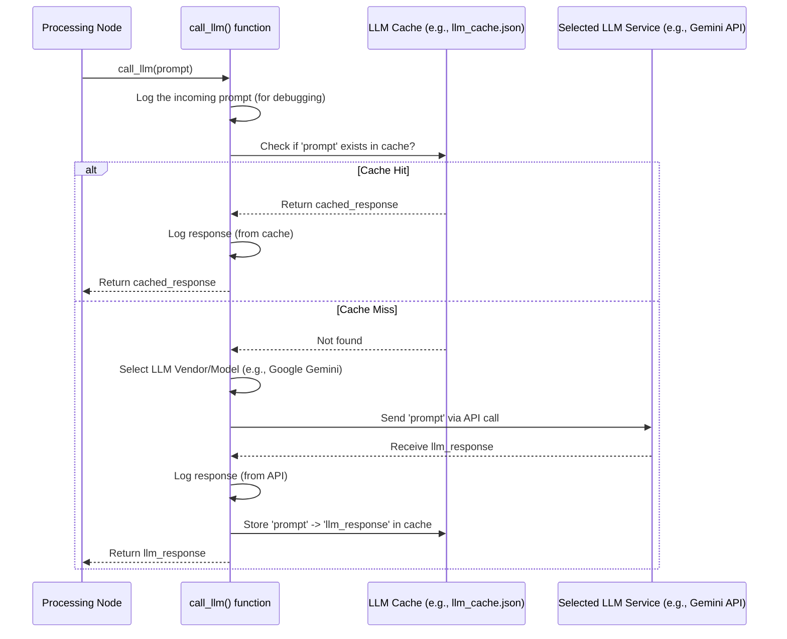

# Chapter 5: LLM Interaction Layer

Welcome to Chapter 5! In [Chapter 4: Processing Nodes](04_processing_nodes_.md), we met the "workers" on our assembly line, like `IdentifyAbstractions` and `WriteChapters`. We learned that several of these nodes perform complex tasks like understanding code, summarizing concepts, and even writing parts of the tutorial itself. How do they do that? They get help from very smart Artificial Intelligence, specifically Large Language Models (LLMs).

But how does a node like `IdentifyAbstractions` actually *talk* to an LLM like Google's Gemini or Anthropic's Claude? Does each node need to know the specific computer language and commands for every single different AI service out there? That sounds complicated!

**Our Goal:** Understand the component that handles all the communication with these powerful LLMs. We'll see how it acts as a translator and messenger between our application and the AI.

**Use Case Example:** Imagine the `IdentifyAbstractions` node has analyzed the code files and needs to figure out the most important concepts. It needs to ask an LLM: "Based on this code, what are the key ideas a beginner should learn?" How does the node send this question, get the answer back, and maybe even speed things up if it asks the same question again later?

## The Translator and Messenger: Why We Need This Layer

Think of the LLMs (Gemini, Claude, OpenAI's models) as super-smart expert consultants who specialize in understanding and generating text, including code explanations. Our Processing Nodes need to ask these consultants for help.

However, each consultant might:
*   Speak a slightly different "language" (require different API calls or setup).
*   Have different contact details (API keys, endpoints).
*   Take time to answer, especially for complex questions.
*   Charge a fee for their time (API usage costs).

Instead of making each Processing Node learn how to deal with all these details for every possible consultant, we introduce a helper: the **LLM Interaction Layer**.

This layer acts like a skilled personal assistant or translator:
1.  **Takes the Request:** A node gives the layer a question (a "prompt") and the context (like code snippets).
2.  **Chooses the Consultant:** It knows which LLM service is configured to be used (e.g., Gemini).
3.  **Handles Communication:** It formats the request correctly for the chosen LLM and sends it over the internet (makes the API call).
4.  **Gets the Answer:** It receives the response from the LLM.
5.  **Remembers Past Conversations (Caching):** If the *exact same question* was asked recently, the layer might remember the answer and provide it instantly, saving time and potential cost.
6.  **Delivers the Result:** It gives the processed answer back to the node that asked.

This way, the nodes (like `IdentifyAbstractions`) don't need to worry about the specific LLM being used or the complexities of API calls. They just talk to the LLM Interaction Layer.

## Key Concepts: How the Layer Works

Let's break down the main jobs of this interaction layer:

1.  **Prompt Preparation:** While the nodes *create* the main question (the prompt), the interaction layer might add standard instructions or formatting before sending it off.
2.  **LLM Service Selection:** The layer reads configuration (often from environment variables or settings) to know *which* LLM service (e.g., `Google`, `Anthropic`, `OpenAI`) and specific model (e.g., `gemini-1.5-pro-latest`, `claude-3-haiku-20240307`) to use.
3.  **API Interaction:** This is the core technical part – making the actual web request to the LLM's servers, including handling authentication (like API keys).
4.  **Response Processing:** Sometimes the LLM's raw response needs a little cleanup before being sent back to the node.
5.  **Caching:** To speed things up and reduce costs, the layer stores prompts and their corresponding responses. Before contacting the LLM, it checks if the exact same prompt is already in its cache. If yes, it returns the cached response immediately. If not, it contacts the LLM, gets the new response, and stores it in the cache for next time.

## How Nodes Use the Layer: `call_llm`

Nodes don't interact with a complex object. They typically use a single, simple function provided by this layer. In our project, this function lives in `utils/call_llm.py` and is named, appropriately, `call_llm`.

Imagine the `IdentifyAbstractions` node needs help. Inside its `exec` method, it might do something like this (simplified concept):

```python
# --- Simplified concept inside a Node's exec method ---
from utils.call_llm import call_llm # Import the messenger function

# ... node prepares the code context and the question ...
code_context = "..." # Some code snippets
file_listing = "..." # List of files
project_name = "MyProject"

# Craft the specific question for the LLM
prompt = f"""
Analyze the codebase context for '{project_name}':
{code_context}
Identify the top 5 core abstractions.
List of files: {file_listing}
Format the output as YAML...
"""

# Ask the LLM Interaction Layer for help!
print("Asking the AI consultant (LLM)...")
llm_response_text = call_llm(prompt) # Just call the function!

# The node now has the response and can process it (e.g., parse YAML)
print("Got the response back from the LLM layer.")
# ... process llm_response_text ...
```

See how simple it is for the node? It prepares the `prompt` string and then just calls `call_llm(prompt)`. It doesn't need to know if it's talking to Gemini, Claude, or if the response came from the cache or a live API call. The interaction layer handles all that complexity.

## Under the Hood: Inside `utils/call_llm.py`

Let's peek inside the interaction layer's main function, `call_llm`, to see how it works.

**1. The Overall Flow**

When a node calls `call_llm(prompt)`, here's what happens step-by-step:



**2. Diving into the Code (`utils/call_llm.py`)**

The actual code handles details like loading API keys and using specific libraries for each vendor. Here's a simplified look at the key parts:

```python
# --- File: utils/call_llm.py (Simplified) ---
import os
import json
import logging # For saving logs

# --- Cache Setup ---
cache_file = "llm_cache.json" # File to store previous results

def load_cache():
    """Loads the cache from the JSON file."""
    if os.path.exists(cache_file):
        try:
            with open(cache_file, 'r') as f:
                return json.load(f)
        except Exception as e:
            logging.warning(f"Could not load cache: {e}")
    return {} # Return empty dict if no file or error

def save_cache(cache):
    """Saves the cache to the JSON file."""
    try:
        with open(cache_file, 'w') as f:
            json.dump(cache, f)
    except Exception as e:
        logging.error(f"Could not save cache: {e}")

# --- The Main Function ---
def call_llm(prompt: str, use_cache: bool = True) -> str:
    """Sends prompt to LLM, using cache if enabled."""
    logging.info(f"PROMPT: {prompt[:100]}...") # Log beginning of prompt

    cache = {}
    if use_cache:
        cache = load_cache()
        if prompt in cache:
            logging.info("Cache HIT")
            response_text = cache[prompt]
            logging.info(f"RESPONSE (cached): {response_text[:100]}...")
            return response_text # Return cached response immediately
        else:
             logging.info("Cache MISS")

    # --- If not in cache, call the actual LLM ---
    response_text = ""
    try:
        # Read environment variables or config to choose the LLM
        llm_vendor = os.getenv("LLM_VENDOR", "Google") # Default to Google
        # ... (logic to get model name based on vendor) ...
        model_name = "..." # e.g., "gemini-1.5-pro-latest"

        print(f"Contacting LLM Service: {llm_vendor} / {model_name}")

        if llm_vendor == "Google":
            # Import the Google library
            from google import genai
            # Setup client using API Key (needs GEMINI_API_KEY environment variable)
            client = genai.Client(api_key=os.getenv("GEMINI_API_KEY"))
            # Make the API call
            response = client.models.generate_content(model=model_name, contents=[prompt])
            response_text = response.text

        elif llm_vendor == "Anthropic":
            # Import the Anthropic library
            from anthropic import Anthropic
            # Setup client (needs ANTHROPIC_API_KEY environment variable)
            client = Anthropic(api_key=os.getenv("ANTHROPIC_API_KEY"))
            # Make the API call
            response = client.messages.create(...) # Arguments for Claude
            response_text = response.content[1].text # Get text from response structure

        elif llm_vendor == "OpenAI":
            # Import the OpenAI library
            from openai import OpenAI
             # Setup client (needs OPENAI_API_KEY environment variable)
            client = OpenAI(api_key=os.getenv("OPENAI_API_KEY"))
            # Make the API call
            response = client.chat.completions.create(...) # Arguments for OpenAI
            response_text = response.choices[0].message.content

        else:
            raise ValueError(f"Unsupported LLM vendor: {llm_vendor}")

        logging.info(f"RESPONSE (API): {response_text[:100]}...")

    except Exception as e:
        logging.error(f"LLM API call failed: {e}")
        # Handle error gracefully, maybe return an error message
        response_text = f"Error: LLM call failed. {e}"

    # --- Update Cache ---
    if use_cache:
        cache[prompt] = response_text
        save_cache(cache)

    return response_text
```

**Key takeaways from the code:**

*   **Caching:** It explicitly loads the cache, checks if the `prompt` is a key in the loaded dictionary, and saves the new response back if it wasn't found.
*   **Vendor Selection:** It uses environment variables (`LLM_VENDOR`) to decide which block of code (Google, Anthropic, OpenAI) to execute. This makes it easy to switch LLMs without changing the node code.
*   **API Keys:** It relies on environment variables (like `GEMINI_API_KEY`) for sensitive information.
*   **Abstraction:** The function hides the different libraries (`genai`, `anthropic`, `openai`) and their specific ways of making API calls.
*   **Logging:** It logs prompts and responses (useful for debugging).

## Conclusion

The LLM Interaction Layer is a vital helper component in our project. It acts as a dedicated messenger and translator, managing all communication between our [Processing Nodes](04_processing_nodes_.md) and external Large Language Models. By handling API specifics, vendor selection, and caching (`call_llm`), it allows nodes to simply ask for AI assistance with a single function call, making the system more modular, maintainable, and efficient.

This layer takes prompts from nodes and returns text responses from the LLM. But what if we want our tutorial generated in a language other than English? How does the potentially English response from the LLM get translated, and how do we ensure the prompts themselves guide the LLM to *generate* content in the desired language?

Ready to explore how the tool handles different languages? Let's move on to [Chapter 6: Multi-Language Handling](06_multi_language_handling_.md)!

---

Generated by [AI Codebase Knowledge Builder](https://github.com/The-Pocket/Tutorial-Codebase-Knowledge)