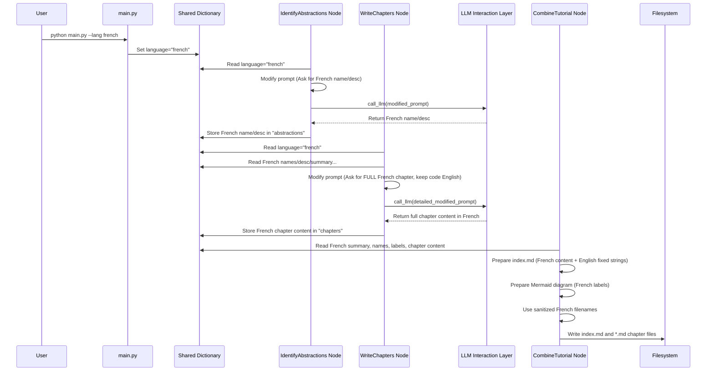

# Chapter 6: Multi-Language Handling

Welcome to Chapter 6! In the [previous chapter (LLM Interaction Layer)](05_llm_interaction_layer_.md), we saw how our Processing Nodes use a helper layer (`call_llm`) to communicate with powerful Large Language Models (LLMs) for tasks like analyzing code and writing explanations. This layer acts like a messenger, sending prompts (questions) to the LLM and getting answers back.

But what if you, or the intended audience for the tutorial, prefer a language other than English? Wouldn't it be great if the tutorial generator could speak *your* language?

**Our Goal:** Understand how the `Tutorial-Codebase-Knowledge` project can generate tutorials in different languages, making the explanations accessible to a wider audience.

**Use Case Example:** Imagine you're part of a team in France, and you want to generate a tutorial for a new Python project to help onboard your French-speaking colleagues. How can you tell the tool to generate the tutorial in French, ensuring the explanations, chapter titles, and summaries are all *en français*, while keeping the Python code itself unchanged?

## The Multilingual Guide: Why We Need This Feature

Code itself is often written using English keywords (`if`, `else`, `class`, `function`), but the explanations *about* the code don't have to be! Reading technical documentation in a non-native language can be challenging, especially for beginners.

The Multi-Language Handling feature acts like adding a **multilingual guide** to our tutorial generation process. When you specify a language preference (like French, Spanish, or German), this guide ensures that:
1.  The instructions given to the LLM specifically ask for translations.
2.  The final tutorial text (explanations, titles, summaries) is generated in your chosen language.
3.  Crucially, the code examples remain in their original form, as translating code syntax would break it.

This makes the generated tutorials much more helpful for non-English speakers.

## Key Concepts: How Language Travels and Influences Prompts

How does the tool achieve this? It involves a few key steps working together:

1.  **Telling the Tool Your Language:** As we saw briefly in [Chapter 1: Configuration & Entry Point](01_configuration___entry_point_.md), you specify your desired language using the `--language` flag when you run the script. For example: `python main.py --repo ... --language french`.
2.  **Passing the Preference:** The `main.py` script stores your choice in the `shared` dictionary under the key `"language"`. This dictionary travels along the [Workflow Pipeline](03_workflow_pipeline_.md), making the language preference available to all [Processing Nodes](04_processing_nodes_.md).
3.  **Modifying LLM Prompts:** This is the core mechanism. Nodes that interact with the LLM (like `IdentifyAbstractions`, `AnalyzeRelationships`, and especially `WriteChapters`) check the `shared["language"]` value. If the language is *not* English, they dynamically **add specific instructions to the prompts** they send to the LLM via the [LLM Interaction Layer](05_llm_interaction_layer_.md).
4.  **Targeted Translation Instructions:** These added instructions tell the LLM exactly *which* parts to translate (e.g., "Generate the `name` and `description` in French") and which parts to leave alone (e.g., "Do NOT translate code snippets").
5.  **Handling Translated Output:** Nodes that receive translated text (like names or descriptions) from the LLM store it in the `shared` dictionary. Subsequent nodes then use this potentially translated text when constructing further prompts or the final output files. Filenames for chapters, for example, are generated based on the potentially translated chapter titles.

## How It Works: A Walkthrough with "French"

Let's trace how the request for a French tutorial flows through the system:

1.  **You Run the Command:**
    ```bash
    python main.py --repo https://github.com/some/project --language french
    ```
2.  **Configuration:** `main.py` parses the arguments and creates the `shared` dictionary:
    ```python
    # --- Simplified 'shared' dictionary ---
    shared = {
        "repo_url": "https://github.com/some/project",
        "language": "french", # Your preference is stored!
        "include_patterns": {"*.py"},
        # ... other config ...
        "files": [], # To be filled later
        "abstractions": [], # To be filled later
        # ...
    }
    ```
3.  **Pipeline Starts:** The workflow begins, passing `shared` to the first node.
4.  **`IdentifyAbstractions` Node:**
    *   `prep`: Reads `shared["language"]` (finds "french").
    *   `exec`: Constructs the prompt for the LLM. Because the language is not English, it *adds* instructions:
        ```diff
          prompt = f"""
          For the project `{project_name}`:

          Codebase Context:
          {context}

        + IMPORTANT: Generate the `name` and `description` for each abstraction in **French** language. Do NOT use English for these fields.
        +
          Analyze the codebase context.
          Identify the top 5-10 core most important abstractions...

          For each abstraction, provide:
        - 1. A concise `name`.
        - 2. A beginner-friendly `description`...
        + 1. A concise `name` (value in French).
        + 2. A beginner-friendly `description`... (value in French).
          3. A list of relevant `file_indices`...

          List of file indices and paths present in the context:
          {file_listing_for_prompt}

          Format the output as a YAML list...
          """
        ```
    *   `call_llm` sends this modified prompt.
    *   The LLM generates names and descriptions *in French*.
    *   `post`: Stores the list of abstractions (with French names/descriptions) into `shared["abstractions"]`.
5.  **`AnalyzeRelationships` Node:** Similar process - it adds instructions to the prompt asking for the `summary` and relationship `label` fields to be generated in French. It uses the already-translated French abstraction names from `shared` in its context. The French summary/labels are stored in `shared["relationships"]`.
6.  **`OrderChapters` Node:** This node primarily orders existing abstractions, so its prompt usually doesn't need significant language modification, but it uses the French names provided in its input context.
7.  **`WriteChapters` Node (Batch Execution):**
    *   `prep`: Reads `shared["language"]`. For each chapter to be written, it gathers the context, including the French abstraction name/description, French summary/labels, and the full chapter list (with French titles). It also generates a *filename* based on the French chapter title (e.g., `01_traitement_des_requetes.md`).
    *   `exec` (runs for *each* chapter): Constructs a detailed prompt. Because the language is French, it adds strong instructions at the beginning and throughout:
        ```diff
          prompt = f"""
        + IMPORTANT: Write this ENTIRE tutorial chapter in **French**. Some input context (like concept name, description, chapter list, previous summary) might already be in French, but you MUST translate ALL other generated content including explanations, examples, technical terms, and potentially code comments into French. DO NOT use English anywhere except in code syntax, required proper nouns, or when specified. The entire output MUST be in French.
        +
          Write a very beginner-friendly tutorial chapter (in Markdown format) for the project `{project_name}` about the concept: "{abstraction_name}". This is Chapter {chapter_num}.

          Concept Details (Note: Provided in French):
          - Name: {abstraction_name}
          - Description:
          {abstraction_description}

          Complete Tutorial Structure (Note: Chapter names might be in French):
          {item["full_chapter_listing"]}

          Context from previous chapters (Note: This summary might be in French):
          {previous_chapters_summary if previous_chapters_summary else "This is the first chapter."}

          Relevant Code Snippets (Code itself remains unchanged):
          {file_context_str if file_context_str else "No specific code snippets provided for this abstraction."}

          Instructions for the chapter (Generate content in French unless specified otherwise):
        - - Start with a clear heading...
        - - Explain how to use this abstraction...
        - - Each code block should be BELOW 20 lines!... Use comments... explanation right after it.
        - - Describe the internal implementation... walkthrough... step-by-step... sequenceDiagram... {mermaid_lang_note}.
        - - Then dive deeper into code... Provide example code blocks... Explain.
        - - IMPORTANT: When you need to refer to other core abstractions... ALWAYS use proper Markdown links... Use the Complete Tutorial Structure above to find the correct filename and the chapter title (Use the French chapter title...). Translate the surrounding text.
        - - Use mermaid diagrams... {mermaid_lang_note}.
        - - Heavily use analogies and examples throughout (in French)...
        - - End the chapter with a brief conclusion... transition to the next chapter (in French)... link... (Use the French chapter title...).
        - - Ensure the tone is welcoming... (appropriate for French readers).
        + - Start with a clear heading... (in French).
        + - Explain how to use this abstraction... (in French).
        + - Each code block should be BELOW 20 lines!... Use comments (Translate to French if possible, otherwise keep minimal English for clarity)... explanation right after it (in French).
        + - Describe the internal implementation... walkthrough... step-by-step (in French)... sequenceDiagram... (Use French for labels/text if appropriate).
        + - Then dive deeper into code... Provide example code blocks... Explain (in French).
        + - IMPORTANT: When you need to refer to other core abstractions... ALWAYS use proper Markdown links... Use the Complete Tutorial Structure above to find the correct filename and the chapter title (Use the French chapter title...). Translate the surrounding text.
        + - Use mermaid diagrams... (Use French for labels/text if appropriate).
        + - Heavily use analogies and examples throughout (in French)...
        + - End the chapter with a brief conclusion... transition to the next chapter (in French)... link... (Use the French chapter title...).
        + - Ensure the tone is welcoming... (appropriate for French readers).
          - Output *only* the Markdown content for this chapter.

          Now, directly provide a super beginner-friendly Markdown output (DON'T need ```markdown``` tags):
          """
        ```
    *   `call_llm` sends this detailed prompt for each chapter.
    *   The LLM generates the full chapter content *in French*, keeping code blocks untouched.
    *   `post`: Collects all the French chapter content into `shared["chapters"]`.
8.  **`CombineTutorial` Node:**
    *   `prep`: Uses the French summary, French abstraction names, and French relationship labels to build the `index.md` content and the Mermaid diagram labels. It uses the filenames generated in `WriteChapters.prep` (e.g., `01_traitement_des_requetes.md`). Note that fixed strings like "Source Repository:" or the final attribution line remain in English.
    *   `exec`: Writes the `index.md` and all the French chapter `.md` files to the output directory.

**Visualizing the Flow:**



## What Stays in English?

It's important to note that not *everything* gets translated:
*   **Code:** All code snippets, keywords, variable names, function names within the code examples remain exactly as they are in the source repository. Translating code would break it.
*   **Filenames in Code:** References to filenames *within* code examples are not translated.
*   **Some Fixed Text:** Certain text generated directly by the `CombineTutorial` node, like the "Source Repository:" line or the final attribution footer ("Generated by..."), are currently kept in English for simplicity.
*   **Logs:** Console output messages during the generation process are in English.

The focus is on translating the *explanatory* content generated by the LLM to make the tutorial itself understandable.

## Handling Filenames

Since chapter titles are translated (e.g., "Query Processing" might become "Traitement des requêtes" in French), the filenames for the chapter markdown files need to be generated carefully. The `WriteChapters` node takes the (potentially translated) title, converts it to lowercase, and replaces spaces or special characters with underscores (`_`) to create a safe filename like `01_traitement_des_requetes.md`. The `CombineTutorial` node then uses these generated filenames when creating links in `index.md`.

```python
# --- Simplified concept in WriteChapters.prep ---
chapter_name = abstractions[abstraction_index]["name"] # e.g., "Traitement des requêtes"
# Create safe filename (from potentially translated name)
safe_name = "".join(c if c.isalnum() else '_' for c in chapter_name).lower()
# -> "traitement_des_requetes"
filename = f"{i+1:02d}_{safe_name}.md" # -> "01_traitement_des_requetes.md"
```

## Conclusion

Multi-Language Handling significantly increases the accessibility of the tutorials generated by `Tutorial-Codebase-Knowledge`. By simply adding the `--language` flag, users can request tutorials in their preferred language. The system achieves this by passing the language preference through the workflow via the `shared` dictionary and cleverly modifying the prompts sent to the Large Language Model. These modified prompts instruct the LLM to translate explanatory text (names, descriptions, summaries, chapter content) while carefully preserving the original code snippets.

With the code fetched, analyzed, explained (potentially in multiple languages!), and individual chapters written, there's one final step: putting everything together into the final tutorial structure that you can view.

Ready to see how the final files are organized and written to your disk? Let's move on to the last chapter: [Chapter 7: Tutorial Compilation](07_tutorial_compilation_.md)!

---

Generated by [AI Codebase Knowledge Builder](https://github.com/The-Pocket/Tutorial-Codebase-Knowledge)