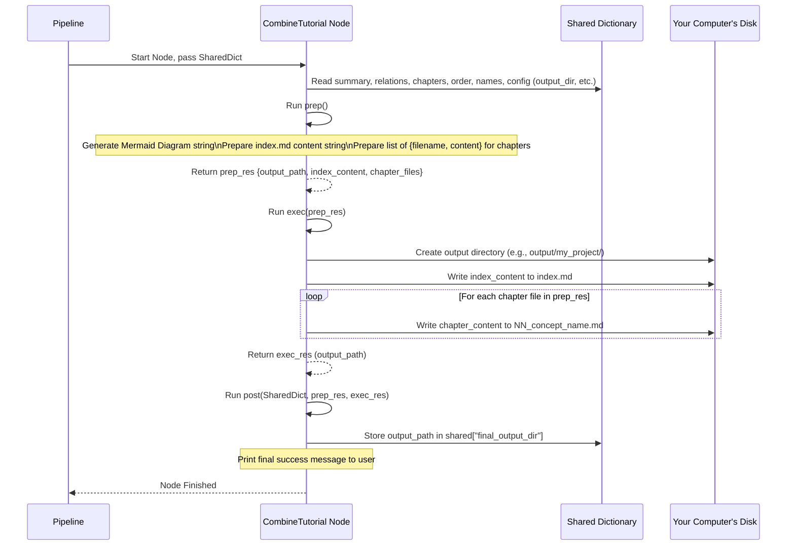

# Chapter 7: Tutorial Compilation


```markdown
# Chapter 7: Tutorial Compilation

Welcome to the final chapter of our journey through the `Tutorial-Codebase-Knowledge` project! We've come a long way:

*   In [Chapter 1](01_configuration___entry_point_.md), we learned how to give instructions.
*   In [Chapter 2](02_code_fetching_.md), we fetched the code.
*   In [Chapter 3](03_workflow_pipeline_.md), we saw the assembly line sequence.
*   In [Chapter 4](04_processing_nodes_.md), we met the worker nodes.
*   In [Chapter 5](05_llm_interaction_layer_.md), we saw how nodes talk to AI.
*   In [Chapter 6](06_multi_language_handling_.md), we learned how tutorials can be generated in different languages.

Phew! After all that work, our `shared` dictionary is now full of valuable information: the project summary, details about how concepts relate, the best order to explain them, and the actual written content for each chapter (potentially even translated into your chosen language!).

But right now, all this information is still just data inside our running program. It's like having all the written pages, illustrations, and cover text for a book, but they're just lying in separate piles. How do we turn this into a finished book that someone can actually read?

**Our Goal:** Understand the final step where the application gathers all the generated content and structures it into the final tutorial format, creating the main `index.md` file and writing each chapter into its own file in your chosen output folder.

**Use Case Example:** We asked for a French tutorial for our Python project, saved in `my_python_tutorial`. The previous steps generated a French summary, French chapter titles, French relationship labels, and French Markdown content for each chapter. How does the tool now create the `my_python_tutorial` folder with an `index.md` linking to files like `01_traitement_des_requetes.md` and `02_optimisation_des_requetes.md`, all containing the correct French content?

## The Bookbinder: Assembling the Final Tutorial

This final stage is like the **bookbinder** in our factory analogy. The bookbinder receives:
*   The manuscript pages (our generated chapter Markdown content from `shared["chapters"]`).
*   The intended table of contents (the order from `shared["chapter_order"]`).
*   The book summary and illustration concepts (summary and relationship data from `shared["relationships"]`).
*   The cover title (project name from `shared["project_name"]`).
*   The customer's delivery address (the output directory from `shared["output_dir"]`).

The bookbinder's job is to carefully arrange all these pieces, create the main table of contents page (`index.md`) with links and maybe a diagram, and then bind everything into the final structure, placing the finished book (the tutorial files) at the delivery address (the output folder).

## Key Concepts: Gathering and Structuring

This compilation step involves two main activities:

1.  **Gathering All Pieces:** The node responsible for compilation needs access to almost everything generated during the process, primarily reading from the `shared` dictionary:
    *   `shared["project_name"]`: The name for the tutorial title.
    *   `shared["repo_url"]`: The link to the source code repository.
    *   `shared["output_dir"]`: The base path where the tutorial should be saved.
    *   `shared["relationships"]`: Contains the project `summary` and relationship `details` (including potentially translated labels).
    *   `shared["abstractions"]`: Contains the details for each concept, including potentially translated `name` and `description`.
    *   `shared["chapter_order"]`: The list of abstraction indices defining the chapter sequence.
    *   `shared["chapters"]`: The list of Markdown strings, one for each chapter's content (potentially translated).

2.  **Structuring the Output:** The goal is to create a standard, easy-to-navigate tutorial structure on your computer's disk, typically looking like this:

    ```
    your_output_directory/
    │
    └── your_project_name/  <-- A folder named after your project
        │
        ├── index.md        <-- The main entry point/Table of Contents
        ├── 01_first_concept.md  <-- Chapter 1 file
        ├── 02_second_concept.md <-- Chapter 2 file
        ├── ...
        └── NN_last_concept.md   <-- Last chapter file
    ```

    *   **`index.md`:** This is the starting point. It contains:
        *   The tutorial title (Project Name).
        *   The project summary (potentially translated).
        *   A link to the original source code repository.
        *   A **Relationship Diagram** (using Mermaid syntax) showing how the main concepts connect, using the potentially translated names and labels.
        *   A **List of Chapters**, with links to each chapter's `.md` file, using the potentially translated chapter titles.
    *   **Chapter Files (`NN_*.md`):** Each file corresponds to one chapter from `shared["chapters"]`. The filename is generated based on the chapter number and a "sanitized" version of the potentially translated chapter title (e.g., "Traitement des requêtes" becomes `traitement_des_requetes`). Each file contains the Markdown content generated by the `WriteChapters` node, plus a small footer attributing the generation tool.

## The Final Worker: `CombineTutorial` Node

The specific [Processing Node](04_processing_nodes_.md) that acts as our bookbinder is called `CombineTutorial`. It's the very last node in our [Workflow Pipeline](03_workflow_pipeline_.md).

Let's see how it works using its `prep`, `exec`, and `post` cycle:

1.  **`prep(self, shared)` (Gather and Prepare):**
    *   Reads all the necessary pieces from the `shared` dictionary (project name, summary, relationships, abstractions, chapter order, chapter content, output directory, repo URL).
    *   **Generates Mermaid Diagram:** Creates the text-based code for the relationship diagram (`flowchart TD...`) using the abstraction names (potentially translated) as nodes and relationship details (potentially translated labels) as edges.
    *   **Prepares `index.md` Content:** Constructs the *entire content* for the `index.md` file as a single string. This includes the title, summary, repo link, the generated Mermaid diagram code block, and the list of chapter links. The links are created using the `chapter_order`, the potentially translated abstraction `name` for the link text, and the carefully generated safe filename for the link target.
    *   **Prepares Chapter File Data:** Creates a list where each item represents a chapter file to be written. Each item contains the final `filename` (e.g., `01_introduction.md`) and the corresponding chapter `content` string (taken from `shared["chapters"]`, potentially with a footer added).
    *   Determines the final output folder path (e.g., `output/my_project`).
    *   Returns all this prepared data (output path, index content string, list of chapter file data) ready for writing.

2.  **`exec(self, prep_res)` (Write to Disk):**
    *   Takes the prepared data from `prep`.
    *   Creates the final output directory (e.g., `output/my_project`) if it doesn't exist.
    *   Writes the prepared `index.md` content string to a file named `index.md` inside the output directory.
    *   Loops through the list of chapter file data prepared in `prep`. For each item, it writes the chapter `content` string to a file with the specified `filename` inside the output directory.
    *   Prints messages to the console indicating which files are being written.
    *   Returns the path to the output directory where the tutorial was saved.

3.  **`post(self, shared, prep_res, exec_res)` (Confirm):**
    *   Takes the output directory path returned by `exec`.
    *   Stores this path in `shared["final_output_dir"]`.
    *   Prints a final confirmation message to the user, telling them where to find the generated tutorial files.

**Visualizing the `CombineTutorial` Node:**



**Code Snippet Insight:**

Looking at the `CombineTutorial` code in `nodes.py` (provided in the previous chapter's context), you can see these steps reflected:
*   The `prep` method gathers data from `shared`, builds the `mermaid_lines`, constructs the `index_content` string piece by piece, and creates the `chapter_files` list.
*   The `exec` method uses `os.makedirs` to create the directory and then opens files (`index.md` and each chapter file) in write mode (`"w"`) to save the content prepared by `prep`.
*   The `post` method stores the result and prints the final message.

## The Final Result

After `CombineTutorial` finishes, you will find a new folder on your computer at the location you specified with `--output` (or the default `output` folder). Inside it will be a subfolder named after your project, containing the complete tutorial:

```
output/             <-- Base output directory
└── your_project_name/
    ├── index.md        <-- Start here! Contains summary, diagram, chapter links.
    ├── 01_concept_one.md
    ├── 02_concept_two.md
    └── ...             <-- All your generated chapter files.
```

You can open `index.md` in a Markdown viewer (or even a web browser with a Markdown extension) to start reading your brand new, AI-generated codebase tutorial!

## Conclusion

Tutorial Compilation is the satisfying final step in the `Tutorial-Codebase-Knowledge` process. The `CombineTutorial` node acts as the meticulous bookbinder, taking all the intermediate results stored in the `shared` dictionary – the summary, relationship diagrams, chapter order, and the written (potentially translated) chapter content – and assembling them into a structured set of Markdown files on your disk. It creates the main `index.md` entry point and neatly organizes each chapter into its own file, ready for you or your colleagues to read.

Congratulations! You've now seen the entire lifecycle of the tutorial generation, from the initial command-line configuration right through to the final compiled files being saved to your computer. We hope this journey has given you a clear understanding of how this project works under the hood. Now, go ahead and explore the tutorials you can generate!
```

---

Generated by [AI Codebase Knowledge Builder](https://github.com/The-Pocket/Tutorial-Codebase-Knowledge)