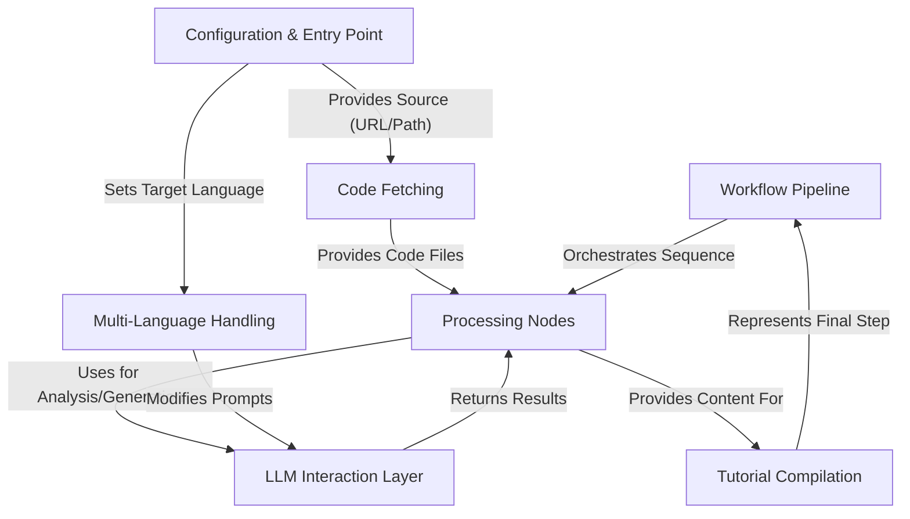

# Tutorial: Tutorial-Codebase-Knowledge

This project, *Tutorial-Codebase-Knowledge*, functions as an **AI-powered documentation generator**. It takes a codebase, either from a **GitHub repository** or a **local directory**, as input. 
Using a Large Language Model (**LLM**), it analyzes the code to identify *core abstractions* and understand their *relationships*. 
It then structures this understanding into a series of beginner-friendly **Markdown tutorial chapters**, ordered logically. 
Finally, it compiles these chapters, along with a project summary and relationship diagrams, into a complete tutorial output, supporting generation in *multiple languages*.

**Source Repository:** [None](None)

## Chapters

1. [Configuration & Entry Point
](01_configuration___entry_point_.md)
2. [Code Fetching
](02_code_fetching_.md)
3. [Workflow Pipeline
](03_workflow_pipeline_.md)
4. [Processing Nodes
](04_processing_nodes_.md)
5. [LLM Interaction Layer
](05_llm_interaction_layer_.md)
6. [Multi-Language Handling
](06_multi_language_handling_.md)
7. [Tutorial Compilation
](07_tutorial_compilation_.md)

---

Generated by [AI Codebase Knowledge Builder](https://github.com/The-Pocket/Tutorial-Codebase-Knowledge)