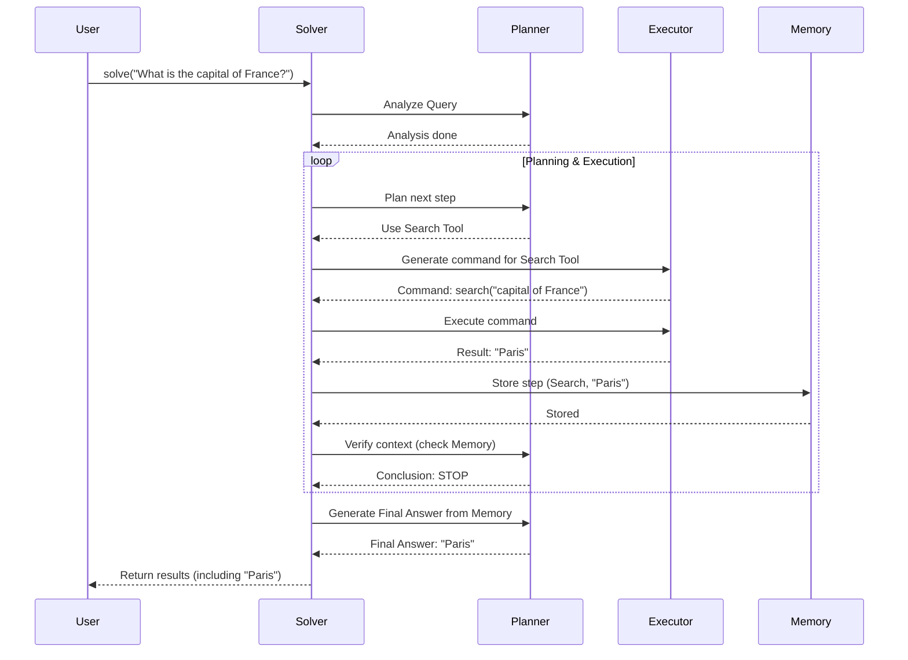

# Chapter 1: Solver Framework

Welcome to the `octotools` tutorial! We're excited to have you here. In this first chapter, we'll explore the heart of our project: the **Solver Framework**.

Imagine you want to ask a smart assistant a question, maybe something simple like "What's the capital of France?" or something more complex involving calculations or searching the web. How does the assistant figure out the answer? It needs a manager, a central system to coordinate all the different parts involved in finding that answer. That's exactly what the Solver Framework does in `octotools`.

**What Problem Does the Solver Solve?**

Think about solving a complex problem yourself. You might need to:
1.  Understand the question.
2.  Break it down into smaller steps.
3.  Use different tools (like a calculator, a search engine, or even just your memory).
4.  Keep track of what you've done.
5.  Put everything together to get the final answer.

`octotools` works similarly, using different software components. The Solver Framework is the **conductor** that manages this entire process, ensuring all the specialized components work together smoothly. Without it, the different parts wouldn't know how to collaborate to solve your query.

**The Orchestra Analogy**

Think of the Solver Framework as the conductor of an orchestra. The orchestra has different sections:
*   **Planner:** Reads the musical score (your query) and decides which instruments should play next and what they should play.
*   **Executor:** The musicians who actually play the instruments (the tools, like a calculator or web search).
*   **Memory:** The collective memory of the orchestra, remembering what has been played already.

The **Solver (Conductor)** doesn't play an instrument itself, but it directs the Planner, Executor, and Memory, ensuring they work in harmony to produce a beautiful piece of music (the final answer to your query).

**How to Use the Solver**

Using the Solver is designed to be straightforward. You typically start by creating a `Solver` instance and then giving it a problem to solve.

Let's see how you might set up and use the Solver to answer "What is the capital of France?".

1.  **Constructing the Solver:**
    We use a helper function `construct_solver` to set up the Solver with all its necessary components (Planner, Memory, Executor) and configurations.

    ```python
    # From octotools/solver.py (simplified for clarity)
    from octotools.solver import construct_solver

    # Set up the solver with default settings
    # This creates the Planner, Memory, and Executor behind the scenes
    solver = construct_solver(
        llm_engine_name="gpt-4o", # Choose the language model
        verbose=True             # Show detailed steps
    )

    print("Solver is ready!")
    ```
    This code snippet imports the necessary function and creates our `Solver` object. We tell it which AI model to use (like `gpt-4o`) and ask it to be `verbose` (print out what it's doing).

2.  **Solving a Query:**
    Once the `solver` object is ready, you can ask it a question using the `solve` method.

    ```python
    # Let's ask our question
    question = "What is the capital of France?"
    result_data = solver.solve(question)

    # The result_data contains the answer and other details
    print("\n--- Final Answer ---")
    print(result_data.get("direct_output", "No direct answer found."))
    ```
    Here, we pass our `question` to the `solver.solve()` method. The Solver then coordinates its internal components to find the answer. The `result_data` variable holds a dictionary containing the final answer (usually under the key `"direct_output"`) and potentially other information like intermediate steps if requested.

**What Happens Under the Hood? (The Solving Process)**

When you call `solver.solve("What is the capital of France?")`, a sequence of events unfolds, managed by the Solver:

1.  **Query Received:** The Solver gets the question "What is the capital of France?".
2.  **Query Analysis:** It asks the [Planner](03_query_analysis_.md) to understand the core goal of the question. (Goal: Find the capital city of the country France).
3.  **Planning & Execution Loop:** The Solver starts a cycle (the [Planning-Execution Cycle](02_planning_execution_cycle_.md)):
    *   **Plan:** The [Planner](02_planning_execution_cycle_.md) decides the next step. Maybe it thinks: "I need to use a search tool".
    *   **Generate Command:** The [Executor](07_tool_command_generation_.md) (with help from the Planner) figures out the exact command for the search tool, like `search("capital of France")`.
    *   **Execute:** The [Executor](02_planning_execution_cycle_.md) runs the command using the appropriate [Tool](05_tool_architecture_.md). The tool returns the result (e.g., "Paris").
    *   **Memorize:** The [Memory](08_memory_management_.md) component stores the action taken (used search tool) and the result ("Paris").
4.  **Verification:** The Solver asks the [Planner](09_context_verification_.md) to check the [Memory](08_memory_management_.md): "Do we have enough information to answer the original question now?" (Planner sees "Paris" is the capital). The Planner concludes: "Yes, STOP."
5.  **Final Answer Generation:** Since the verification said STOP, the Solver asks the Planner to formulate the final answer based on the information gathered in Memory.
6.  **Return Result:** The Solver returns the results, including the final answer ("Paris").

Here's a simplified diagram of this flow:



**A Peek at the Code**

Let's look at the `Solver` class structure briefly.

*   **Initialization (`__init__`)**: When `construct_solver` creates a Solver, it passes the already created Planner, Memory, and Executor objects to the Solver's `__init__` method.

    ```python
    # From octotools/solver.py
    class Solver:
        def __init__(
            self,
            planner, # The Planner object
            memory,  # The Memory object
            executor,# The Executor object
            output_types: str = "base,final,direct", # What kind of answers to generate
            max_steps: int = 10, # Max steps allowed
            max_time: int = 300, # Max time allowed (seconds)
            # ... other settings ...
            verbose: bool = True
        ):
            self.planner = planner
            self.memory = memory
            self.executor = executor
            self.max_steps = max_steps
            self.max_time = max_time
            # ... store other settings ...
            self.verbose = verbose
            if self.verbose:
                print("Solver initialized!")
    ```
    This setup ensures the Solver knows which components (Planner, Memory, Executor) to coordinate. It also stores settings like maximum steps or time limits.

*   **The `solve` Method (Simplified Concept)**: This is where the main orchestration logic resides.

    ```python
    # Conceptual structure of solve() in octotools/solver.py
    class Solver:
        # ... (init method above) ...

        def solve(self, question: str, image_path: Optional[str] = None):
            if self.verbose: print(f"Received query: {question}")

            # 1. Analyze the query (using Planner)
            query_analysis = self.planner.analyze_query(question, image_path)
            if self.verbose: print(f"Query Analysis: {query_analysis}")

            step_count = 0
            start_time = time.time()

            # 2. Start the Planning-Execution Loop
            while step_count < self.max_steps and (time.time() - start_time) < self.max_time:
                step_count += 1
                if self.verbose: print(f"--- Starting Step {step_count} ---")

                # 2a. Plan next action (using Planner)
                context, sub_goal, tool_name = self.planner.plan_step(...) # Simplified call

                # 2b. Generate command (using Executor)
                command = self.executor.generate_tool_command(...) # Simplified call

                # 2c. Execute command (using Executor)
                result = self.executor.execute_tool_command(tool_name, command)

                # 2d. Update Memory
                self.memory.add_action(step_count, tool_name, sub_goal, command, result)

                # 2e. Verify if done (using Planner)
                conclusion = self.planner.verify_context(...) # Simplified call
                if conclusion == 'STOP':
                    if self.verbose: print("Conclusion is STOP. Breaking loop.")
                    break # Exit the loop

            # 3. Generate Final Answer (using Planner)
            final_answer = self.planner.generate_direct_output(question, image_path, self.memory)
            if self.verbose: print(f"Final Answer: {final_answer}")

            # 4. Return all collected data
            return {"direct_output": final_answer, ...} # Other data like memory included
    ```
    This simplified view shows the core loop managed by the Solver: plan, generate command, execute, remember, verify. The actual code involves more details for handling different scenarios, errors, and output types, but this captures the essence of the Solver's role.

**Conclusion**

You've now met the Solver Framework – the central conductor of `octotools`. It doesn't figure out the steps or run the tools itself, but it masterfully orchestrates the Planner, Executor, and Memory components to transform your query into a meaningful answer. It manages the entire workflow, from understanding the question to delivering the final result.

Understanding the Solver's role as the orchestrator is key to grasping how `octotools` tackles problems. In the next chapter, we'll zoom in on the core rhythm of this orchestra: the [Planning-Execution Cycle](02_planning_execution_cycle_.md).

---

Generated by [AI Codebase Knowledge Builder](https://github.com/The-Pocket/Tutorial-Codebase-Knowledge)