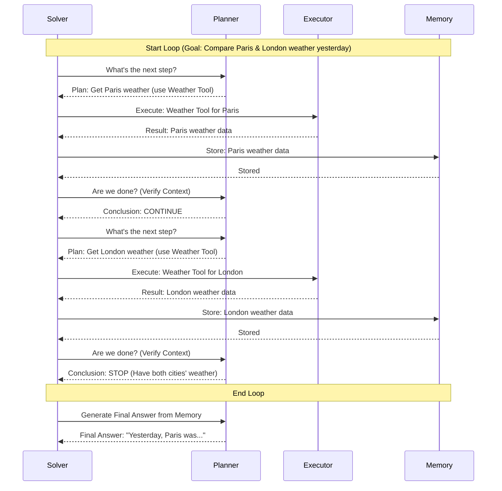

# Chapter 2: Planning-Execution Cycle

In the [Solver Framework](01_solver_framework_.md) chapter, we learned that the `Solver` acts like an orchestra conductor, managing different parts to answer your questions. But how does the conductor actually lead the orchestra through the performance? What's the rhythm and flow? That's where the **Planning-Execution Cycle** comes in. It's the core beat that `octotools` follows to solve problems.

**What's the Big Idea? The Chef Analogy**

Imagine a chef tasked with making a fancy dinner. The chef doesn't just magically produce the meal. They follow a process, a cycle:

1.  **Plan:** The chef looks at the order ("Make Coq au Vin") and plans the first steps ("I need to brown the chicken"). They decide which tool (a pan) and technique (searing) to use.
2.  **Execute:** The chef takes the pan, adds oil, heats it, and sears the chicken. They use their tools and skills to perform the planned action.
3.  **Verify & Remember:** The chef checks the chicken ("Is it nicely browned?"). They remember this step is done and maybe note down the result ("Chicken browned successfully").
4.  **Repeat:** Is the whole dish ready? Nope. The chef plans the next step ("Now, sauté the vegetables"), executes it (chops and cooks veggies in the same pan), verifies ("Are the veggies soft?"), and remembers. This cycle repeats – adding wine, simmering, etc. – until the final dish is ready (verified) or they run out of ingredients (resources).

The Planning-Execution Cycle in `octotools` works just like this chef. It's an **iterative process** – a loop – that breaks down a big problem into smaller steps and tackles them one by one until the job is done.

**Why Do We Need This Cycle?**

Complex questions often can't be answered in a single step. Think about asking: "What was the weather like in Paris yesterday, and can you compare it to London's weather?".

`octotools` can't just *know* the answer. It needs to:
1.  Understand you need weather for *two* cities for *yesterday*.
2.  Figure out it needs a weather tool.
3.  Plan: "Get Paris weather for yesterday."
4.  Execute: Use the weather tool for Paris.
5.  Remember: Store Paris's weather.
6.  Plan: "Okay, now get London's weather for yesterday."
7.  Execute: Use the weather tool for London.
8.  Remember: Store London's weather.
9.  Plan: "Compare the two results."
10. Execute: Perform the comparison (maybe using the AI's reasoning ability).
11. Remember: Store the comparison.
12. Verify: "Do I have everything needed to answer the original question now?" Yes!
13. Final Answer: Construct the answer using the stored information.

Without this step-by-step cycle of planning, doing, and checking, the system would be lost, unable to handle anything beyond the simplest requests.

**The Steps in the Cycle**

Let's break down the core parts of the loop, managed by the [Solver Framework](01_solver_framework_.md):

1.  **Plan:** The [Planner](03_query_analysis_.md) component looks at the overall goal (from the initial [Query Analysis](03_query_analysis_.md)) and the current state (what's stored in [Memory](08_memory_management_.md)). It decides the *single most useful next action* to take. This might involve choosing a specific [Tool](05_tool_architecture_.md) (like a calculator, web search, or weather checker).
    *   *Chef Analogy:* Deciding "Sear the chicken" and selecting the "Frying Pan" tool.

2.  **Execute:** The [Executor](07_tool_command_generation_.md) component takes the plan and makes it happen. It figures out the exact command for the chosen tool (e.g., `weather_tool(city='Paris', date='yesterday')`) and runs it. The tool performs its task and returns a result.
    *   *Chef Analogy:* Actually using the pan to sear the chicken.

3.  **Memorize & Verify:**
    *   **Memorize:** The result from the Executor is stored in [Memory Management](08_memory_management_.md). This keeps track of what actions were taken, what tools were used, and what results were found.
        *   *Chef Analogy:* Remembering "Chicken successfully browned."
    *   **Verify:** The [Planner](09_context_verification_.md) checks the Memory. Based on everything learned so far, it asks: "Do we have enough information to fully answer the original user question?". This is the [Context Verification](09_context_verification_.md) step.
        *   *Chef Analogy:* Tasting the dish or checking the recipe – "Is this Coq au Vin complete and delicious?"

4.  **Loop or Stop:**
    *   If the verification step says "CONTINUE" (we're not done yet), the cycle repeats, going back to the **Plan** step to figure out the next action.
    *   If the verification step says "STOP" (we have the answer!), the loop ends. The Solver then asks the Planner to generate the final answer based on everything gathered in Memory.
        *   *Chef Analogy:* If the dish is perfect, serve it! If not, back to planning the next cooking step.

**Visualizing the Cycle**

Here’s a simple diagram showing the loop for our weather example:



**How it Looks in the Code (Conceptual)**

In Chapter 1, we saw the `Solver.solve` method. The Planning-Execution Cycle lives inside a `while` loop within that method. Here's a simplified look:

```python
# Simplified concept from octotools/solver.py - Solver.solve()

class Solver:
    # ... (other methods like __init__) ...

    def solve(self, question: str, image_path: Optional[str] = None):
        # ... (Initial Query Analysis happens here) ...
        query_analysis = self.planner.analyze_query(question, image_path)

        step_count = 0
        # The loop starts here! It continues until max steps/time or verification says STOP.
        while step_count < self.max_steps: # Add time limit check too
            step_count += 1
            print(f"--- Starting Step {step_count} ---")

            # 1. Plan: Ask Planner for the next action and tool
            # Planner looks at the goal, memory, and decides.
            context, sub_goal, tool_name = self.planner.generate_next_step(...)

            # 2. Execute: Ask Executor to run the tool
            # Executor generates the specific command...
            command = self.executor.generate_tool_command(...)
            # ...and runs it using the chosen tool.
            result = self.executor.execute_tool_command(tool_name, command)

            # 3a. Memorize: Tell Memory to store this step's details
            self.memory.add_action(step_count, tool_name, sub_goal, command, result)

            # 3b. Verify: Ask Planner to check if we are done
            conclusion = self.planner.verificate_context(...)
            if conclusion == 'STOP':
                print("Conclusion is STOP. Breaking loop.")
                break # Exit the loop!

            # 4. Loop: If not 'STOP', the 'while' loop continues to the next iteration.

        # ... (Generate Final Answer after the loop breaks) ...
        final_answer = self.planner.generate_direct_output(...)
        return {"direct_output": final_answer, ...}

```

*   **`while step_count < self.max_steps`**: This line starts the loop. It will keep running as long as we haven't taken too many steps (or run out of time).
*   **`self.planner.generate_next_step(...)`**: This is the **Plan** phase. The Solver asks the Planner what to do next. The Planner returns the plan (context, sub-goal, tool name).
*   **`self.executor.generate_tool_command(...)`** and **`self.executor.execute_tool_command(...)`**: This is the **Execute** phase. The Solver tells the Executor to first create the specific command and then run it using the planned tool. The Executor returns the `result`.
*   **`self.memory.add_action(...)`**: This is the **Memorize** part of the third step. The Solver tells the Memory component to remember the action taken and its result.
*   **`self.planner.verificate_context(...)`**: This is the **Verify** part of the third step. The Solver asks the Planner to check if the overall goal is met based on the current Memory.
*   **`if conclusion == 'STOP': break`**: This checks the result of the verification. If the Planner says 'STOP', we `break` out of the `while` loop. Otherwise, the loop continues to the next step.

**Under the Hood: Connecting the Pieces**

The `Solver` class (in `octotools/solver.py`) is the primary driver of this cycle. It doesn't perform the planning or execution itself, but it calls the methods of the specialized components:

1.  **Planning:** `Solver` calls `planner.generate_next_step()` (from `octotools/models/planner.py`). The Planner uses its AI capabilities and knowledge of available tools to decide the next best action.
2.  **Execution:** `Solver` calls `executor.generate_tool_command()` and then `executor.execute_tool_command()` (from `octotools/models/executor.py`). The Executor interacts with the specific [Tool](05_tool_architecture_.md) code to run the command and get the result.
3.  **Memorization:** `Solver` calls `memory.add_action()` (from `octotools/models/memory.py`). The Memory component simply stores the information passed to it.
4.  **Verification:** `Solver` calls `planner.verificate_context()` (from `octotools/models/planner.py`). The Planner again uses its AI to analyze the Memory and determine if the task is complete.

This continuous loop – Plan -> Execute -> Memorize & Verify -> Loop/Stop – allows `octotools` to systematically work through complex problems, step by step, just like our chef preparing a meal.

**Conclusion**

You've now learned about the Planning-Execution Cycle, the fundamental heartbeat of `octotools`. It's the iterative process where the system plans a step, executes it using a tool, remembers the outcome, and verifies if the job is done, repeating until the query is solved. This cycle allows `octotools` to tackle complex tasks that require multiple actions and tools.

Understanding this cycle is crucial because it dictates how `octotools` approaches problem-solving. In the next chapter, we'll dive deeper into the very first step that kicks off this process: [Query Analysis](03_query_analysis_.md), where the system first tries to understand what you're actually asking.

---

Generated by [AI Codebase Knowledge Builder](https://github.com/The-Pocket/Tutorial-Codebase-Knowledge)