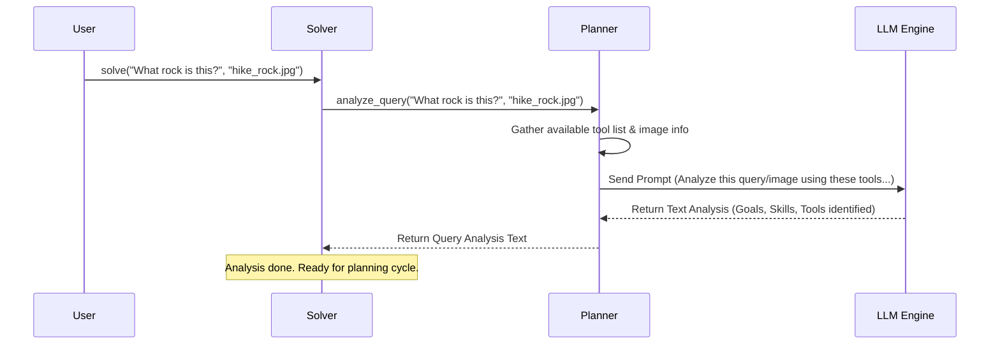

# Chapter 3: Query Analysis

In the previous chapter on the [Planning-Execution Cycle](02_planning_execution_cycle_.md), we saw how `octotools` works like a chef following a recipe, performing steps iteratively (Plan -> Execute -> Memorize & Verify) until the job is done. But before the chef can even start cooking, they need to read the order and understand *what* dish to make. How does `octotools` figure out what you actually want when you ask it a question? That's the job of **Query Analysis**.

**What Problem Does Query Analysis Solve? The Doctor Analogy**

Imagine you go to the doctor feeling unwell. You don't just walk in and get handed medicine immediately! The doctor first asks questions ("What are your symptoms?", "Where does it hurt?", "When did it start?") and might run some tests (like taking your temperature). They *analyze* your situation before deciding on a diagnosis and treatment plan.

Query Analysis in `octotools` is like that doctor's diagnosis. When you give `octotools` a question (your "symptom"), maybe like:

> "I found this cool rock on my hike today (see attached picture). Can you tell me what type it is and if it's valuable?"

The system can't just jump into searching the web or running a calculator. It first needs to **understand** the request deeply. This initial understanding phase is Query Analysis. It breaks down your question to figure out:

1.  **What's the main goal?** (Identify the rock, assess its value).
2.  **What information do we have?** (A text question and an image).
3.  **What skills are needed?** (Image recognition, geology knowledge, maybe searching for market prices).
4.  **Which tools might help?** (Perhaps an `Image_Identifier_Tool`, a `Web_Search_Tool`, maybe even a `Geology_Database_Tool`).

Without this analysis, the [Planning-Execution Cycle](02_planning_execution_cycle_.md) wouldn't know where to start or which tools to even consider. Query Analysis provides the essential foundation for all the planning and actions that follow.

**How Query Analysis Works in `octotools`**

Query Analysis is one of the very first steps performed by the [Solver Framework](01_solver_framework_.md) when you call the `solve` method. It happens *before* the main Plan-Execute loop begins.

The `Solver` delegates this task to its `Planner` component. The `Planner` has a specific method, `analyze_query`, designed for this purpose.

Let's look at how the `Solver` uses it (simplified from Chapter 1):

```python
# Conceptual structure of solve() in octotools/solver.py
class Solver:
    # ... (init method) ...

    def solve(self, question: str, image_path: Optional[str] = None):
        if self.verbose: print(f"Received query: {question}")

        # >>> HERE IT IS! <<<
        # 1. Analyze the query (using Planner)
        query_analysis = self.planner.analyze_query(question, image_path)
        if self.verbose: print(f"Query Analysis Results:\n{query_analysis}")
        # >>> END OF QUERY ANALYSIS STEP <<<

        # ... (Start the Planning-Execution Loop based on the analysis) ...
        # while loop { Plan -> Execute -> Memorize & Verify }
        # ...

        # ... (Generate Final Answer) ...
        return {"direct_output": final_answer, ...}
```

*   **Input:** The `solver.solve` method receives your `question` (text) and optionally an `image_path`.
*   **Action:** It calls `self.planner.analyze_query`, passing along the question and image path.
*   **Output:** The `analyze_query` method returns a string (`query_analysis`) containing a structured breakdown of the query.

**What does the output look like?**

The `query_analysis` result is typically a text summary generated by the underlying AI model. For our rock identification example, it might look something like this (simplified):

```text
Query Analysis Results:

1.  **Summary:** The user wants to identify a rock shown in the provided image ('hike_rock.jpg') and determine its potential monetary value.

2.  **Required Skills:**
    *   Image Recognition: To analyze the visual features of the rock in the image.
    *   Geological Knowledge: To classify the rock based on its features.
    *   Information Retrieval: To search for information about the identified rock type.
    *   Value Assessment: To find comparable market prices or criteria for valuation.

3.  **Relevant Tools:**
    *   `Image_Identifier_Tool`: Could potentially identify visual elements or textures in the image.
    *   `Web_Search_Tool`: Useful for searching geological databases or finding information about rock types and their market value. Needs specific search terms (like the identified rock name).

4.  **Additional Considerations:** Rock identification from images can be difficult. Value depends heavily on quality, size, and rarity, which might not be fully assessable from the image alone.
```

This analysis now gives the `Planner` the necessary context to start the [Planning-Execution Cycle](02_planning_execution_cycle_.md) effectively. It knows the goals and which tools are likely candidates for the first steps.

**Under the Hood: How the Planner Analyzes**

So, how does the `planner.analyze_query` method actually generate this analysis? It doesn't have this knowledge built-in; it leverages the power of a Large Language Model (LLM).

1.  **Information Gathering:** The `Planner` gathers all the necessary information:
    *   The user's `question`.
    *   Information about the `image` (if provided), like its path and maybe dimensions ([Multimodal Processing](04_multimodal_processing_.md)).
    *   A list of all available tools and their descriptions (from the [Tool Architecture](05_tool_architecture_.md)).

2.  **Prompting the LLM:** The `Planner` constructs a special instruction, called a *prompt*, for the AI model ([LLM Engine Integration](06_llm_engine_integration_.md)). This prompt essentially asks the AI to act as an expert analyst.

3.  **LLM Processing:** The prompt, along with the user's question, image data (if any), and tool list, is sent to the LLM engine. The LLM reads everything and generates the structured analysis based on the instructions in the prompt.

4.  **Returning the Analysis:** The `Planner` receives the text analysis back from the LLM and returns it to the `Solver`.

Here’s a simple diagram illustrating this flow:



**A Peek at the Code (`planner.py`)**

The core logic resides in the `Planner` class within `octotools/models/planner.py`.

*   **The `analyze_query` Method:** This method orchestrates the analysis.

    ```python
    # Simplified from octotools/models/planner.py
    from octotools.models.formatters import QueryAnalysis # Output structure helper

    class Planner:
        def __init__(self, llm_engine_name: str, toolbox_metadata: dict, available_tools: List, ...):
            # Store available tools, create LLM engine (incl. multimodal)
            self.llm_engine_mm = create_llm_engine(model_string=llm_engine_name, is_multimodal=True)
            self.available_tools = available_tools
            self.toolbox_metadata = toolbox_metadata
            # ... other initializations ...

        def analyze_query(self, question: str, image_path: str) -> str:
            # Get basic image info (path, maybe size) if image_path exists
            image_info = self.get_image_info(image_path)

            # Construct the detailed prompt for the LLM
            query_prompt = self._build_analysis_prompt(question, image_info)

            # Prepare input data (text prompt + image bytes if available)
            input_data = [query_prompt]
            if image_info:
                # ... (code to load image bytes) ...
                input_data.append(image_bytes)

            # Call the multimodal LLM engine with the prompt and image
            # Use QueryAnalysis formatter to suggest structure for the output
            analysis_result = self.llm_engine_mm(input_data, response_format=QueryAnalysis)

            # Return the generated analysis as a string
            return str(analysis_result).strip()

        def _build_analysis_prompt(self, question: str, image_info: dict) -> str:
            # Creates the detailed instructions for the LLM
            prompt = f"""
Task: Analyze the given query and image to determine goals, skills, and tools.

Available tools: {self.available_tools}
Tool Metadata: {self.toolbox_metadata}
Image Info: {image_info}
Query: {question}

Instructions:
1. Summarize query objectives and image content.
2. List required skills (e.g., image recognition, search).
3. List relevant tools from available tools, explaining their use.
4. Add any other considerations.
Output in a clear, structured format.
            """ # Simplified prompt
            return prompt

        def get_image_info(self, image_path: str) -> Dict:
            # Helper to get basic info about the image file
            # ... (implementation details) ...
            return {"image_path": image_path, ...} if image_path else {}

    ```
    *   The `analyze_query` method takes the `question` and `image_path`.
    *   It calls internal helpers like `get_image_info` and `_build_analysis_prompt`.
    *   Crucially, it uses `self.llm_engine_mm` (the multimodal LLM engine) to process the `input_data` (which includes the prompt and potentially image data).
    *   The `response_format=QueryAnalysis` hint helps the LLM structure its output.
    *   The `_build_analysis_prompt` shows how the instructions, user query, image info, and tool details are combined into a single request for the AI.

**Conclusion**

Query Analysis is the essential first step in `octotools`' problem-solving process. Like a doctor diagnosing a patient, it carefully examines your request (text and images) to understand the core objectives, required skills, and potential tools *before* any action is taken. This analysis, performed by the `Planner` using an LLM, provides the critical foundation for the subsequent [Planning-Execution Cycle](02_planning_execution_cycle_.md).

Now that we understand how `octotools` figures out *what* you're asking, including handling images, let's dive deeper into how it manages different types of input like text and images together. In the next chapter, we'll explore [Multimodal Processing](04_multimodal_processing_.md).

---

Generated by [AI Codebase Knowledge Builder](https://github.com/The-Pocket/Tutorial-Codebase-Knowledge)