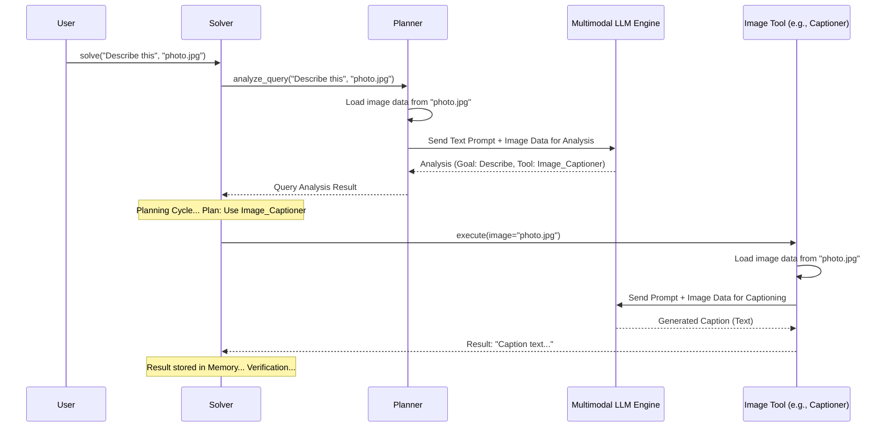

# Chapter 4: Multimodal Processing

In the previous chapter on [Query Analysis](03_query_analysis_.md), we saw how `octotools` first tries to understand your request, even if it includes both text and an image, like asking "What type of rock is this?" while showing a picture. But *how* does it actually handle these different kinds of information together? That's where **Multimodal Processing** comes in.

**What Problem Does Multimodal Processing Solve? The Human Senses Analogy**

Think about how you understand the world. You don't just rely on one sense! You might *see* a dog wagging its tail and *hear* it barking playfully. Combining sight and sound gives you a much better understanding of the situation than just one sense alone.

Computers traditionally worked mainly with text or structured data. But the real world is full of different types of information: text, images, sounds, videos. **Multimodal Processing** is the ability for a system like `octotools` to understand and work with *multiple types* (or "modes") of input data simultaneously, just like humans use multiple senses.

For `octotools`, this currently means handling **text** and **images** together. This capability is crucial for tasks like:

*   Analyzing a photo you upload ("What landmarks are in this picture?").
*   Answering questions about a diagram ("Explain the process shown in this flowchart.").
*   Identifying objects ("Is there a cat in this image?").

Without multimodal processing, `octotools` would be like trying to understand a movie with only the sound or only the picture – you'd miss a lot of information!

**How `octotools` Handles Multiple Modes (Text + Image)**

The key idea is that `octotools` is built from the ground up to expect that input might not just be text.

1.  **Input Layer (`Solver.solve`)**: When you start a task, the main `solve` method in the [Solver Framework](01_solver_framework_.md) is designed to accept both text and image information right away.

    ```python
    # Conceptual call to the Solver
    solver = construct_solver(...) # Setup the solver

    # We can provide both a question (text) and an image path
    result = solver.solve(
        question="What is happening in this picture?",
        image_path="path/to/your/image.jpg" # Path to the image file
    )

    print(result.get("direct_output"))
    ```
    This simple setup allows you to easily provide both types of information to the system.

2.  **Core Components are Aware**: Components like the `Planner` are designed to receive and use both text and image information. As we saw in [Query Analysis](03_query_analysis_.md), the `planner.analyze_query` method takes both `question` and `image_path` as inputs.

    ```python
    # Inside Solver.solve (Simplified concept from Chapter 1 & 3)
    class Solver:
        def solve(self, question: str, image_path: Optional[str] = None):
            # Both question and image_path are passed to the Planner
            query_analysis = self.planner.analyze_query(question, image_path)
            # ... rest of the process ...
    ```
    The `Planner` can then use this combined information to understand the goal better.

3.  **Multimodal Large Language Models (LLMs)**: The real "magic" behind this capability comes from integrating with advanced AI models called **Multimodal LLMs** (like GPT-4o). These models have been trained on vast amounts of both text and images, allowing them to understand relationships between them. `octotools` uses these models via its [LLM Engine Integration](06_llm_engine_integration_.md). When the `Planner` needs to analyze the initial query or generate a response involving an image, it sends *both* the text prompt and the image data to the LLM.

4.  **Specialized Tools**: Some tools within the [Tool Architecture](05_tool_architecture_.md) are specifically designed to work with images. Examples include:
    *   `Image_Captioner_Tool`: Describes what's in an image.
    *   `Object_Detector_Tool`: Finds specific objects within an image.
    These tools know how to take an image file path, process the image (often using their *own* connection to a multimodal LLM), and produce results.

**Example: Asking About an Image**

Let's trace how multimodal processing helps answer: "Describe the main activity in this photo." with `photo.jpg`.

1.  **Input:** `solver.solve("Describe the main activity...", image_path="photo.jpg")`
2.  **Query Analysis:** The `Solver` calls `planner.analyze_query`, passing both the text and the image path. The `Planner` uses the multimodal LLM, sending it the text prompt *and* the actual image data from `photo.jpg`. The LLM analyzes both and suggests the goal is image description, possibly using the `Image_Captioner_Tool`.
3.  **Planning:** During the [Planning-Execution Cycle](02_planning_execution_cycle_.md), the `Planner` decides the best first step is likely to use the `Image_Captioner_Tool`.
4.  **Execution:** The `Solver` tells the `Executor` to run the `Image_Captioner_Tool` with the input `image="photo.jpg"`.
5.  **Tool Action:** The `Image_Captioner_Tool` itself loads the `photo.jpg` image data and sends it (along with a prompt like "Describe this image") to its configured multimodal LLM.
6.  **Result:** The LLM returns a text description (e.g., "A person is riding a bicycle down a street."). The tool returns this text.
7.  **Memorization & Verification:** The result ("A person is riding...") is stored in [Memory Management](08_memory_management_.md). The `Planner` verifies if this description fulfills the original request. If yes, the process might stop.
8.  **Final Answer:** The `Solver` generates the final answer based on the caption stored in memory.

**Visualizing the Flow**

Here's how the text and image data flow through the system when analyzing or using an image tool:



This shows how both the `Planner` (for initial understanding) and specific `Image Tools` can interact with the multimodal LLM, sending it both text instructions and image data.

**Under the Hood: Code Examples**

Let's look at snippets showing how text and image data are handled.

1.  **Planner Analyzing Query (`octotools/models/planner.py`)**:
    The `analyze_query` method gathers text, image info, and prepares data for the multimodal LLM.

    ```python
    # Simplified from octotools/models/planner.py - Planner.analyze_query
    class Planner:
        def __init__(self, llm_engine_name: str, ...):
            # Creates the multimodal LLM engine instance
            self.llm_engine_mm = create_llm_engine(model_string=llm_engine_name, is_multimodal=True)
            # ... other setup ...

        def analyze_query(self, question: str, image_path: str) -> str:
            # Build the text prompt for analysis
            query_prompt = self._build_analysis_prompt(question, ...)

            # Prepare input data: Start with the text prompt
            input_data = [query_prompt]

            # If an image path is provided...
            if image_path and os.path.isfile(image_path):
                try:
                    # ...read the image file into bytes...
                    with open(image_path, 'rb') as file:
                        image_bytes = file.read()
                    # ...and add the image bytes to the input data.
                    input_data.append(image_bytes)
                except Exception as e:
                    print(f"Error reading image file: {str(e)}")

            # Send BOTH text prompt and image bytes (if any) to the multimodal LLM
            analysis_result = self.llm_engine_mm(input_data, ...)
            return str(analysis_result).strip()

        def _build_analysis_prompt(self, question: str, ...) -> str:
            # Helper function to create the text part of the prompt
            # ... (details omitted) ...
            return "Analyze this query and image..." # Simplified
    ```
    This code shows the core logic: create a text prompt, load image bytes if available, and send *both* to the `self.llm_engine_mm` (the multimodal LLM engine).

2.  **Image Tool Executing (`octotools/tools/image_captioner/tool.py`)**:
    Image-specific tools also use this pattern.

    ```python
    # Simplified from octotools/tools/image_captioner/tool.py
    from octotools.tools.base import BaseTool
    from octotools.engine.factory import create_llm_engine
    import os

    class Image_Captioner_Tool(BaseTool):
        def __init__(self, model_string="gpt-4o-mini"):
            # Tool setup...
            super().__init__(...)
            # Each tool requiring multimodal capabilities might create its own engine
            self.llm_engine = create_llm_engine(model_string=model_string, is_multimodal=True)

        def execute(self, image, prompt="Describe this image in detail."):
            # Default text prompt
            input_data = [prompt]

            # Check if the image path is valid
            if image and os.path.isfile(image):
                try:
                    # Read the image file into bytes
                    with open(image, 'rb') as file:
                        image_bytes = file.read()
                    # Add image bytes to the input list
                    input_data.append(image_bytes)
                except Exception as e:
                    return f"Error reading image file: {str(e)}"
            else:
                return "Error: Invalid image file path."

            # Send the prompt and image bytes to the tool's LLM engine
            caption = self.llm_engine(input_data)
            return caption
    ```
    Here, the `Image_Captioner_Tool` takes an `image` path, loads the image data, combines it with a text `prompt`, and sends it all to its `self.llm_engine` to get the caption.

**Conclusion**

Multimodal Processing is `octotools`' ability to understand and work with different types of information together, primarily text and images. By leveraging powerful multimodal LLMs and designing components to handle diverse inputs, `octotools` can tackle a much wider range of real-world tasks that involve visual information, just like humans use multiple senses. This makes it a more versatile and capable problem-solving assistant.

Now that we understand how `octotools` can handle different input types, let's delve deeper into the building blocks that perform specific actions: the tools themselves. In the next chapter, we'll explore the [Tool Architecture](05_tool_architecture_.md).

---

Generated by [AI Codebase Knowledge Builder](https://github.com/The-Pocket/Tutorial-Codebase-Knowledge)