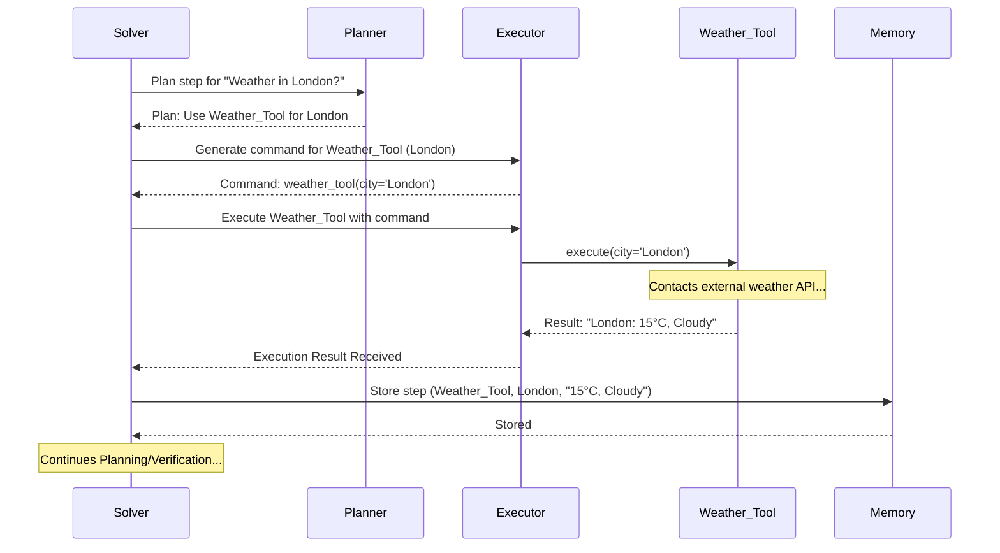

# Chapter 5: Tool Architecture

In the last chapter, we explored [Multimodal Processing](04_multimodal_processing_.md), learning how `octotools` can understand and work with different kinds of information like text and images together. But how does it actually *do* specific things, like searching the web, calculating a math problem, or analyzing an image's content? It needs specialized components for these actions. That's where the **Tool Architecture** comes in.

**What's the Problem? Needing the Right Tool for the Job**

Imagine you have a home repair project. You need to hang a picture, tighten a loose screw, and maybe saw a piece of wood. You wouldn't use a hammer for all these tasks, right? You need a hammer for the nail, a screwdriver for the screw, and a saw for the wood. Each task requires a specific tool designed for that job.

`octotools` faces a similar situation when trying to answer your questions or complete tasks. A question like "What's the weather in London?" requires fetching current weather data, while "What is 5 times 127?" needs calculation, and "Describe this picture" involves image analysis. The system needs a collection of specialized "digital tools" to handle these diverse requests.

The **Tool Architecture** in `octotools` is like having a well-organized workshop or toolbox. It provides:
1.  A set of specialized tools, each performing a specific task.
2.  A standard way for the main system to interact with any tool, regardless of what it does.

This organization makes `octotools` powerful and flexible.

**Key Concepts of the Tool Architecture**

1.  **Specialized Tools:** Just like in a workshop, `octotools` has different tools, each built for a specific purpose.
    *   `Web_Search_Tool`: Searches the internet.
    *   `Calculator_Tool`: Performs mathematical calculations.
    *   `Image_Captioner_Tool`: Describes the content of an image.
    *   `Generalist_Solution_Generator_Tool`: Uses AI to answer general questions or follow instructions (like we saw in the previous chapter's examples).
    *(Note: These are example names; the actual tools might vary).*

2.  **Common Interface (`BaseTool`):** Imagine all tools in your workshop (hammer, screwdriver, saw) having the same basic handle design. You know how to pick up and generally use any of them, even if their specific function differs. `octotools` has a similar concept called `BaseTool`. Every tool in `octotools` is built upon this `BaseTool`. It defines a standard way for the system (specifically the [Executor](02_planning_execution_cycle_.md)) to:
    *   Get information about the tool (its name, description, what inputs it needs).
    *   Tell the tool to run (`execute` its task).

3.  **Modularity:** Because each tool is a separate component built on the `BaseTool` standard, the system is very **modular**. This means:
    *   **Easy to Add:** Developers can create new tools for new capabilities (like adding a new wrench to your toolbox) without disrupting the existing ones.
    *   **Easy to Update:** A specific tool can be improved or fixed independently.
    *   **Flexible:** The system can be configured to use only the tools needed for a particular setup.

4.  **Defined Inputs and Outputs:** Each tool clearly states what kind of information it needs to do its job (its **inputs**) and what kind of result it will produce (its **output**). For example:
    *   `Calculator_Tool` might expect a math expression string as input (e.g., `"5 * 127"`) and produce a number or string as output (e.g., `"635"`).
    *   `Image_Captioner_Tool` might expect an image file path as input and produce a text description as output.

**How are Tools Used? (The System's Perspective)**

As a user, you usually don't interact with these tools directly. Instead, the [Solver Framework](01_solver_framework_.md) manages the process:

1.  The [Planner](02_planning_execution_cycle_.md) analyzes your request and decides which tool is needed for the next step.
2.  The [Executor](02_planning_execution_cycle_.md) receives the plan (e.g., "Use Calculator Tool to find 5 * 127").
3.  The Executor finds the specified tool (e.g., `Calculator_Tool`).
4.  Because all tools share the `BaseTool` interface, the Executor knows it can call the tool's `execute` method, passing the required inputs (e.g., the expression `"5 * 127"`).
5.  The tool performs its specific task and returns the result to the Executor.
6.  The Executor passes this result to the [Memory Management](08_memory_management_.md) component.

Here's a conceptual code snippet showing how the Executor might run a tool:

```python
# Conceptual code inside the Executor

# Assume 'tool_name' is "Calculator_Tool" and 'command' is {"expression": "5 * 127"}
# The Executor finds the actual tool object based on the name
tool_object = self.find_tool(tool_name) # Finds the Calculator_Tool instance

if tool_object:
    try:
        # All tools have an 'execute' method thanks to BaseTool!
        # We pass the arguments from the command.
        result = tool_object.execute(**command['arguments']) # e.g., execute(expression="5 * 127")
        print(f"Tool {tool_name} executed successfully. Result: {result}")
        return result
    except Exception as e:
        print(f"Error executing tool {tool_name}: {e}")
        return f"Error: {e}"
else:
    print(f"Error: Tool {tool_name} not found.")
    return "Error: Tool not found"
```

This simplified code shows the core idea: the Executor gets the tool name and command details, finds the corresponding tool object, and calls its `execute` method using the standard interface provided by `BaseTool`.

**Under the Hood: The Workshop in Action**

Let's revisit our workshop analogy.

*   **Solver:** The Workshop Manager, overseeing the entire project.
*   **Planner:** The Foreman, reading the blueprint (your query) and deciding which specialist (tool) is needed next.
*   **Executor:** The Assistant, who fetches the specific tool chosen by the Foreman and operates it according to instructions.
*   **Tools (e.g., `Web_Search_Tool`, `Calculator_Tool`):** The specialized workers or machines, each performing one task when called upon.
*   **`BaseTool`:** The standard operating procedure manual that every specialist follows, ensuring the Assistant knows how to give instructions (`execute`) and get results.
*   **Tool Discovery (`Initializer`):** The workshop inventory system that knows which tools are available and what they do.

When you ask `octotools` "What is the weather in London?", the flow looks something like this:



This diagram shows the Executor interacting with a specific tool (`Weather_Tool`) using its `execute` method, thanks to the common structure defined by the Tool Architecture.

**Diving Deeper into the Code**

1.  **The Foundation: `BaseTool` (`octotools/tools/base.py`)**
    This class is the blueprint for all tools.

    ```python
    # Simplified from octotools/tools/base.py
    class BaseTool:
        """Base class for all tools."""
        require_llm_engine = False # Does this tool need an LLM? Default is no.

        def __init__(self, tool_name=None, tool_description=None, ...):
            """Stores basic info about the tool."""
            self.tool_name = tool_name
            self.tool_description = tool_description
            # ... other metadata like version, input_types, output_type ...
            self.model_string = None # Placeholder for LLM model if needed

        def get_metadata(self):
            """Returns the tool's description and capabilities."""
            return {
                "tool_name": self.tool_name,
                "tool_description": self.tool_description,
                # ... other metadata ...
                "require_llm_engine": self.require_llm_engine,
            }

        def execute(self, *args, **kwargs):
            """The main function of the tool. MUST be implemented by subclasses."""
            raise NotImplementedError("Subclasses must implement the execute method.")

    ```
    *   **`__init__`**: Stores metadata (name, description, etc.) about the tool.
    *   **`get_metadata`**: Provides a standard way to ask a tool about itself.
    *   **`execute`**: The placeholder for the tool's main action. Every real tool *must* provide its own version of this method.
    *   **`require_llm_engine`**: A flag indicating if this tool needs access to an AI model ([LLM Engine Integration](06_llm_engine_integration_.md)).

2.  **A Specific Tool Example: `Generalist_Solution_Generator_Tool` (`octotools/tools/generalist_solution_generator/tool.py`)**
    This tool uses an LLM to handle various tasks. Notice how it builds upon `BaseTool`.

    ```python
    # Simplified from octotools/tools/generalist_solution_generator/tool.py
    from octotools.tools.base import BaseTool
    from octotools.engine.factory import create_llm_engine
    import os

    # Inherits from BaseTool!
    class Generalist_Solution_Generator_Tool(BaseTool):
        require_llm_engine = True # This tool DOES need an LLM

        def __init__(self, model_string="gpt-4o-mini"):
            # Call BaseTool's init to set standard metadata
            super().__init__(
                tool_name="Generalist_Solution_Generator_Tool",
                tool_description="Answers general queries or analyzes images using an LLM.",
                # ... other metadata like input_types, demo_commands ...
                model_string=model_string # Store the chosen LLM model
            )
            # Tool-specific setup (if any) could go here

        # Implement the required 'execute' method
        def execute(self, prompt, image=None):
            # Create an LLM engine instance (details in Chapter 6)
            llm_engine = create_llm_engine(self.model_string, is_multimodal=bool(image))

            # Prepare input (text prompt + image bytes if provided)
            input_data = [prompt]
            if image and os.path.isfile(image):
                # ... (code to load image bytes) ...
                input_data.append(image_bytes)

            # Call the LLM engine to get the response
            response = llm_engine(input_data)
            return response

    ```
    *   **`class Generalist_Solution_Generator_Tool(BaseTool):`**: This line shows the tool *inheriting* from `BaseTool`. It gets all the basic structure and methods from `BaseTool`.
    *   **`require_llm_engine = True`**: Overrides the default, indicating it needs an LLM.
    *   **`super().__init__(...)`**: Calls the `BaseTool`'s `__init__` method to set up the common metadata (name, description).
    *   **`execute(self, prompt, image=None)`**: This is the tool's *specific* implementation of the `execute` method. It takes a `prompt` and optional `image`, uses the [LLM Engine Integration](06_llm_engine_integration_.md) to process them, and returns the result.

3.  **Finding the Tools: `Initializer` (`octotools/models/initializer.py`)**
    How does `octotools` know which tools like `Generalist_Solution_Generator_Tool` exist? The `Initializer` component scans the `octotools/tools/` directory when the system starts.

    ```python
    # Conceptual logic from octotools/models/initializer.py
    import os
    import importlib
    import inspect

    class Initializer:
        def __init__(self, enabled_tools: list = [], ...):
            self.enabled_tools = enabled_tools # List of tool names to load
            self.toolbox_metadata = {} # Stores info about loaded tools
            self.available_tools = [] # List of successfully loaded tool objects
            self._set_up_tools()

        def _set_up_tools(self):
            print("Scanning for tools...")
            tools_dir = "path/to/octotools/tools" # Actual path is found dynamically

            for tool_folder_name in os.listdir(tools_dir):
                # Check if this tool is enabled or if 'all' are enabled
                if tool_folder_name in self.enabled_tools or "all" in self.enabled_tools:
                    tool_file_path = os.path.join(tools_dir, tool_folder_name, "tool.py")
                    if os.path.exists(tool_file_path):
                        try:
                            # Dynamically import the tool's code
                            module = importlib.import_module(f"octotools.tools.{tool_folder_name}.tool")
                            # Find the class ending in 'Tool' (e.g., Generalist_Solution_Generator_Tool)
                            for name, obj in inspect.getmembers(module):
                                if inspect.isclass(obj) and name.endswith('Tool') and name != 'BaseTool':
                                    # Create an instance of the tool
                                    tool_instance = obj(model_string=self.model_string) # Pass LLM config if needed
                                    # Store its metadata and the instance itself
                                    self.toolbox_metadata[name] = tool_instance.get_metadata()
                                    self.available_tools.append(tool_instance) # Storing instance conceptually
                                    print(f"Loaded tool: {name}")
                        except Exception as e:
                            print(f"Failed to load tool {tool_folder_name}: {e}")

            print(f"Finished loading tools. Available: {list(self.toolbox_metadata.keys())}")

    ```
    This simplified logic shows how the `Initializer` looks inside each subfolder of `octotools/tools/`, finds the `tool.py` file, imports the `Tool` class defined within it, creates an instance, and stores its metadata. This builds the "toolbox" that the Planner and Executor can use.

**Conclusion**

The Tool Architecture is the heart of `octotools`' ability to perform diverse actions. By defining a standard blueprint (`BaseTool`) for specialized, modular tools, it creates a flexible and extensible system. Like a well-equipped workshop, `octotools` can select the right tool for the job, whether it's searching the web, analyzing an image, or performing a calculation. This architecture ensures that adding new capabilities is straightforward, simply requiring a new tool that follows the `BaseTool` standard.

Understanding this architecture helps clarify how the [Planner](02_planning_execution_cycle_.md) can choose actions and how the [Executor](02_planning_execution_cycle_.md) can reliably run them. But how do these tools, especially ones like the `Generalist_Solution_Generator_Tool`, actually interact with the powerful AI models that drive much of `octotools`' intelligence? In the next chapter, we'll explore the [LLM Engine Integration](06_llm_engine_integration_.md).

---

Generated by [AI Codebase Knowledge Builder](https://github.com/The-Pocket/Tutorial-Codebase-Knowledge)