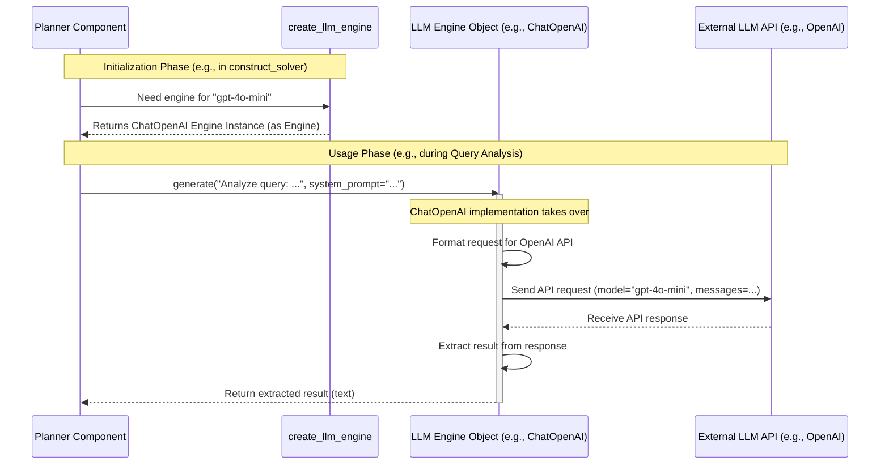

# Chapter 6: LLM Engine Integration

In the previous chapter on [Tool Architecture](05_tool_architecture_.md), we saw how `octotools` uses specialized tools like a `Web_Search_Tool` or `Calculator_Tool` to perform specific actions. We also saw tools like `Generalist_Solution_Generator_Tool` that rely on Artificial Intelligence (AI) to work. But how does `octotools` actually talk to these powerful AI brains, especially when there are many different AI providers like OpenAI (ChatGPT), Google (Gemini), Anthropic (Claude), and others? This chapter introduces the **LLM Engine Integration**.

**What Problem Does This Solve? The Universal Power Adapter Analogy**

Imagine you're traveling the world. You have your laptop (made in the US), your phone charger (from Europe), and maybe a camera charger (from Japan). Each device has a different plug! When you arrive at your hotel in Australia, you find yet another different wall socket. What do you do? You use a **universal power adapter**!

This adapter has different heads (or settings) for different plugs and sockets. You plug your device into the correct head on the adapter, set the adapter for the Australian socket, and plug it into the wall. The adapter handles the differences, letting you use any of your devices easily.

The **LLM Engine Integration** in `octotools` works just like that universal adapter.
*   **Different AI Models:** OpenAI's GPT-4o, Google's Gemini, Anthropic's Claude are like devices with different plugs.
*   **`octotools` Components:** The parts of `octotools` that need AI (like the [Planner](02_planning_execution_cycle_.md) or specific AI-powered tools) are like the wall socket.
*   **LLM Engine Integration:** This is the universal adapter. It provides a **single, standard way** for `octotools` components to connect to and use *any* supported AI model, hiding the specific details of each AI provider's unique API (their "plug type").

Without this integration, `octotools` would need separate code for every single AI model it wanted to support, making it messy and hard to maintain. This system makes `octotools` flexible and future-proof.

**Key Concepts**

1.  **Unified Interface (`EngineLM`):** This is the core blueprint, like the main body of the universal adapter. It defines the standard way components will interact with *any* LLM engine. It specifies that every engine must know how to perform basic actions, most importantly, a `generate` function to get a response from the AI. This ensures consistency.

2.  **Specific Engines (e.g., `ChatOpenAI`, `ChatGemini`, `ChatAnthropic`):** These are like the specific adapter heads for different countries (AI providers). Each specific engine class (e.g., `ChatOpenAI`) knows exactly how to talk to its particular AI service (e.g., the OpenAI API). It takes the standard request from the Unified Interface and translates it into the format that OpenAI expects, sends it off, gets the result, and translates it back into a standard format.

3.  **Factory Pattern (`create_llm_engine`):** This is like a smart shopkeeper at an electronics store. You tell the shopkeeper, "I need an adapter for my US laptop to work in an Australian socket." The shopkeeper knows exactly which adapter (or adapter head) to give you. Similarly, the `create_llm_engine` function is a central place in `octotools`. You tell it which AI model you want to use by providing its name (e.g., `"gpt-4o-mini"` or `"gemini-1.5-flash"`), and the factory *creates and returns* the correct specific engine object (like `ChatOpenAI` or `ChatGemini`), ready to be used via the Unified Interface.

**How to Use the LLM Engine Integration**

You usually don't interact with the LLM engines directly as an end-user of `octotools`. Instead, you specify which AI model you want when you set up the main `Solver` or if you configure specific tools.

Remember from [Chapter 1: Solver Framework](01_solver_framework_.md) how we constructed the Solver?

```python
# From octotools/solver.py (simplified for clarity)
from octotools.solver import construct_solver

# >>> HERE! <<< Specify the desired LLM model name
solver = construct_solver(
    llm_engine_name="gpt-4o-mini", # Tells the system to use OpenAI's gpt-4o-mini
    verbose=True
)

print("Solver is ready!")
```

Behind the scenes, the `construct_solver` function (or a tool's setup) takes this `llm_engine_name` and uses the `create_llm_engine` factory to get the right engine object.

If you were developing a new tool or needed direct access for some reason, you could use the factory like this:

```python
# Import the factory function
from octotools.engine.factory import create_llm_engine

# Ask the factory for an OpenAI engine instance
# Make sure your OPENAI_API_KEY is set in your environment!
try:
    openai_engine = create_llm_engine(model_string="gpt-4o-mini")
    print(f"Successfully created engine for: {openai_engine.model_string}")

    # Ask the factory for a Google Gemini engine instance
    # Make sure your GOOGLE_API_KEY is set in your environment!
    gemini_engine = create_llm_engine(model_string="gemini-1.5-flash")
    print(f"Successfully created engine for: {gemini_engine.model_string}")

except ValueError as e:
    print(f"Error creating engine: {e}")
except ImportError as e:
    print(f"Import Error: {e}") # e.g., missing 'openai' or 'google-generativeai' package
```

This code directly calls the factory with the model names. The factory returns the appropriate engine object (`ChatOpenAI` instance for the first call, `ChatGemini` for the second). You could then use `openai_engine` or `gemini_engine` in your code, calling the same methods (like `generate`) on either one, thanks to the Unified Interface.

**Internal Implementation: What Happens Under the Hood?**

Let's trace what happens when a component, say the [Planner](03_query_analysis_.md), needs to use the LLM to analyze a query.

1.  **Setup:** When the `Planner` was created (likely during `construct_solver`), it received an LLM engine object (e.g., a `ChatOpenAI` instance) that the `create_llm_engine` factory provided based on the `llm_engine_name` you specified. Let's assume it got a `ChatOpenAI` engine for `"gpt-4o-mini"`.
2.  **Request:** The `Planner` has some text (a prompt) it wants the AI to process. It calls the standard `generate` method on the engine object it holds: `llm_engine.generate("Analyze this query: ...")`.
3.  **Translation (Inside `ChatOpenAI.generate`):** The `ChatOpenAI` object receives this call. It knows it needs to talk to the *OpenAI API*. It formats the input prompt according to OpenAI's requirements (e.g., creating a message list with roles like "system" and "user").
4.  **API Call:** The `ChatOpenAI` object uses the installed `openai` library to send the formatted request to OpenAI's servers, specifying the model `"gpt-4o-mini"`.
5.  **External Processing:** OpenAI's servers process the request using the GPT-4o Mini model.
6.  **Response:** OpenAI sends the result back to the `ChatOpenAI` object.
7.  **Standardization:** The `ChatOpenAI` object extracts the useful part of the response (e.g., the generated text).
8.  **Return:** It returns the processed result (the AI's analysis text) back to the `Planner`.

The key is that the `Planner` didn't need to know *anything* about OpenAI's specific API format. It just used the standard `generate` method. If you had configured `llm_engine_name="gemini-1.5-flash"`, the `Planner` would have held a `ChatGemini` object, called the exact same `generate` method, and the `ChatGemini` object would have handled talking to Google's API instead.

Here's a diagram illustrating this flow:



**Diving Deeper into the Code**

1.  **The Factory (`octotools/engine/factory.py`)**
    This function acts as the central dispatcher.

    ```python
    # Simplified from octotools/engine/factory.py
    from typing import Any

    def create_llm_engine(model_string: str, use_cache: bool = False, is_multimodal: bool = True, **kwargs) -> Any:
        """Factory function to create appropriate LLM engine instance."""

        # Check model name and import/return the correct class
        if any(x in model_string for x in ["gpt", "o1", "o3", "o4"]):
            from .openai import ChatOpenAI # Import only when needed
            return ChatOpenAI(model_string=model_string, use_cache=use_cache, is_multimodal=is_multimodal, **kwargs)

        elif "claude" in model_string:
            from .anthropic import ChatAnthropic
            return ChatAnthropic(model_string=model_string, use_cache=use_cache, is_multimodal=is_multimodal, **kwargs)

        elif "gemini" in model_string:
            from .gemini import ChatGemini
            return ChatGemini(model_string=model_string, use_cache=use_cache, is_multimodal=is_multimodal, **kwargs)

        # ... (checks for other providers like Deepseek, Grok, VLLM, Together) ...

        else:
            raise ValueError(f"Engine {model_string} not supported.")
    ```
    This code snippet shows how `create_llm_engine` checks the `model_string` and, based on keywords (like "gpt", "claude", "gemini"), imports and creates an instance of the corresponding specific engine class (e.g., `ChatOpenAI`, `ChatAnthropic`, `ChatGemini`).

2.  **The Unified Interface (`octotools/engine/base.py`)**
    This is the abstract base class that defines the standard.

    ```python
    # Simplified from octotools/engine/base.py
    from abc import ABC, abstractmethod

    class EngineLM(ABC): # ABC means Abstract Base Class
        """Base class for all Language Model engines."""
        model_string: str # Each engine instance will store its model name

        @abstractmethod # This decorator means subclasses MUST implement this method
        def generate(self, prompt, system_prompt=None, **kwargs):
            """Generates a response from the language model."""
            pass # Base class doesn't do anything, just defines the structure

        # The __call__ method allows using the engine object like a function
        def __call__(self, prompt, **kwargs):
            return self.generate(prompt, **kwargs)

    # (CachedEngine provides caching functionality, also in base.py)
    ```
    This code defines the `EngineLM` blueprint. It states that any class inheriting from `EngineLM` *must* provide its own implementation of the `generate` method. This ensures all engines can be used in the same way.

3.  **A Specific Engine (`octotools/engine/openai.py`)**
    Here's how `ChatOpenAI` implements the interface.

    ```python
    # Simplified from octotools/engine/openai.py
    from .base import EngineLM, CachedEngine # Import the base class
    from openai import OpenAI # Import the official OpenAI library
    import os

    # Inherits from EngineLM (and CachedEngine for caching)
    class ChatOpenAI(EngineLM, CachedEngine):
        DEFAULT_SYSTEM_PROMPT = "You are a helpful assistant."

        def __init__(self, model_string="gpt-4o-mini", ...):
            self.model_string = model_string
            # ... (Initialize caching if enabled) ...
            # Create the OpenAI client object to interact with the API
            self.client = OpenAI(api_key=os.getenv("OPENAI_API_KEY"))
            # ... (other setup) ...

        # Implement the required 'generate' method
        def generate(self, content, system_prompt=None, **kwargs):
            # Determine the system prompt to use
            sys_prompt_arg = system_prompt if system_prompt else self.DEFAULT_SYSTEM_PROMPT

            # ... (Check cache logic omitted for simplicity) ...

            try:
                # Prepare messages for the OpenAI API
                messages = [
                    {"role": "system", "content": sys_prompt_arg},
                    # Handle text or multimodal input (simplified here)
                    {"role": "user", "content": content if isinstance(content, str) else self._format_content(content)}
                ]

                # Call the OpenAI API using the client
                response = self.client.chat.completions.create(
                    model=self.model_string,
                    messages=messages,
                    # ... (other parameters like temperature, max_tokens) ...
                )
                # Extract the text result
                result_text = response.choices[0].message.content

                # ... (Save to cache logic omitted) ...
                return result_text

            except Exception as e:
                print(f"Error during OpenAI API call: {e}")
                return f"Error: {e}" # Return error message

        # (Helper methods like _format_content for multimodal omitted)
    ```
    This shows `ChatOpenAI` inheriting from `EngineLM`. Its `generate` method takes the input `content`, formats it into the `messages` list structure required by OpenAI's Chat API, calls `self.client.chat.completions.create`, and extracts the text response. This internal complexity is hidden from the component (like the `Planner`) that simply called `engine.generate(...)`.

**Conclusion**

The LLM Engine Integration is `octotools`' "universal power adapter" for AI models. It uses a **Unified Interface (`EngineLM`)**, **Specific Engines** (like `ChatOpenAI`), and a **Factory (`create_llm_engine`)** to let you easily plug in different Large Language Models (OpenAI, Gemini, Claude, etc.) without changing the core `octotools` logic. This makes the system highly flexible and adaptable to new AI advancements. You simply specify the `llm_engine_name` you want to use, and the system handles the rest.

Now that we understand how `octotools` connects to the AI brains it needs, how does it use that intelligence (specifically from the Planner) to figure out the *exact* commands to give to the various tools we learned about in the [Tool Architecture](05_tool_architecture_.md)? In the next chapter, we'll explore [Tool Command Generation](07_tool_command_generation_.md).

---

Generated by [AI Codebase Knowledge Builder](https://github.com/The-Pocket/Tutorial-Codebase-Knowledge)