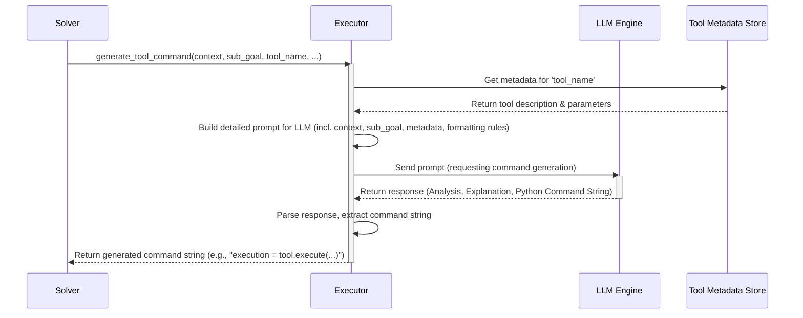

# Chapter 7: Tool Command Generation

Welcome back! In the previous chapter, [LLM Engine Integration](06_llm_engine_integration_.md), we learned how `octotools` connects to various powerful AI models like GPT-4o or Gemini, using them like a universal adapter connects different electronic devices. We saw that components like the [Planner](02_planning_execution_cycle_.md) use these AI models to make decisions, such as choosing which tool to use next.

But just knowing *which* tool to use isn't enough. How does the system figure out the *exact* way to use that tool, with all the correct details filled in? That's the job of **Tool Command Generation**.

**What's the Problem? From Plan to Precise Instructions**

Imagine you're assembling flat-pack furniture. The instructions might say "Attach Part A to Part B using the large screws." This tells you *what* to do and *which* tools (screws) to use. But you still need to figure out *exactly* how: Which holes line up? Which way does Part A face? How tight should the screws be? You need to translate the general instruction into precise actions.

Similarly, in `octotools`, the [Planner](02_planning_execution_cycle_.md) might decide:
> "Okay, the user wants to know the capital of France. The next step (sub-goal) is to find this information using the `Web_Search_Tool`."

This is a good plan, but it's not a command the computer can run directly. The `Web_Search_Tool` needs specific input, like what exact search query to use.

**Tool Command Generation** acts like a skilled translator or a detailed instruction writer. It takes the Planner's high-level plan (the sub-goal and the chosen tool) and translates it into a precise, executable command that the specific tool understands. It figures out details like:

*   What specific function in the tool's code needs to be called? (Usually the `execute` method from the [Tool Architecture](05_tool_architecture_.md)).
*   What are the exact parameters (inputs) required by that function? (e.g., `query="capital of France"`).
*   How should these parameters be formatted? (e.g., text should be in quotes).

Without this step, the plan would just be an idea, not something the system could actually *do*.

**How Tool Command Generation Works**

This translation process happens within the [Executor](02_planning_execution_cycle_.md) component, right after the Planner decides on the next step and *before* the Executor actually runs the tool. It's a key part of the [Planning-Execution Cycle](02_planning_execution_cycle_.md).

Here's the flow:

1.  **Input:** The `Executor` receives information from the [Solver](01_solver_framework_.md):
    *   The original user `question`.
    *   The `image` path (if any).
    *   The current `context` (information learned from previous steps, stored in [Memory Management](08_memory_management_.md)).
    *   The specific `sub_goal` for this step (e.g., "Find the capital of France").
    *   The `tool_name` chosen by the Planner (e.g., `"Web_Search_Tool"`).
    *   The `tool_metadata` (description, required inputs/parameters for the chosen tool, obtained from the [Tool Architecture](05_tool_architecture_.md)).

2.  **Translation using AI:** The `Executor` uses its connection to an AI model (via the [LLM Engine Integration](06_llm_engine_integration_.md)) to perform the translation. It sends a detailed prompt to the AI, containing all the input information and asking it to generate the correct Python code to run the tool for the given sub-goal.

3.  **Output:** The AI model returns a structured response, including the precise Python command.

**Example: Finding the Capital of France**

Let's trace this for our "What is the capital of France?" example.

*   **Planner's Decision:**
    *   Sub-goal: "Find the capital city of the country France."
    *   Tool Name: `"Web_Search_Tool"`

*   **Input to Command Generation (inside Executor):**
    *   `question`: "What is the capital of France?"
    *   `image`: None
    *   `context`: "No previous steps."
    *   `sub_goal`: "Find the capital city of the country France."
    *   `tool_name`: "Web_Search_Tool"
    *   `tool_metadata`: `{ "tool_name": "Web_Search_Tool", "description": "Searches the web for information.", "input_types": { "query": {"type": "string", "required": True, "description": "The search query string."} } }` (Simplified)

*   **Executor asks LLM:** The `Executor` sends a prompt like: "Based on the query, context, sub-goal, and this tool's metadata, generate the Python command to execute the Web_Search_Tool to find the capital of France. Format the output strictly as `execution = tool.execute(...)`."

*   **LLM Generates Command:** The AI analyzes the request and the tool's need for a `query` parameter. It generates the Python code:

    ```python
    # This is the command string generated by the LLM
    execution = tool.execute(query="capital of France")
    ```

*   **Output Received:** The `Executor` gets this command string back. Now it knows exactly how to run the `Web_Search_Tool`.

This generated command is then passed to the next stage within the Executor, which actually runs this code using the `Web_Search_Tool` object.

**Internal Implementation: How the Executor Does It**

The magic happens inside the `Executor` class, specifically in its `generate_tool_command` method.

1.  **Receive Inputs:** The `Solver` calls `executor.generate_tool_command`, passing all the necessary pieces: `question`, `image`, `context`, `sub_goal`, `tool_name`, and `tool_metadata`.
2.  **Build Prompt:** The `Executor` carefully constructs a detailed prompt for the LLM. This prompt includes all the received inputs and very specific instructions on *how* the command should be generated and formatted. It emphasizes using the `tool_metadata` (especially `input_types`) to get the parameters right and requires the output code to use the exact format `execution = tool.execute(...)`.
3.  **Call LLM:** The `Executor` uses the `create_llm_engine` factory (from [LLM Engine Integration](06_llm_engine_integration_.md)) to get an LLM engine instance. It sends the carefully crafted prompt to the LLM, often requesting a specific output structure (like the `ToolCommand` format mentioned in the code, which helps parse the result).
4.  **Receive & Parse Response:** The LLM processes the complex prompt and returns the generated command, usually along with its reasoning (analysis and explanation). The `Executor` has helper functions (like `extract_explanation_and_command`) to parse this response and pull out just the crucial Python command string.
5.  **Return Command:** The `Executor` returns the extracted command string to the `Solver`, ready for execution.

**Visualizing the Flow**

Here's a simplified sequence diagram showing the Executor generating a command:



**Diving Deeper into the Code (`octotools/models/executor.py`)**

Let's look at simplified snippets from the `Executor` class.

1.  **The `generate_tool_command` Method:** This orchestrates the process.

    ```python
    # Simplified from octotools/models/executor.py
    from octotools.engine.factory import create_llm_engine
    from octotools.models.formatters import ToolCommand # Helper for structured output

    class Executor:
        def __init__(self, llm_engine_name: str, ...):
            self.llm_engine_name = llm_engine_name
            # ... other initializations ...

        def generate_tool_command(self, question: str, image: str, context: str, sub_goal: str, tool_name: str, tool_metadata: dict) -> Any:
            # 1. Build the detailed prompt (see below)
            prompt = self._build_command_generation_prompt(
                question, image, context, sub_goal, tool_name, tool_metadata
            )

            # 2. Get an LLM engine instance
            llm = create_llm_engine(model_string=self.llm_engine_name, is_multimodal=False)

            # 3. Call the LLM, asking for a structured response
            tool_command_response = llm(prompt, response_format=ToolCommand)

            # 4. Return the structured response (contains analysis, explanation, command)
            # (The calling code in Solver will extract the command string later)
            return tool_command_response

        def _build_command_generation_prompt(self, q, img, ctx, goal, tool, meta) -> str:
            # Creates the detailed instructions for the LLM
            # Includes all inputs and strict formatting rules.
            prompt = f"""
Task: Generate a precise Python command for the tool '{tool}'.

Query: {q}
Context: {ctx}
Sub-Goal: {goal}
Tool Metadata: {meta} # Contains input params!

Instructions:
- Analyze context, goal, and metadata.
- Construct Python code ending with 'execution = tool.execute(...)'
- Use EXACT parameter names from metadata.
- Handle required parameters.

Output Format: MUST use ToolCommand structure (Analysis, Explanation, Command).
The command MUST be valid Python using 'execution = tool.execute'.
""" # Highly simplified prompt
            return prompt

    ```
    *   The method takes all the necessary inputs.
    *   It calls a helper (`_build_command_generation_prompt`) to create the prompt. Note how the prompt includes the `tool_metadata`, which is crucial for the LLM to know the tool's parameters.
    *   It gets an LLM engine using the factory.
    *   It calls the LLM, passing the prompt and specifying the desired `ToolCommand` output format.
    *   It returns the structured response received from the LLM.

2.  **Extracting the Command (Conceptual):** After `generate_tool_command` returns the structured response, the `Solver` (or `Executor` in a different step) needs to pull out the actual command string.

    ```python
    # Conceptual step after calling generate_tool_command
    structured_response = executor.generate_tool_command(...) # Gets ToolCommand object

    # The ToolCommand object has attributes like .analysis, .explanation, .command
    command_string = structured_response.command.strip() # Get the command part
    # command_string now holds e.g., 'execution = tool.execute(query="capital of France")'

    # --- Later ---
    # This command_string is then passed to executor.execute_tool_command
    result = executor.execute_tool_command(tool_name, command_string)
    ```
    This shows how the system gets the raw command string from the structured response provided by the LLM, ready to be executed.

**Conclusion**

Tool Command Generation is the vital translation layer in `octotools`. It bridges the gap between the Planner's high-level decision ("Use the Web Search Tool to find X") and the specific, runnable code required by the actual tool (`execution = tool.execute(query="X")`). By leveraging an LLM guided by detailed prompts and tool metadata, the `Executor` can intelligently construct these precise commands, ensuring that the chosen tools are used correctly to achieve the desired sub-goal. This makes the whole system capable of executing complex plans involving various tools.

Now that we've seen how a command is generated and executed, what happens to the result? How does `octotools` remember what it did and what it found? In the next chapter, we'll explore [Memory Management](08_memory_management_.md).

---

Generated by [AI Codebase Knowledge Builder](https://github.com/The-Pocket/Tutorial-Codebase-Knowledge)