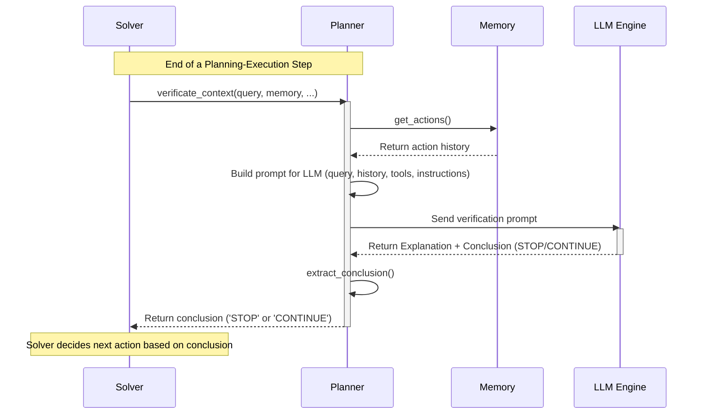

# Chapter 9: Context Verification

In the previous chapter on [Memory Management](08_memory_management_.md), we learned how `octotools` acts like a diligent detective, keeping a detailed notebook (the Memory) of every step taken and every clue found while solving your query. But how does the detective know when they've gathered enough evidence to close the case? How does `octotools` know when it has enough information to finally answer your question? That's the job of **Context Verification**.

**What Problem Does Context Verification Solve? The Quality Inspector Analogy**

Imagine a factory producing toy cars. Before a toy car is shipped, it goes through a quality control check. An inspector looks at a checklist: Are the wheels attached correctly? Is the paint job okay? Does the door open? Only when *all* checks pass does the inspector approve the car.

**Context Verification** in `octotools` is like that quality control inspector. After each step in the problem-solving process (each "action" using a tool), this verification step kicks in. It looks at:
1.  Your original question (the "product specifications").
2.  Everything learned so far and stored in [Memory Management](08_memory_management_.md) (the "product" built so far).

It then decides: "Have we met all the requirements of the original question, or do we need to do more work (run more tools)?"

Let's say you ask: "What is the capital of France, and what is its population?"
*   After Step 1, Memory might contain: `Result: "Paris"` (found the capital).
*   The Context Verification inspector checks: "Okay, we have the capital ('Paris'), but the original question *also* asked for the population. We're not done yet!" It decides: **CONTINUE**.
*   After Step 2, Memory might contain: `Step 1 Result: "Paris"`, `Step 2 Result: "Population of Paris is 2.1 million"`.
*   The inspector checks again: "We have the capital ('Paris') and the population ('2.1 million'). This seems to cover everything the user asked for." It decides: **STOP**.

Without this check, `octotools` might stop too early (missing parts of your answer) or keep running unnecessary steps. Context Verification ensures the process stops at the right time.

**How Context Verification Works in the Cycle**

Context Verification is a crucial checkpoint within the [Planning-Execution Cycle](02_planning_execution_cycle_.md). Remember the cycle: Plan -> Execute -> Memorize & Verify -> Loop/Stop? This is the "Verify" part!

1.  **Action Completed:** The [Executor](02_planning_execution_cycle_.md) finishes running a tool, and the result is stored in [Memory Management](08_memory_management_.md).
2.  **Verification Triggered:** The [Solver Framework](01_solver_framework_.md) then asks the [Planner](02_planning_execution_cycle_.md) component to perform the verification check.
3.  **Planner Analyzes:** The `Planner` looks at the complete history in Memory, comparing it against the original query and the initial [Query Analysis](03_query_analysis_.md). It uses its connection to an AI model (via [LLM Engine Integration](06_llm_engine_integration_.md)) to make this judgment.
4.  **Decision:** The `Planner` returns a conclusion:
    *   `CONTINUE`: If more information is needed to fully answer the query. The loop goes back to the "Plan" phase to figure out the next step.
    *   `STOP`: If the information in Memory is sufficient to answer the original query. The loop finishes, and the Solver proceeds to generate the final answer.

**Example Input and Output**

Let's revisit the "Capital and Population of France" example.

*   **After Step 1 (Finding Capital):**
    *   **Input to Verification (Planner):**
        *   `Query`: "What is the capital of France, and what is its population?"
        *   `Memory`: `{ "Action Step 1": {"tool": "Web_Search_Tool", "result": "Paris"} }` (Simplified)
    *   **Output from Verification (Planner):** `CONTINUE` (because population is missing)

*   **After Step 2 (Finding Population):**
    *   **Input to Verification (Planner):**
        *   `Query`: "What is the capital of France, and what is its population?"
        *   `Memory`: `{ "Action Step 1": {"result": "Paris"}, "Action Step 2": {"tool": "Web_Search_Tool", "result": "2.1 million"} }` (Simplified)
    *   **Output from Verification (Planner):** `STOP` (because both parts of the query seem answered)

**Internal Implementation: How the Planner Decides**

How does the `Planner` make this crucial STOP or CONTINUE decision? It doesn't just guess; it uses the AI's reasoning capabilities.

1.  **Gathering Context:** The `Solver` calls the `Planner`'s `verificate_context` method, passing the original `question`, `image` (if any), the initial `query_analysis`, and the current `memory` object.
2.  **Building the Prompt:** The `Planner` constructs a detailed prompt for the LLM. This prompt contains:
    *   The original query.
    *   The initial analysis of the query.
    *   The complete history of actions and results from Memory.
    *   A list of available tools (in case the LLM thinks another tool could help).
    *   Specific instructions asking the LLM to evaluate if the Memory fully addresses the query and to conclude with *either* `Conclusion: STOP` or `Conclusion: CONTINUE`.
3.  **Asking the AI:** The `Planner` sends this prompt to the configured LLM engine (using [LLM Engine Integration](06_llm_engine_integration_.md)).
4.  **Receiving the Verdict:** The LLM analyzes everything and provides a response that includes:
    *   An `Explanation` detailing its reasoning (why it thinks the task is done or what's still missing).
    *   The final `Conclusion` (either `STOP` or `CONTINUE`).
5.  **Extracting the Conclusion:** The `Planner` has a helper method (`extract_conclusion`) to reliably parse the LLM's response and get the simple `STOP` or `CONTINUE` signal.
6.  **Returning the Signal:** The `Planner` returns this signal to the `Solver`, which then decides whether to continue the loop or proceed to the final answer generation.

**Sequence Diagram: The Verification Checkpoint**



This diagram shows the `Planner` taking the lead, gathering information from `Memory`, consulting the `LLM Engine`, and returning the final verdict to the `Solver`.

**Diving Deeper into the Code (`octotools/models/planner.py`)**

Let's look at the key methods involved in the `Planner` class.

1.  **The `verificate_context` Method:** This method sets up and sends the request to the LLM.

    ```python
    # Simplified from octotools/models/planner.py
    from octotools.models.memory import Memory
    from octotools.models.formatters import MemoryVerification # Structured output helper

    class Planner:
        # ... (init, other methods like analyze_query) ...

        def verificate_context(self, question: str, image: str, query_analysis: str, memory: Memory) -> Any:
            # Get info about image, if any
            image_info = self.get_image_info(image)

            # Build the detailed prompt (see helper function structure below)
            prompt_memory_verification = self._build_verification_prompt(
                question, image_info, query_analysis, memory
            )

            # Prepare input data (prompt + image if available)
            input_data = [prompt_memory_verification]
            # ... (code to add image bytes if image_info exists) ...

            # Call the multimodal LLM, requesting structured output
            verification_response = self.llm_engine_mm(
                input_data, response_format=MemoryVerification
            )

            # Return the structured response (contains explanation and conclusion)
            return verification_response

        def _build_verification_prompt(self, q, img_info, analysis, mem) -> str:
            # Creates the detailed instructions for the LLM
            prompt = f"""
Task: Evaluate if memory COMPLETELY answers the query. Decide STOP or CONTINUE.

Query: {q}
Image Info: {img_info}
Initial Analysis: {analysis}
Memory (Actions Log): {mem.get_actions()}
Available Tools: {self.available_tools}

Instructions:
1. Analyze query, memory, and tools.
2. Does the memory fully address ALL parts of the query?
3. Are there unused tools that could add VITAL info?
4. Based ONLY on the memory, decide: STOP (fully answered) or CONTINUE (more needed).

Response Format (MUST use MemoryVerification structure):
Explanation: <Detailed justification for your decision.>
Conclusion: <MUST BE EITHER 'STOP' or 'CONTINUE'>
""" # Heavily simplified prompt
            return prompt
    ```
    *   This method gathers all necessary context (query, image info, memory history).
    *   It calls a helper (`_build_verification_prompt` shown conceptually) to create the instructions for the AI. Notice how the prompt explicitly asks the AI to compare the `Memory` against the `Query` and decide `STOP` or `CONTINUE`.
    *   It uses the multimodal LLM engine (`self.llm_engine_mm`) to get the AI's verdict, requesting a specific format (`MemoryVerification`) for easy parsing.

2.  **The `extract_conclusion` Method:** This helper parses the AI's response.

    ```python
    # Simplified from octotools/models/planner.py
    import re

    class Planner:
        # ... (init, verificate_context, etc.) ...

        def extract_conclusion(self, response: Any) -> str:
            # If response is already structured (MemoryVerification object)
            if isinstance(response, MemoryVerification):
                analysis = response.analysis # Get the explanation
                stop_signal = response.stop_signal # Get the boolean conclusion
                conclusion = 'STOP' if stop_signal else 'CONTINUE'
                return analysis, conclusion # Return explanation and signal

            # Fallback: Try parsing raw text if not structured
            else:
                raw_text = str(response)
                analysis = raw_text # Use the whole text as analysis
                # Search for 'Conclusion: STOP' or 'Conclusion: CONTINUE' (case-insensitive)
                match = re.search(r'Conclusion:\s*(STOP|CONTINUE)', raw_text, re.IGNORECASE)
                if match:
                    return analysis, match.group(1).upper() # Return STOP or CONTINUE

                # If pattern not found, check for keywords anywhere
                if 'stop' in raw_text.lower(): return analysis, 'STOP'
                if 'continue' in raw_text.lower(): return analysis, 'CONTINUE'

                # Default to CONTINUE if unsure
                print("Warning: Could not determine STOP/CONTINUE. Defaulting to CONTINUE.")
                return analysis, 'CONTINUE'

    ```
    *   This method takes the response from the LLM (which might be a structured `MemoryVerification` object or raw text).
    *   It tries to extract the `Explanation` (analysis) and the final `Conclusion` ('STOP' or 'CONTINUE').
    *   It includes fallback logic to search for keywords if the structured format isn't perfect, ensuring a decision is always made.

**Conclusion**

Context Verification is the critical quality check within `octotools`. Like an inspector signing off on a finished product, it uses the [Planner](02_planning_execution_cycle_.md) and AI reasoning to examine the gathered information in [Memory Management](08_memory_management_.md) against the original query. By deciding whether to `STOP` or `CONTINUE`, it ensures that the [Planning-Execution Cycle](02_planning_execution_cycle_.md) runs efficiently and concludes only when the query is adequately addressed. This step is vital for ensuring the final answer is complete and relevant.

Now that we know how `octotools` decides when it's finished collecting information, how do we know if the final answer it produces is actually *good*? In the final chapter, we'll explore the [Task Evaluation System](10_task_evaluation_system_.md).

---

Generated by [AI Codebase Knowledge Builder](https://github.com/The-Pocket/Tutorial-Codebase-Knowledge)