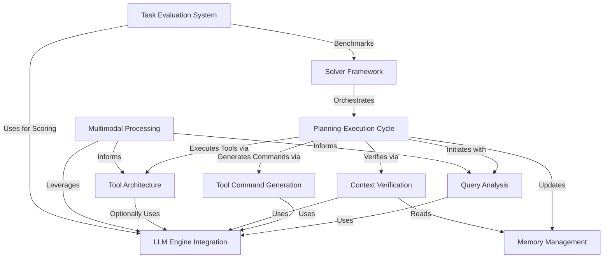

# Tutorial: octotools

`octotools` is a versatile framework designed to understand and solve user queries, including those with **images**.
It intelligently plans a series of steps, selects appropriate *Tools* from a modular architecture, and uses integrated Large Language Models (**LLMs**) to execute tasks like generating code or analyzing visuals.
The system maintains a *Memory* of its actions and verifies context before providing a final answer. It also includes a system to *evaluate* its performance on various benchmarks.

**Source Repository:** [None](None)

## Chapters

1. [Solver Framework
](01_solver_framework_.md)
2. [Planning-Execution Cycle
](02_planning_execution_cycle_.md)
3. [Query Analysis
](03_query_analysis_.md)
4. [Multimodal Processing
](04_multimodal_processing_.md)
5. [Tool Architecture
](05_tool_architecture_.md)
6. [LLM Engine Integration
](06_llm_engine_integration_.md)
7. [Tool Command Generation
](07_tool_command_generation_.md)
8. [Memory Management
](08_memory_management_.md)
9. [Context Verification
](09_context_verification_.md)
10. [Task Evaluation System
](10_task_evaluation_system_.md)

---

Generated by [AI Codebase Knowledge Builder](https://github.com/The-Pocket/Tutorial-Codebase-Knowledge)