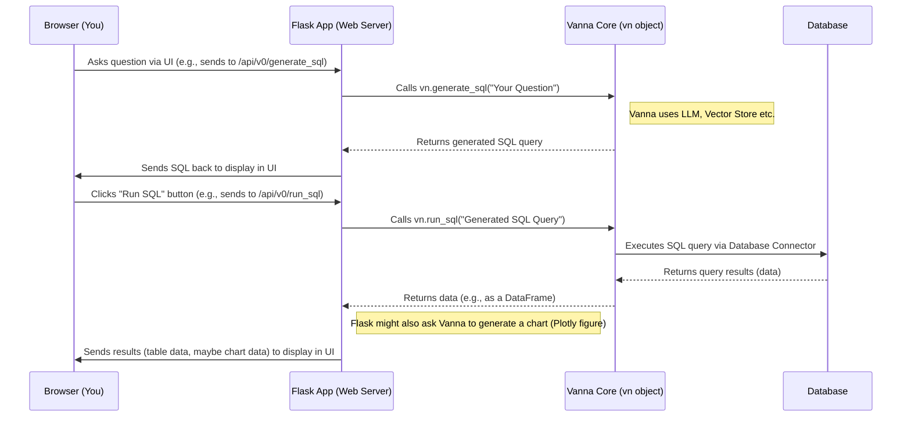

# Chapter 1: Flask API/App (Web Interface)

Welcome to the `ssadata` tutorial! We're going to explore how this project lets you "talk" to your data using plain English.

Imagine you have a magic box (`ssadata`'s core engine, Vanna) that can understand your questions about data (like "How many babies were named 'Emma' in 2022?") and automatically write the complex database code (SQL) to find the answer. That's amazing! But... how do you easily *use* this magic box? Do you need to be a Python wizard every time you have a question?

That's where our first component comes in: the **Flask API/App (Web Interface)**.

**Problem:** How can someone use the power of Vanna without needing to write or run Python code directly?
**Solution:** Wrap Vanna in a simple web application using Flask!

Think of the core Vanna engine as the powerful engine of a car. The Flask App is like the car's dashboard, steering wheel, and pedals. It gives you, the driver (or user), a familiar and easy way to control the engine and see what it's doing, all through your web browser.

## What is Flask? (A Quick Peek)

Flask is a popular Python tool (called a "microframework") for building web applications. It provides the basic building blocks needed to create websites and web APIs (Application Programming Interfaces).

**Analogy:** Imagine building something with LEGOs. Flask gives you a set of simple, standard LEGO bricks. You don't get a pre-built castle, but you get the essential pieces to build your own small web server quickly and easily.

## How the Flask App Works in `ssadata`

In `ssadata`, the Flask component (specifically the `VannaFlaskApp` class found in `src/vanna/flask/__init__.py`) takes the core Vanna logic (which we'll learn more about in [Chapter 2: VannaBase (Core Interface)](02_vannabase__core_interface__.md)) and makes it accessible over the web.

It does this by creating:

1.  **A Web Server:** It runs a tiny web server on your computer (usually accessible at `http://localhost:8084` in your browser).
2.  **API Endpoints:** These are specific URLs on that server that trigger actions. For example, visiting `/api/v0/generate_sql` tells the app, "Hey, take the user's question and ask Vanna to generate the SQL code."
3.  **A Frontend:** It serves the actual web page (HTML for structure, CSS for style, JavaScript for interactivity) that you see and interact with in your browser – the text boxes, buttons, and areas where results appear.

## Using the Web Interface: An Example

Let's walk through a typical interaction:

1.  **You Start the App:** You run a simple Python script to launch the Flask web server.

    ```python
    # Import the necessary Vanna components
    from vanna.flask import VannaFlaskApp
    # Assume 'vn' is your already set up Vanna object
    # (connected to database, maybe trained a bit)
    # e.g., from vanna.vannadb import VannaDB
    # vn = VannaDB(...)
    # vn.connect_to_sqlite('my_database.sqlite') # Example connection

    # Create the Flask App, passing in your Vanna object
    app = VannaFlaskApp(vn)

    # Start the web server (usually runs on http://localhost:8084)
    app.run()
    ```
    *Explanation:* This code imports the `VannaFlaskApp`, creates it using your configured `vn` object, and then starts the web server. You'll see a message telling you where to open it in your browser.

2.  **You Open Your Browser:** You navigate to `http://localhost:8084`. You see the `ssadata` dashboard.

3.  **You Ask a Question:** You type your question, like "What were the top 5 states with the most births in 2020?", into a text box and click "Submit".

4.  **Behind the Scenes (Simplified):**
    *   Your browser sends the question "What were the top 5 states with the most births in 2020?" to the Flask app's `/api/v0/generate_sql` endpoint.
    *   The Flask app receives this.
    *   It calls the core Vanna function: `vn.generate_sql("What were the top 5 states with the most births in 2020?")`.
    *   Vanna uses its brain ([LLM Connector (Reasoning Engine)](03_llm_connector__reasoning_engine__.md)) and memory ([Vector Store (Knowledge Storage)](05_vector_store__knowledge_storage__.md)) to figure out the correct SQL query.
    *   Vanna returns the SQL string (e.g., `SELECT state, SUM(births) as total_births FROM ssa_data WHERE year = 2020 GROUP BY state ORDER BY total_births DESC LIMIT 5`) back to the Flask app.
    *   The Flask app packages this SQL into a standard format (JSON) and sends it back to your browser.

5.  **You See the SQL:** The generated SQL query appears on the web page.

6.  **You Run the SQL:** You click a "Run SQL" button.
    *   The browser tells the Flask app (via another endpoint like `/api/v0/run_sql`).
    *   Flask tells Vanna to execute the SQL using its [Database Connector (Execution Layer)](06_database_connector__execution_layer__.md).
    *   Vanna gets the results (a table of states and birth counts) from the database.
    *   Vanna sends the results back through Flask to your browser.

7.  **You See the Results:** The results are displayed on the web page, often as a table and potentially as a chart!

## Key Features Enabled by Flask

*   **Web Dashboard:** The primary graphical interface for users.
*   **API Endpoints:** Specific URLs like `/generate_sql`, `/run_sql`, `/get_training_data`, `/generate_plotly_figure` that allow the frontend (or other programs) to interact with Vanna.
*   **No Python Needed (for End-Users):** The whole point! Ask questions, get SQL, see results via the browser.
*   **Result Display:** Shows generated SQL, data tables, and Plotly charts.
*   **Training Data Management:** Allows viewing, adding, and removing [Training Data Management (Learning Material)](07_training_data_management__learning_material__.md) through the interface (if enabled).
*   **Caching:** Temporarily stores generated SQL, results, etc., to speed things up (using `MemoryCache` by default).
*   **Authentication:** Can be configured to require login (though it uses `NoAuth` by default, meaning no login needed).

## Under the Hood: How Requests are Handled

Let's visualize the flow when you ask a question and run the SQL:



**Diving into the Code (a little bit):**

The core logic lives in `src/vanna/flask/__init__.py`.

1.  **Initialization (`VannaFlaskApp.__init__`)**: When you create `VannaFlaskApp(vn)`, it sets up the basic Flask application and configures features based on the arguments you provide (like `logo`, `title`, `chart`, `sql`, etc.).

    ```python
    # Simplified snippet from VannaFlaskApp.__init__
    class VannaFlaskApp(VannaFlaskAPI):
        def __init__(
            self,
            vn: VannaBase, # Your core Vanna object
            # ... lots of options like logo, title, features ...
            chart=True,
            sql=True,
            # ...
        ):
            # Call the parent class initializer
            super().__init__(vn, ..., chart=chart)

            # Store configuration options for the frontend
            self.config["logo"] = logo
            self.config["title"] = title
            self.config["sql"] = sql # Show SQL editor?
            self.config["chart"] = chart # Generate charts?
            # ... other configurations ...

            # Define the main route for the web page
            @self.flask_app.route('/')
            def main_page():
                # Serve the main HTML content
                return html_content # Pre-defined HTML structure
    ```
    *Explanation:* The `__init__` method configures how the web interface will look and behave based on the settings you choose when creating the `VannaFlaskApp`. It also sets up the main route `/` to serve the web page itself.

2.  **API Endpoint Definition (`@self.flask_app.route(...)`)**: Functions decorated with `@self.flask_app.route(...)` define the API endpoints.

    ```python
    # Simplified snippet from VannaFlaskAPI for generating SQL
    @self.flask_app.route("/api/v0/generate_sql", methods=["GET"])
    @self.requires_auth # Handles authentication (uses NoAuth by default)
    def generate_sql(user: any):
        question = flask.request.args.get("question") # Get question from URL
        # ... (error handling) ...

        # Use the Vanna object (self.vn) passed during initialization
        sql = self.vn.generate_sql(question=question)

        # Use the cache object (self.cache)
        id = self.cache.generate_id()
        self.cache.set(id=id, field="sql", value=sql)
        # ... (cache question too) ...

        # Send response back to browser as JSON
        return flask.jsonify({"type": "sql", "id": id, "text": sql})
    ```
    *Explanation:* This shows how a specific URL (`/api/v0/generate_sql`) is linked to a Python function. The function gets data from the web request (`flask.request`), uses the core `self.vn` object ([VannaBase (Core Interface)](02_vannabase__core_interface__.md)) to do the work, potentially uses the cache, and sends back a structured response using `flask.jsonify`.

## Conclusion

The Flask API/App is the friendly face of `ssadata`. It transforms the powerful but code-heavy Vanna engine into an accessible web-based tool. It handles incoming requests from your browser, talks to the core Vanna components to get work done (like generating SQL or running queries), and sends the results back to be displayed on the web page. This makes it easy for anyone to start asking questions of their data.

Now that we've seen the user-friendly interface, let's peel back the next layer and look at the central orchestrator within Vanna itself.

Ready to dive deeper? Let's explore the core! [Chapter 2: VannaBase (Core Interface)](02_vannabase__core_interface__.md)

---

Generated by [AI Codebase Knowledge Builder](https://github.com/The-Pocket/Tutorial-Codebase-Knowledge)