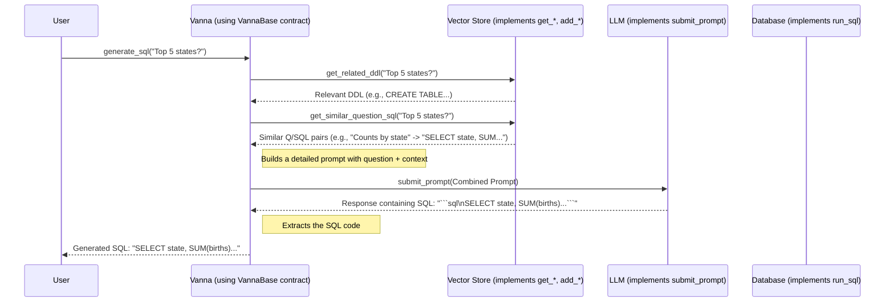

# Chapter 2: VannaBase (Core Interface)

Welcome back! In [Chapter 1: Flask API/App (Web Interface)](01_flask_api_app__web_interface__.md), we saw how `ssadata` provides a user-friendly web dashboard to interact with Vanna, the core "question-to-SQL" engine. We learned that the Flask app acts like the car's dashboard, letting you steer the engine without needing to be a mechanic.

But what *is* that engine, exactly? How does Vanna ensure that no matter which specific AI model (like GPT-4 or a local model) or knowledge storage (like ChromaDB or Pinecone) you use, the basic operations remain the same?

**Problem:** How can we build a flexible system where different components (AI models, databases, vector stores) can be swapped in and out, but the core way we interact with the system (asking questions, training it) stays consistent?
**Solution:** Define a standard contract or blueprint that *every* Vanna setup must follow. This blueprint is called **`VannaBase`**.

Think of `VannaBase` as the official job description for being a "Vanna Question-to-SQL Translator". It doesn't tell you *exactly* how to do the job (e.g., which specific language model to use), but it lists the *required skills* you absolutely must have.

## What is `VannaBase`? (The Blueprint)

`VannaBase` is a special type of class in Python called an **Abstract Base Class (ABC)**. Don't let the fancy name scare you!

**Analogy:** Imagine you want to build different types of vehicles (cars, trucks, motorcycles). An ABC is like a basic vehicle checklist:
*   Must have an engine.
*   Must have wheels.
*   Must be able to start.
*   Must be able to stop.
*   Must be able to steer.

The checklist (`VannaBase`) defines *what* capabilities are needed. The specific implementations (a `SportsCar` class, a `PickupTruck` class) then provide the *how* – a V8 engine vs. an electric motor, four wheels vs. two, power steering vs. manual.

`VannaBase` defines the essential functions that any complete Vanna system needs to provide. It acts as the central interface or "contract".

## Key Skills Required by `VannaBase`

`VannaBase` outlines several key capabilities (as methods) that concrete Vanna implementations must provide. Here are the main ideas:

1.  **Connecting (`connect_to_*`)**: Methods to establish a connection with the actual database where your data lives. This is handled by the [Database Connector (Execution Layer)](06_database_connector__execution_layer__.md).
2.  **Learning (`add_*`, `train`)**: Methods to teach Vanna about your data. This involves:
    *   Adding database structure info (DDL - `add_ddl`).
    *   Adding example question-SQL pairs (`add_question_sql`).
    *   Adding helpful documentation (`add_documentation`).
    These are stored efficiently, often using a [Vector Store (Knowledge Storage)](05_vector_store__knowledge_storage__.md) and managed via [Training Data Management (Learning Material)](07_training_data_management__learning_material__.md).
3.  **Remembering (`get_*`)**: Methods to retrieve relevant information Vanna has learned when answering a new question (e.g., `get_related_ddl`, `get_similar_question_sql`). This usually involves searching the [Vector Store (Knowledge Storage)](05_vector_store__knowledge_storage__.md).
4.  **Thinking (`submit_prompt`)**: The method that takes a carefully constructed prompt (containing the user's question and relevant context) and sends it to the underlying Large Language Model (LLM) for processing. This is the job of the [LLM Connector (Reasoning Engine)](03_llm_connector__reasoning_engine__.md).
5.  **Answering (`generate_sql`, `ask`)**: High-level methods that orchestrate the other skills. You give it a question, and it uses the `get_*` methods to find context, constructs a prompt (see [Prompt Engineering (Guiding the LLM)](04_prompt_engineering__guiding_the_llm__.md)), uses `submit_prompt` to ask the LLM, and returns the SQL query.
6.  **Executing (`run_sql`)**: The method to actually run the generated SQL query against your database using the [Database Connector (Execution Layer)](06_database_connector__execution_layer__.md).

**Important:** `VannaBase` itself doesn't contain the *code* for most of these skills (they are "abstract"). It just declares that these skills *must exist*. Specific classes like `VannaOpenAI` (using OpenAI's LLM) or `VannaChromaDB` (using ChromaDB for storage) then provide the actual code to perform these actions.

## How it Works Together: Asking a Question

Let's trace how `VannaBase` enables the core "ask a question, get SQL" workflow. When you call a method like `vn.generate_sql(question)` (where `vn` is your specific Vanna setup), here's a simplified view of what happens, orchestrated by the logic defined within or using the `VannaBase` contract:

1.  **Retrieve Context:** The `generate_sql` method calls `get_related_ddl`, `get_similar_question_sql`, and `get_related_documentation`. These methods (implemented by your chosen [Vector Store (Knowledge Storage)](05_vector_store__knowledge_storage__.md)) fetch relevant information based on your question.
2.  **Build Prompt:** Using the retrieved context and your original question, a detailed prompt is assembled. This process is crucial for guiding the AI (see [Prompt Engineering (Guiding the LLM)](04_prompt_engineering__guiding_the_llm__.md)).
3.  **Consult LLM:** The assembled prompt is sent to the AI model via the `submit_prompt` method (implemented by your chosen [LLM Connector (Reasoning Engine)](03_llm_connector__reasoning_engine__.md)).
4.  **Receive SQL:** The LLM processes the prompt and sends back its best guess for the SQL query.
5.  **Extract & Return:** The raw response from the LLM might contain extra text. Helper functions extract just the SQL code, which is then returned to you.

Here's a diagram showing this interaction:



## Using a Vanna Object (Based on `VannaBase`)

You typically don't interact with `VannaBase` directly. Instead, you create an object from a *concrete* class that *inherits* from `VannaBase` (like `VannaOpenAI`, `VannaMistral`, combined with a vector store like `VannaChromaDB`). Thanks to `VannaBase`, all these objects will have the same core methods available:

```python
# Assume 'vn' is an object created from a class that implements VannaBase
# For example:
# from vanna.openai import OpenAI_Chat # LLM Connector implementation
# from vanna.chromadb import ChromaDB_VectorStore # Vector Store implementation
# class MyVanna(ChromaDB_VectorStore, OpenAI_Chat): # Combine implementations
#     def __init__(self, config=None):
#         ChromaDB_VectorStore.__init__(self, config=config)
#         OpenAI_Chat.__init__(self, config=config)
# vn = MyVanna(config={'api_key': 'sk-...', 'model': 'gpt-4'})

# -- Common Interaction Pattern --

# 1. Connect to the database (uses a DB connector implementation)
# vn.connect_to_sqlite('ssadata.db')
# print("Connected to database.")

# 2. Train Vanna with knowledge (uses vector store implementation)
# vn.train(ddl="CREATE TABLE ssa_data (year INT, state TEXT, births INT)")
# vn.train(question="Total births per year", sql="SELECT year, SUM(births) FROM ssa_data GROUP BY year")
# print("Training data added.")

# 3. Ask a question (orchestrates get_*, submit_prompt using specific implementations)
question = "How many births in California in 2021?"
print(f"Asking: {question}")
# The generate_sql method is guaranteed by VannaBase
generated_sql = vn.generate_sql(question)
print(f"Generated SQL: {generated_sql}") # Output depends on LLM and training

# 4. Run the SQL (uses the DB connector implementation)
# The run_sql method is guaranteed by VannaBase
# results_df = vn.run_sql(generated_sql)
# print("Results:")
# print(results_df) # Shows a table (DataFrame) with the answer
```

**Explanation:** Even though `MyVanna` might use OpenAI and ChromaDB behind the scenes, you interact with it using standard methods like `connect_to_sqlite`, `train`, and `generate_sql`. `VannaBase` ensures this consistency. You could swap `OpenAI_Chat` for `Mistral_Chat` and the way you *call* `vn.generate_sql` wouldn't change.

## Under the Hood: `VannaBase` Code

The definition of `VannaBase` lives in `src/vanna/base/base.py`. It uses Python's `abc` module.

```python
# Simplified snippet from src/vanna/base/base.py
from abc import ABC, abstractmethod # Import Abstract Base Class tools
from typing import List, Any
import pandas as pd

# VannaBase inherits from ABC, marking it as an abstract class
class VannaBase(ABC):

    def __init__(self, config=None):
        # Basic setup, stores configuration
        self.config = config if config else {}
        self.run_sql_is_set = False # Flag to check if DB connection is ready
        # ... other initial setup ...

    # --- Abstract Methods (The "Must Have" Skills) ---
    # Subclasses MUST provide their own implementation for these

    @abstractmethod
    def generate_embedding(self, data: str, **kwargs) -> List[float]:
        """Turns text into a list of numbers (vector) for similarity search."""
        # No code here! Subclass (e.g., using OpenAI) must implement this.
        pass

    @abstractmethod
    def submit_prompt(self, prompt: Any, **kwargs) -> str:
        """Sends the completed prompt to the LLM and gets the raw response."""
        # No code here! Subclass (e.g., calling an LLM API) must implement this.
        pass

    @abstractmethod
    def add_ddl(self, ddl: str, **kwargs) -> str:
        """Stores DDL information (e.g., in a vector database)."""
        # No code here! Subclass (e.g., ChromaDB) must implement this.
        pass

    @abstractmethod
    def get_related_ddl(self, question: str, **kwargs) -> list:
        """Retrieves DDL relevant to the question."""
        # No code here! Subclass (e.g., ChromaDB) must implement this.
        pass

    @abstractmethod
    def run_sql(self, sql: str, **kwargs) -> pd.DataFrame:
        """Runs SQL on the connected database."""
        # Default implementation raises an error, needs connection first.
        raise Exception("Connect to a database first...")
        # Subclass connected via connect_to_* provides the actual execution.

    # --- Concrete Methods (Orchestration) ---
    # These often use the abstract methods above

    def generate_sql(self, question: str, allow_llm_to_see_data=False, **kwargs) -> str:
        # Simplified logic shown here:
        print(f"Generating SQL for: {question}")

        # 1. Call abstract methods to get context
        ddl_list = self.get_related_ddl(question, **kwargs) # Calls implementation in subclass
        question_sql_list = self.get_similar_question_sql(question, **kwargs) # Calls implementation
        doc_list = self.get_related_documentation(question, **kwargs) # Calls implementation
        print(f"  - Retrieved context (DDL: {len(ddl_list)}, Q/SQL: {len(question_sql_list)}, Docs: {len(doc_list)})")

        # 2. Build the prompt (details in Chapter 4)
        prompt = self.get_sql_prompt(
            question=question,
            ddl_list=ddl_list,
            question_sql_list=question_sql_list,
            doc_list=doc_list,
            # ... other args ...
        )
        print("  - Built prompt for LLM")

        # 3. Call abstract method to send prompt to LLM
        llm_response = self.submit_prompt(prompt, **kwargs) # Calls implementation in subclass
        print("  - Got response from LLM")

        # 4. Extract SQL (helper method)
        extracted_sql = self.extract_sql(llm_response)
        print("  - Extracted SQL")

        return extracted_sql

    # ... many other methods like ask(), train(), connect_to_*, get_sql_prompt() ...
```

**Explanation:**
*   `class VannaBase(ABC):` declares it as an abstract base class.
*   `@abstractmethod` decorator: This is the key! It marks methods like `generate_embedding`, `submit_prompt`, `add_ddl`, `get_related_ddl` as required. Any class trying to inherit from `VannaBase` *must* provide its own working version of these methods, otherwise Python will raise an error.
*   Methods *without* `@abstractmethod` (like `generate_sql`): These are concrete methods. They often contain the orchestration logic, calling the abstract methods to get work done without needing to know the specific details of *how* those abstract methods are implemented in the subclass.

## Conclusion

`VannaBase` is the foundation of Vanna's flexibility. It's the central contract or blueprint that defines the essential capabilities every Vanna setup needs: connecting to data, learning, remembering, thinking (LLM interaction), answering, and executing. By defining *what* needs to be done (the interface) but leaving the *how* (the implementation) to specific subclasses, `VannaBase` allows you to mix and match different LLMs, vector stores, and database connectors while keeping the core interaction consistent.

Now that we understand the overall blueprint, let's zoom in on one of the key implementers of this contract: the component responsible for the "thinking" part.

Ready to meet the brains of the operation? Let's move on to [Chapter 3: LLM Connector (Reasoning Engine)](03_llm_connector__reasoning_engine__.md)!

---

Generated by [AI Codebase Knowledge Builder](https://github.com/The-Pocket/Tutorial-Codebase-Knowledge)