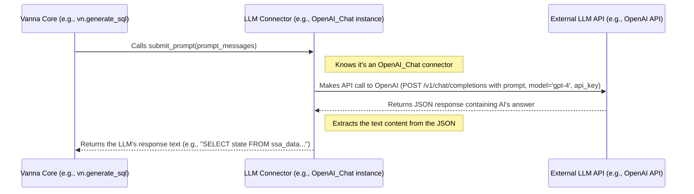

# Chapter 3: LLM Connector (Reasoning Engine)

Welcome back! In [Chapter 2: VannaBase (Core Interface)](02_vannabase__core_interface__.md), we learned about `VannaBase`, the essential blueprint or contract that defines *what* any Vanna system must be able to do. It's like the job description for our "question-to-SQL" translator.

Now, let's focus on a key part of that job: the "thinking" or "reasoning" component. When Vanna needs to generate a SQL query based on your question and the relevant context it found, it doesn't actually *know* SQL itself. It needs to consult an expert.

**Problem:** How does Vanna actually "talk" to the powerful Artificial Intelligence (AI) model – the Large Language Model (LLM) – that acts as the expert brain to generate the SQL code, explain results, or ask clarifying questions? Different LLMs (like OpenAI's GPT-4, Anthropic's Claude, Mistral models, or models you run locally) have different ways of being communicated with.
**Solution:** Use a dedicated component called the **LLM Connector**.

Think of the LLM as a brilliant but highly specialized expert who only speaks a particular technical language (their API). The LLM Connector is like Vanna's dedicated **translator and communicator**. It knows exactly how to format Vanna's request (the prompt, containing your question and context) into the specific language the chosen LLM expert understands, send the message, and then translate the expert's answer back for Vanna.

## What Does the LLM Connector Do?

The LLM Connector is responsible for one crucial task defined in the [VannaBase (Core Interface)](02_vannabase__core_interface__.md) contract: implementing the `submit_prompt` method.

Its main jobs are:

1.  **Receive the Prompt:** It takes the fully assembled prompt from Vanna. This prompt includes your original question plus all the helpful context (like table structures and similar past questions) gathered by Vanna (we'll learn more about how this prompt is built in [Chapter 4: Prompt Engineering (Guiding the LLM)](04_prompt_engineering__guiding_the_llm__.md)).
2.  **Format for the Specific LLM:** Different LLMs expect messages formatted in slightly different ways. The connector ensures the prompt is structured correctly for the specific LLM being used (e.g., OpenAI, Mistral, Google Gemini, Ollama).
3.  **Send to LLM:** It handles the technical details of making the API call (sending the request over the internet or to a local process) to the chosen LLM service. This often involves authentication (like using an API key).
4.  **Receive and Process Response:** It gets the raw answer back from the LLM and usually extracts the main text content, which Vanna can then use (e.g., extracting the SQL code from the LLM's explanation).

**Analogy:** Imagine you need advice from different experts: one speaks only French (Claude), one only Mandarin (GPT-4), and one only via formal letters (a local model). The LLM Connector is like having three different assistants. You give your request (the prompt) to the appropriate assistant, and they handle translating it, sending it via the correct channel (phone call, email, letter), getting the reply, and translating it back for you.

## Flexibility: Plugging in Different "Brains"

One of the great things about Vanna's design, using the [VannaBase (Core Interface)](02_vannabase__core_interface__.md) blueprint, is that you can choose which LLM Connector (and therefore which LLM "brain") you want to use. Vanna provides connectors for many popular LLMs.

Here's how you might set up Vanna using different LLM Connectors (we're simplifying and assuming the Vector Store part is handled separately for now):

**Example 1: Using OpenAI's GPT model**

```python
# Import the necessary components
from vanna.openai import OpenAI_Chat # The LLM Connector for OpenAI
from vanna.chromadb import ChromaDB_VectorStore # For knowledge storage (Chapter 5)

# Define a class combining the LLM Connector and Vector Store
class MyVannaOpenAI(ChromaDB_VectorStore, OpenAI_Chat):
    def __init__(self, config=None):
        # Set up the storage part
        ChromaDB_VectorStore.__init__(self, config=config)
        # Set up the OpenAI LLM Connector part
        OpenAI_Chat.__init__(self, config=config)

# Create the Vanna instance, providing configuration
vn = MyVannaOpenAI(config={'api_key': 'sk-...your-openai-key...',
                           'model': 'gpt-4'}) # Specify the OpenAI model

# Now you can use 'vn' as usual
# sql = vn.generate_sql("How many states are there?")
# print(sql) # This will use GPT-4 via the OpenAI_Chat connector
```

*Explanation:* This code sets up Vanna to use `OpenAI_Chat` as its LLM Connector. When you call `vn.generate_sql`, `OpenAI_Chat`'s `submit_prompt` method will be used behind the scenes to talk to the OpenAI API using your API key and the specified model (`gpt-4`).

**Example 2: Using a locally running model via Ollama**

```python
# Import different components
from vanna.ollama import Ollama # The LLM Connector for Ollama
from vanna.chromadb import ChromaDB_VectorStore # For knowledge storage (Chapter 5)

# Define a class combining Ollama and ChromaDB
class MyVannaOllama(ChromaDB_VectorStore, Ollama):
    def __init__(self, config=None):
        # Set up the storage part
        ChromaDB_VectorStore.__init__(self, config=config)
        # Set up the Ollama LLM Connector part
        Ollama.__init__(self, config=config)

# Create the Vanna instance, configuring Ollama
# Assumes Ollama server is running locally
vn_local = MyVannaOllama(config={'model': 'llama3.1'}) # Specify the Ollama model

# You use 'vn_local' the exact same way!
# sql_local = vn_local.generate_sql("How many states are there?")
# print(sql_local) # This will use llama3.1 via the Ollama connector
```

*Explanation:* This code sets up Vanna to use `Ollama` as its LLM Connector. It expects an Ollama server running locally (often at `http://localhost:11434`) and will use the `llama3.1` model. Notice that the way you call `vn_local.generate_sql` is *identical* to the OpenAI example. The `Ollama` connector handles the specifics of talking to the local Ollama server.

This flexibility allows you to choose the LLM that best suits your needs, budget, or privacy requirements, without changing how you interact with the core Vanna functionality thanks to the standard interface defined by [VannaBase (Core Interface)](02_vannabase__core_interface__.md).

## Under the Hood: How `submit_prompt` Works

Let's peek behind the curtain. When Vanna's `generate_sql` (or `ask`) method needs the LLM's help, it eventually calls the `submit_prompt` method on the *specific* LLM Connector object you configured (like `OpenAI_Chat` or `Ollama`).

Here's a simplified step-by-step:

1.  **Vanna Calls `submit_prompt`:** Vanna Core passes the carefully constructed prompt (a list of messages, often alternating between "system", "user", and "assistant" roles) to the LLM Connector's `submit_prompt` method.
2.  **Connector Prepares Request:** The connector takes the prompt and formats it according to the specific requirements of the LLM's API. This might involve setting parameters like the model name, temperature (creativity level), maximum output length, etc. It also prepares authentication details (like API keys).
3.  **Connector Makes API Call:** The connector sends the formatted request to the LLM's endpoint (either a URL on the internet for cloud services like OpenAI/Anthropic or a local address for Ollama/vLLM).
4.  **LLM Processes & Responds:** The external LLM receives the request, processes the prompt using its massive neural network, and generates a response (containing the SQL, explanation, or follow-up questions).
5.  **Connector Receives & Returns Response:** The connector gets the raw response back from the LLM API (usually in a format like JSON). It extracts the useful text content and returns it as a string to the Vanna Core logic that called it.

Here's a diagram visualizing this flow:



## Diving into Code (Simplified Examples)

Let's look at simplified versions of the `submit_prompt` method in two different connectors.

**1. OpenAI Connector (`src/vanna/openai/openai_chat.py`)**

```python
# Simplified snippet from OpenAI_Chat.submit_prompt
from openai import OpenAI # Import the OpenAI library

class OpenAI_Chat(VannaBase):
    # ... (initialization sets up self.client with API key) ...

    def submit_prompt(self, prompt, **kwargs) -> str:
        # Get the configured OpenAI client
        # self.client = OpenAI(api_key=...) # Setup during init

        # Use the client to call the OpenAI API's chat completions endpoint
        print(f"Sending prompt to OpenAI model: {self.config.get('model', 'default')}")
        response = self.client.chat.completions.create(
            model=self.config.get('model', 'gpt-3.5-turbo'), # Use configured model
            messages=prompt, # The list of messages Vanna prepared
            temperature=self.config.get('temperature', 0.2), # Control creativity
            # ... other parameters like stop sequences ...
        )
        print("Received response from OpenAI")

        # Extract the text content from the first choice in the response
        message_content = response.choices[0].message.content
        return message_content
```

*Explanation:* This code uses the official `openai` Python library. It calls `self.client.chat.completions.create`, passing the prompt messages and configuration details like the model name. It then digs into the response structure (`response.choices[0].message.content`) to pull out the text generated by the LLM.

**2. Ollama Connector (`src/vanna/ollama/ollama.py`)**

```python
# Simplified snippet from Ollama.submit_prompt
import ollama # Import the Ollama library

class Ollama(VannaBase):
    # ... (initialization sets up self.ollama_client and model) ...

    def submit_prompt(self, prompt, **kwargs) -> str:
        # Get the configured Ollama client and model
        # self.ollama_client = ollama.Client(host=...) # Setup during init
        # self.model = "llama3.1" # Set during init

        # Use the Ollama client to call the local Ollama server's chat endpoint
        print(f"Sending prompt to Ollama model: {self.model}")
        response_dict = self.ollama_client.chat(
            model=self.model, # Use the configured local model
            messages=prompt, # The list of messages Vanna prepared
            stream=False, # Don't stream the response
            options=self.ollama_options # Pass options like temperature etc.
            # ... other parameters like keep_alive ...
        )
        print("Received response from Ollama")

        # Extract the text content from the response dictionary
        message_content = response_dict['message']['content']
        return message_content
```

*Explanation:* This code uses the `ollama` Python library. It calls `self.ollama_client.chat`, passing the prompt and model name. Ollama runs locally, so this sends the request to your local machine. The response is a dictionary, and the code extracts the message content from `response_dict['message']['content']`.

These examples show how each connector implements the *same* `submit_prompt` function from the [VannaBase (Core Interface)](02_vannabase__core_interface__.md) contract but uses different libraries and API calls specific to the LLM it's designed for.

## Conclusion

The LLM Connector is Vanna's specialized communicator, responsible for the crucial step of talking to the external AI "brain". It takes the prompt prepared by Vanna, sends it to the chosen LLM (OpenAI, Ollama, Mistral, etc.) using the correct format and protocol, and returns the LLM's response. This abstraction allows Vanna to be flexible, supporting various LLMs without changing its core logic. You simply plug in the connector for the brain you want to use!

We've seen how Vanna gets context ([Vector Store (Knowledge Storage)](05_vector_store__knowledge_storage__.md)) and how it talks to the LLM (LLM Connector). But how does Vanna know *what* to say to the LLM to get the best possible SQL query? The quality of the prompt is critical.

Ready to learn how to craft effective prompts? Let's explore [Chapter 4: Prompt Engineering (Guiding the LLM)](04_prompt_engineering__guiding_the_llm__.md)!

---

Generated by [AI Codebase Knowledge Builder](https://github.com/The-Pocket/Tutorial-Codebase-Knowledge)