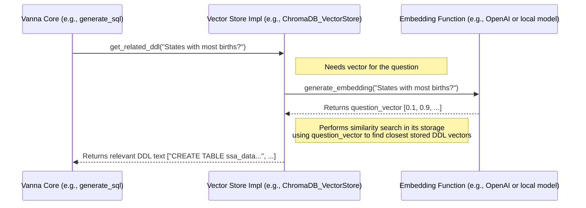

# Chapter 5: Vector Store (Knowledge Storage)

Welcome back! In [Chapter 4: Prompt Engineering (Guiding the LLM)](04_prompt_engineering__guiding_the_llm__.md), we learned how Vanna constructs detailed instructions (prompts) to guide the AI (LLM) in generating accurate SQL. We saw that these prompts include not just the user's question, but also crucial context like database table structures (DDL), similar question/SQL examples, and helpful documentation.

But where does Vanna *get* all that context from? Does it scan the entire database documentation every single time you ask a question? That would be incredibly slow and inefficient!

**Problem:** How can Vanna quickly find the *most relevant* pieces of information about your database (like the specific tables related to "births" or examples of queries involving "top 5") when you ask a new question? Vanna needs a way to store and rapidly search its knowledge.
**Solution:** Use a specialized database called a **Vector Store**.

Think of the Vector Store as Vanna's **long-term memory** or a highly organized **knowledge library**. It's specifically designed to store pieces of text information (like table definitions, documentation snippets, or question-SQL pairs) and retrieve them based on *meaning* or *relevance* to your current question.

## What is a Vector Store? (The Library Analogy)

Imagine a library where books aren't just organized alphabetically, but by their *topic* and *meaning*. You could go to the librarian (the Vector Store) and say, "I'm interested in baby name trends in recent years," and they could instantly point you to the most relevant books and articles, even if they don't contain those exact words.

That's essentially what a Vector Store does for Vanna. It stores information like:

*   **Database Schema (DDL):** `CREATE TABLE` statements that define your tables and columns.
*   **Documentation:** Helpful notes or descriptions about tables, columns, or business logic.
*   **Question-SQL Pairs:** Examples of past questions and the correct SQL queries that answered them.

**How does it search by meaning?**

1.  **Vectors (The Magic):** When Vanna adds information to the Vector Store, it first uses a special function (an "embedding function," often related to the [LLM Connector (Reasoning Engine)](03_llm_connector__reasoning_engine__.md)) to convert the text into a list of numbers called a **vector**. This vector represents the text's meaning or semantic location in a high-dimensional "meaning space." Think of it like giving each piece of information coordinates on a complex map of concepts.
2.  **Similarity Search:** When you ask a question, Vanna converts *your question* into a vector using the same function. It then asks the Vector Store: "Find the stored information whose vectors are closest to my question's vector on the map." The Vector Store is optimized for this kind of "nearest neighbor" search.

This allows Vanna to find relevant DDL or examples even if your question uses slightly different wording than the stored information.

**Different Technologies:** Just like there are different library organization systems, there are different technologies that can act as a Vector Store. Vanna supports several popular ones, including:
*   ChromaDB (often used by default for local setups)
*   Pinecone
*   Qdrant
*   Marqo
*   Azure AI Search
*   Milvus
*   Weaviate
*   And others!

## How Vanna Uses the Vector Store

The Vector Store implements key methods defined in the [VannaBase (Core Interface)](02_vannabase__core_interface__.md) contract, primarily related to adding and retrieving training data.

1.  **Storing Knowledge (`add_*` methods):**
    *   When you "train" Vanna using `vn.train(ddl="...")` or `vn.train(question="...", sql="...")` or `vn.train(documentation="...")`, Vanna takes the provided text.
    *   It calls its internal `generate_embedding` function to create a vector representation of that text.
    *   It then calls the appropriate method on the Vector Store component (e.g., `add_ddl`, `add_question_sql`, `add_documentation`) to store both the original text and its vector representation.

    ```python
    # Conceptual Example: Adding knowledge to the Vector Store
    # (Assuming 'vn' is configured with a Vector Store)

    # Adds DDL, generates embedding, stores in Vector Store
    vn.train(ddl="CREATE TABLE ssa_data (year INT, state TEXT, births INT)")
    print("Stored DDL information.")

    # Adds Q/SQL pair, generates embedding (likely of question or pair), stores
    vn.train(question="Total births per year", sql="SELECT year, SUM(births) FROM ssa_data GROUP BY year")
    print("Stored an example question-SQL pair.")

    # Adds documentation, generates embedding, stores
    vn.train(documentation="The ssa_data table contains US baby name statistics.")
    print("Stored documentation.")
    ```
    *Explanation:* Each `vn.train()` call results in data being converted to a vector and saved in the configured Vector Store (like ChromaDB).

2.  **Retrieving Knowledge (`get_*` methods):**
    *   When you ask a question using `vn.generate_sql("Your question?")`, Vanna needs context for the prompt.
    *   It converts your question into a vector using `generate_embedding`.
    *   It then calls methods like `get_related_ddl(question_vector)`, `get_similar_question_sql(question_vector)`, and `get_related_documentation(question_vector)` on the Vector Store component.
    *   The Vector Store uses the question's vector to perform a similarity search and returns the text of the most relevant stored items (DDL, Q/SQL pairs, docs).
    *   This retrieved context is then passed to the prompt generation logic discussed in [Chapter 4: Prompt Engineering (Guiding the LLM)](04_prompt_engineering__guiding_the_llm__.md).

    ```python
    # Conceptual Example: Retrieving knowledge during question answering
    question = "What are the states with the most births in 2021?"
    print(f"Asking: {question}")

    # Inside vn.generate_sql(question)... (Simplified)
    # 1. Generate embedding for the question
    # question_vector = vn.generate_embedding(question)

    # 2. Query the Vector Store for relevant context
    # relevant_ddl = vn.get_related_ddl(question) # Calls Vector Store's search
    # similar_qs = vn.get_similar_question_sql(question) # Calls Vector Store's search
    # relevant_docs = vn.get_related_documentation(question) # Calls Vector Store's search
    # print(f"  - Retrieved context from Vector Store: DDL, {len(similar_qs)} similar questions, docs")

    # 3. Build prompt using the retrieved context (Chapter 4)
    # prompt = build_prompt(question, relevant_ddl, similar_qs, relevant_docs)

    # 4. Send prompt to LLM (Chapter 3)
    # sql_response = vn.submit_prompt(prompt)

    # 5. Extract SQL
    # generated_sql = extract_sql(sql_response)
    # print(f"Generated SQL (using context from Vector Store): {generated_sql}")

    # This calls the full Vanna process, which uses the Vector Store internally
    generated_sql_actual = vn.generate_sql(question)
    print(f"Actual Generated SQL: {generated_sql_actual}")
    ```
    *Explanation:* The `vn.generate_sql` function relies heavily on the Vector Store's ability to quickly find relevant pieces of stored knowledge (DDL, Q/SQL, docs) based on the meaning of the input question.

## Flexibility: Choosing Your Vector Store

Vanna's architecture allows you to choose the Vector Store technology that fits your needs. You typically combine a Vector Store implementation with an [LLM Connector (Reasoning Engine)](03_llm_connector__reasoning_engine__.md) when setting up Vanna.

**Example: Using ChromaDB (often the default local option)**

```python
# Import the specific Vector Store and LLM Connector
from vanna.chromadb import ChromaDB_VectorStore
from vanna.openai import OpenAI_Chat # Example LLM Connector

# Define your Vanna class by inheriting from both
class MyVanna(ChromaDB_VectorStore, OpenAI_Chat):
    def __init__(self, config=None):
        # Initialize the ChromaDB Vector Store part
        # 'path' tells ChromaDB where to save its files locally
        ChromaDB_VectorStore.__init__(self, config={'path': './my_chroma_db'})

        # Initialize the OpenAI LLM Connector part
        OpenAI_Chat.__init__(self, config=config)

# Create an instance (replace with your actual API key)
# vn = MyVanna(config={'api_key': 'sk-...'})

# Now 'vn' uses ChromaDB for storage and retrieval
# vn.train(ddl="...") # Will store in ChromaDB in the './my_chroma_db' folder
# sql = vn.generate_sql("...") # Will query ChromaDB for context
```
*Explanation:* This code creates a Vanna setup that specifically uses `ChromaDB_VectorStore` for its knowledge storage needs. When `vn.train` or `vn.generate_sql` are called, the methods defined within `ChromaDB_VectorStore` (like `add_ddl`, `get_related_ddl`) will be executed to interact with the local ChromaDB database. You could easily swap `ChromaDB_VectorStore` for `PineconeDB_VectorStore` (with appropriate configuration) to use Pinecone instead, without changing how you call `vn.train` or `vn.generate_sql`.

## Under the Hood: Storing and Searching

Let's visualize the process when Vanna retrieves related DDL using the Vector Store.



**Diving into Code (Simplified Examples)**

Let's look at simplified code for adding and getting DDL from a hypothetical Vector Store implementation like `ChromaDB_VectorStore` (actual code in `src/vanna/chromadb/chromadb_vector.py`).

**1. Adding DDL (`add_ddl`)**

```python
# Simplified snippet from a Vector Store implementation (e.g., ChromaDB)
import chromadb # The library for the specific vector store
import json
from vanna.utils import deterministic_uuid

class SomeVectorStore(VannaBase):
    # ... (Initialization sets up self.chroma_client, self.ddl_collection) ...
    # self.embedding_function is also set up (e.g., using OpenAI or SentenceTransformers)

    def generate_embedding(self, data: str, **kwargs) -> List[float]:
        # Calls the underlying embedding model
        # simplified_embedding = self.embedding_function.encode(data).tolist()
        # return simplified_embedding
        pass # Actual implementation varies

    def add_ddl(self, ddl: str, **kwargs) -> str:
        if ddl is None or not ddl.strip():
            return

        # 1. Prepare the data and metadata
        dataset = kwargs.get("dataset", "default")
        doc_type = "ddl"
        document = {"dataset": dataset, doc_type: ddl}
        metadata = {"doc_type": doc_type}
        doc_json = json.dumps(document, ensure_ascii=False)

        # 2. Generate the embedding for the DDL content
        # Note: We embed the JSON representation to potentially capture metadata context
        embedding_vector = self.generate_embedding(doc_json)

        # 3. Generate a unique ID (often based on content for consistency)
        doc_id = f"{deterministic_uuid(doc_json)}-{doc_type}"

        # 4. Add to the specific ChromaDB collection for DDL
        print(f"  - Storing DDL with ID {doc_id} in vector store")
        self.ddl_collection.add(
            documents=[doc_json],    # Store the JSON string
            embeddings=[embedding_vector], # Store the vector
            metadatas=[metadata],      # Store metadata
            ids=[doc_id]             # Store the unique ID
        )

        return doc_id
```
*Explanation:* The `add_ddl` method takes the DDL text, creates a JSON representation (potentially with metadata like `dataset`), generates a numerical vector (`embedding_vector`) for it using an embedding function, creates a unique ID, and then uses the specific Vector Store library (here, `chromadb`) to add the original data (as JSON), its vector, metadata, and ID to the designated storage area (`self.ddl_collection`).

**2. Getting Related DDL (`get_related_ddl`)**

```python
# Simplified snippet from a Vector Store implementation (e.g., ChromaDB)

class SomeVectorStore(VannaBase):
    # ... (Initialization, generate_embedding as before) ...

    @staticmethod
    def _extract_documents(query_results) -> list:
        # Helper to get text back from query results
        documents = []
        if query_results and "documents" in query_results:
             # Results might be nested, extract the list of document strings
            docs_list = query_results["documents"][0]
            for doc_json in docs_list:
                try:
                    # Parse the JSON string back into a dictionary
                    doc_dict = json.loads(doc_json)
                    # Extract the actual DDL content
                    if "ddl" in doc_dict:
                        documents.append(doc_dict["ddl"])
                except json.JSONDecodeError:
                    # Handle cases where the document isn't valid JSON
                    print(f"Warning: Could not parse document: {doc_json}")
        return documents


    def get_related_ddl(self, question: str, **kwargs) -> list:
        # 1. Generate the embedding for the user's question
        question_vector = self.generate_embedding(question)

        # 2. Query the DDL collection in ChromaDB
        print(f"  - Querying vector store for DDL related to question: '{question}'")
        results = self.ddl_collection.query(
            query_embeddings=[question_vector], # Search using the question's vector
            n_results=self.n_results_ddl,      # Get top N results
            include=["documents"]              # We only need the stored documents back
        )

        # 3. Extract the original DDL text from the results
        extracted_ddl = self._extract_documents(results)
        print(f"  - Found {len(extracted_ddl)} related DDL snippets.")

        return extracted_ddl
```
*Explanation:* The `get_related_ddl` method takes the user's question, generates its vector representation (`question_vector`), and uses the Vector Store library (`chromadb`) to query the DDL storage (`self.ddl_collection`). It asks the store to find the `n_results_ddl` documents whose stored vectors are most similar to the `question_vector`. Finally, it extracts the original DDL text content from the query results using a helper function.

## Conclusion

The Vector Store is Vanna's essential long-term memory. It allows Vanna to store knowledge about your database—like DDL, documentation, and successful question-SQL examples—in a way that enables fast, meaning-based retrieval. When you ask a question, Vanna queries the Vector Store using the question's meaning (its vector) to pull out the most relevant pieces of context. This context is critical for [Prompt Engineering (Guiding the LLM)](04_prompt_engineering__guiding_the_llm__.md) and ultimately helps the AI generate the correct SQL query. By supporting various Vector Store technologies (ChromaDB, Pinecone, etc.), Vanna offers flexibility in how and where this knowledge is stored.

We've now seen how Vanna understands your question, retrieves relevant knowledge from its memory (Vector Store), talks to the AI brain (LLM Connector), and guides the AI with instructions (Prompt Engineering). But once the AI generates the SQL, how does Vanna actually *run* that SQL against your *real* database to get the final answer?

Let's connect to the data! [Chapter 6: Database Connector (Execution Layer)](06_database_connector__execution_layer__.md)

---

Generated by [AI Codebase Knowledge Builder](https://github.com/The-Pocket/Tutorial-Codebase-Knowledge)