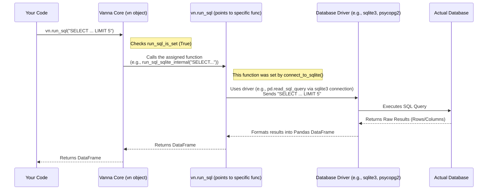

# Chapter 6: Database Connector (Execution Layer)

Welcome back! In [Chapter 5: Vector Store (Knowledge Storage)](05_vector_store__knowledge_storage__.md), we discovered how Vanna uses a Vector Store as its long-term memory, storing and retrieving information like table structures (DDL) and past question/SQL examples to help understand your requests.

So now, Vanna has:
1.  Understood your question.
2.  Retrieved relevant context from its memory ([Vector Store (Knowledge Storage)](05_vector_store__knowledge_storage__.md)).
3.  Crafted a detailed prompt ([Prompt Engineering (Guiding the LLM)](04_prompt_engineering__guiding_the_llm__.md)).
4.  Used its brain ([LLM Connector (Reasoning Engine)](03_llm_connector__reasoning_engine__.md)) to generate the SQL code based on the prompt.

Great! We have the SQL query, like `SELECT state, SUM(births) FROM ssa_data WHERE year = 2020 GROUP BY state LIMIT 5`. But... this is just text. How does this text actually get *run* against your real database (like your company's Snowflake, PostgreSQL, or even a simple SQLite file) to fetch the data?

**Problem:** Vanna has the SQL instructions, but how does it deliver these instructions to the actual database "warehouse" and bring back the requested data "packages"? Different databases speak slightly different dialects and have different ways to connect. How can Vanna handle this without needing custom code for every single database type?
**Solution:** Use the **Database Connector (Execution Layer)**.

Think of the LLM generating the SQL as writing down a detailed order for items stored in a giant warehouse (your database). The Database Connector is like the **reliable courier** Vanna hires. This courier knows:
*   How to get to different types of warehouses (Snowflake, PostgreSQL, BigQuery, SQLite, etc.).
*   How to talk to the warehouse manager (the database driver) to submit the order (the SQL query).
*   How to pick up the data packages (the query results).
*   How to bring them back and present them neatly (usually as a table, specifically a Pandas DataFrame).

## What Does the Database Connector Do?

The Database Connector component is responsible for the final, crucial step: turning the generated SQL text into actual data results. Its main jobs, often facilitated by helper methods within [VannaBase (Core Interface)](02_vannabase__core_interface__.md), are:

1.  **Establish Connection:** Provides easy ways to connect Vanna to your specific database using standard connection details (like username, password, host, database name). Vanna includes helper functions like `connect_to_sqlite`, `connect_to_postgres`, `connect_to_snowflake`, etc., within the `VannaBase` class itself.
2.  **Standardize Execution:** It defines a standard function, `vn.run_sql(sql)`, that Vanna uses internally whenever it needs to execute *any* SQL query. The helper connection methods (like `connect_to_sqlite`) set up this `run_sql` function behind the scenes to work with the *specific* database you connected to.
3.  **Run the Query:** Takes the SQL string generated by the LLM and sends it to the connected database for execution.
4.  **Fetch Results:** Retrieves the data returned by the database.
5.  **Format Results:** Typically formats the results into a Pandas DataFrame, which is a standard way to work with tabular data in Python.

**Analogy Revisited:** The courier (`Database Connector`) doesn't need to know *why* you ordered specific items (that was the LLM's job). It just needs the order slip (SQL) and the warehouse address (connection details). The `connect_to_*` methods give the courier the address and the keys. The `run_sql` method is the action of the courier taking the slip, going to the warehouse, and coming back with the goods (DataFrame).

## Using the Database Connector: Running SQL

You usually interact with the Database Connector in two steps:

**Step 1: Connect to Your Database**

Before Vanna can run any SQL, you need to tell it *where* your data lives. You do this using one of the built-in `connect_to_*` methods.

```python
# Assume 'vn' is your Vanna object (already configured with LLM, Vector Store)
# Example: connecting to a local SQLite database file named 'ssadata.db'

try:
    vn.connect_to_sqlite('ssadata.db')
    print("Successfully connected to the SQLite database!")
    # Now vn.run_sql is configured to work with ssadata.db
except Exception as e:
    print(f"Failed to connect: {e}")

# Example: connecting to PostgreSQL (requires installing psycopg2)
# try:
#   vn.connect_to_postgres(host='localhost', dbname='mydb', user='user', password='password', port=5432)
#   print("Successfully connected to PostgreSQL!")
# except Exception as e:
#   print(f"Failed to connect: {e}")
```
*Explanation:* You call the specific `connect_to_*` method matching your database type (like `connect_to_sqlite`, `connect_to_postgres`, `connect_to_snowflake`). You provide the necessary connection details. If successful, this sets up Vanna's internal `run_sql` function to interact with *that specific database*.

**Step 2: Run the SQL Query**

Once connected, Vanna can execute SQL using its `run_sql` method. This often happens automatically inside the `vn.ask()` function after the SQL is generated, but you can also call it directly if you have a SQL string.

```python
# Assume vn is already connected (from Step 1)
# And assume SQL was generated previously (Chapters 3 & 4)
generated_sql = "SELECT state, SUM(births) as total_births FROM ssa_data WHERE year = 2020 GROUP BY state ORDER BY total_births DESC LIMIT 5"
print(f"Generated SQL: {generated_sql}")

# Now, use the configured run_sql method to execute it
print("Running SQL query...")
try:
    # This uses the connection established in Step 1
    results_df = vn.run_sql(generated_sql)
    print("Query successful! Results:")
    # results_df is usually a Pandas DataFrame
    print(results_df)
except Exception as e:
    print(f"Failed to run SQL: {e}")

```
*Explanation:* You call `vn.run_sql()` and pass the SQL query string. Because `vn.connect_to_sqlite()` (or another connect method) was called earlier, `run_sql` now knows *how* and *where* to execute this query. It returns the results, typically as a Pandas DataFrame.

**Output of the example above might look like:**

```
Generated SQL: SELECT state, SUM(births) as total_births FROM ssa_data WHERE year = 2020 GROUP BY state ORDER BY total_births DESC LIMIT 5
Running SQL query...
Query successful! Results:
  state  total_births
0    CA        420000
1    TX        380000
2    FL        210000
3    NY        205000
4    PA        130000
```
*(Note: Fictional birth numbers)*

## Under the Hood: How Connection and Execution Works

Let's trace the flow when you connect and then run SQL:

1.  **You Call `vn.connect_to_sqlite('ssadata.db')`:**
    *   The `connect_to_sqlite` method inside VannaBase is executed.
    *   It uses Python's built-in `sqlite3` library (or another relevant library like `psycopg2` for PostgreSQL, `snowflake-connector-python` for Snowflake) to establish a connection to the database file/server.
    *   Crucially, it defines a *specific* function (let's call it `run_sql_sqlite_internal`) that knows how to execute SQL *using that sqlite3 connection*.
    *   It then sets Vanna's general `vn.run_sql` attribute to point to this specific `run_sql_sqlite_internal` function.
    *   It sets a flag `vn.run_sql_is_set = True`.

2.  **You Call `vn.run_sql(generated_sql)`:**
    *   Vanna checks if `vn.run_sql_is_set` is True (it is, thanks to step 1).
    *   It calls the function currently assigned to `vn.run_sql` (which is `run_sql_sqlite_internal` in our example).
    *   `run_sql_sqlite_internal` uses the active `sqlite3` connection object.
    *   It often uses a library like Pandas (`pd.read_sql_query`) to send the SQL to the database via the connection and get the results back directly as a DataFrame.
    *   This DataFrame is returned back to your code.

Here's a diagram showing the execution part:



## Diving into Code (Simplified Examples)

The `connect_to_*` methods and the base `run_sql` definition are found in `src/vanna/base/base.py`.

**1. Connecting (`connect_to_sqlite` in `VannaBase`)**

```python
# Simplified snippet from src/vanna/base/base.py VannaBase.connect_to_sqlite

# Make sure necessary libraries are installed
try:
    import pandas as pd
    import sqlite3
except ImportError:
    raise Exception("Dependencies not installed. Run: pip install vanna[sqlite]")

class VannaBase(ABC):
    # ... (other methods like __init__, generate_sql, etc.) ...

    def connect_to_sqlite(self, url: str, check_same_thread: bool = False, **kwargs):
        # ... (code to handle downloading file if URL is http/file) ...
        db_path = url # Assume url is a local path like 'ssadata.db'

        try:
            # Use the standard sqlite3 library to connect
            conn = sqlite3.connect(
                db_path,
                check_same_thread=check_same_thread,
                **kwargs)
            print(f"  - Connection object created for {db_path}")

            # Define the ACTUAL function that will run SQL for THIS connection
            def run_sql_sqlite_internal(sql: str) -> pd.DataFrame:
                print(f"    - Executing SQL via SQLite connector: {sql[:50]}...")
                # Use pandas helper function to run SQL and get DataFrame
                df = pd.read_sql_query(sql, conn)
                print(f"    - Got DataFrame with shape {df.shape}")
                return df

            # IMPORTANT: Point the general vn.run_sql to our specific function
            self.run_sql = run_sql_sqlite_internal
            self.run_sql_is_set = True # Mark that connection is ready
            self.dialect = "SQLite" # Set the SQL dialect Vanna should expect
            print("  - vn.run_sql is now configured for SQLite.")

        except Exception as e:
            raise ConnectionError(f"Failed to connect to SQLite: {e}")

    # Default placeholder for run_sql - raises error if not connected
    def run_sql(self, sql: str, **kwargs) -> pd.DataFrame:
        if not self.run_sql_is_set:
            raise Exception("Database not connected. Use a vn.connect_to_* method first.")
        # This line below would technically never be reached if not connected,
        # as self.run_sql would be overwritten by the connect method.
        # It's more of a safeguard in the abstract class.
        pass
```
*Explanation:* The `connect_to_sqlite` method:
1. Imports necessary libraries (`sqlite3`, `pandas`).
2. Establishes a connection using `sqlite3.connect()`.
3. Defines an *inner function* (`run_sql_sqlite_internal`) that knows how to use *this specific connection* (often using `pd.read_sql_query`).
4. Assigns this inner function to the main `self.run_sql` attribute of the Vanna object.
5. Sets `self.run_sql_is_set` to `True`.

Now, whenever `vn.run_sql()` is called later, it actually executes the specific `run_sql_sqlite_internal` function created during the connection process. Other `connect_to_*` methods follow a similar pattern using their respective database drivers (like `psycopg2` for PostgreSQL).

## Conclusion

The Database Connector is the execution arm of Vanna. It takes the SQL query produced by the LLM and actually runs it against your database. Through the `connect_to_*` helper methods provided in [VannaBase (Core Interface)](02_vannabase__core_interface__.md), you tell Vanna how to reach your database. This configures the standard `vn.run_sql` method to use the correct underlying driver and connection. When called, `vn.run_sql` acts as the courier, sending the SQL order to the database and returning the results, typically as a convenient Pandas DataFrame. This layer ensures that Vanna can interact with a wide variety of databases in a consistent way.

We've now covered the entire core flow: getting the question, using memory (Vector Store), thinking (LLM Connector), guiding the thinking (Prompt Engineering), and executing the result (Database Connector). But how did the Vector Store get populated with useful information in the first place? How do we manage the DDL, documentation, and question/SQL pairs that Vanna learns from?

Let's look at how we supply Vanna with its learning materials! [Chapter 7: Training Data Management (Learning Material)](07_training_data_management__learning_material__.md)

---

Generated by [AI Codebase Knowledge Builder](https://github.com/The-Pocket/Tutorial-Codebase-Knowledge)