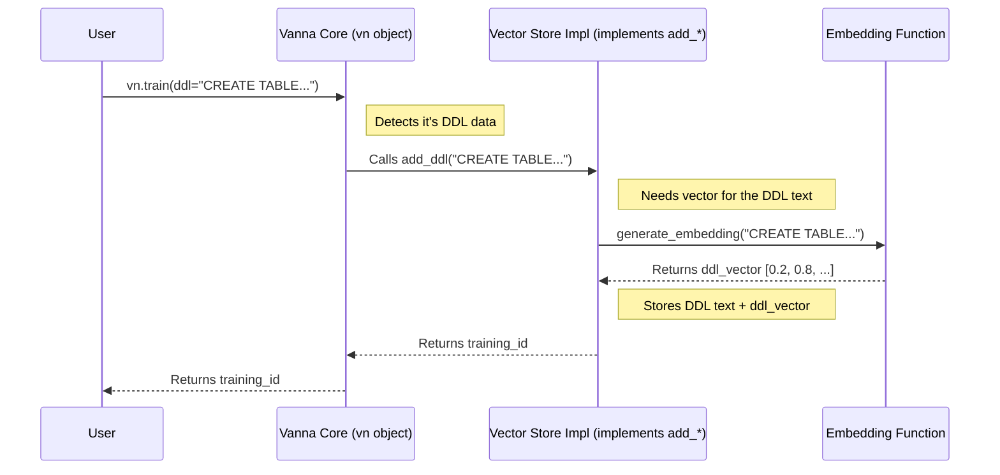

# Chapter 7: Training Data Management (Learning Material)

Welcome back! In [Chapter 6: Database Connector (Execution Layer)](06_database_connector__execution_layer__.md), we saw how Vanna takes the generated SQL query and actually runs it against your database using the Database Connector to get the final data results.

We've covered the whole process: asking a question, Vanna thinking (using its memory, LLM brain, and prompt engineering), and getting the answer by running SQL. But how does Vanna get *smart* about *your specific* database in the first place? How does it know your table names, column meanings, or common query patterns?

**Problem:** Out of the box, Vanna's AI brain ([LLM Connector (Reasoning Engine)](03_llm_connector__reasoning_engine__.md)) is a general expert. It knows a lot about SQL, but it knows nothing about *your* specific database, like the `ssadata` database we're using. How do we teach Vanna about our unique data world?
**Solution:** We need to provide Vanna with **Training Data**.

Think of Vanna like a very smart student starting a new class about *your* database. The student knows how to learn and write (like the LLM knows SQL), but they don't know the specific subject matter yet. **Training Data Management** is the process of giving this student the necessary **Learning Material** – the textbooks, class notes, and practice problems – so they can understand your database and answer questions accurately.

## What is Training Data (Learning Material)?

Training data is the information you feed Vanna to teach it about your specific database context. It helps Vanna bridge the gap between a general question and the specific SQL needed for *your* tables and columns.

Vanna primarily learns from three types of "learning material":

1.  **DDL (Data Definition Language):**
    *   **What it is:** These are the `CREATE TABLE` statements that define the structure of your database tables – the table names, column names, and data types (like `INTEGER`, `TEXT`, etc.).
    *   **Analogy:** This is like giving the student the **textbook's table of contents and glossary**. It shows the main topics (tables) and the key terms (columns) with their basic definitions (data types).
    *   **Example:**
        ```sql
        CREATE TABLE ssa_data (
          year INTEGER,
          state TEXT,
          name TEXT,
          gender TEXT,
          births INTEGER
        )
        ```

2.  **Documentation:**
    *   **What it is:** Plain text descriptions that provide context or clarification about your data. This could explain what a table represents, define a specific column's meaning, or outline business rules.
    *   **Analogy:** These are like the **teacher's notes or annotations** in the textbook margins. They add extra context and meaning beyond the basic definitions.
    *   **Example:** "The `ssa_data` table contains US Social Security Administration baby name data based on applications for Social Security cards."

3.  **Question/SQL Pairs:**
    *   **What it is:** Examples of questions asked in plain English, paired with the correct SQL query that answers that question for your database.
    *   **Analogy:** These are like **practice problems with solutions**. They show the student how to apply their knowledge to answer specific types of questions correctly.
    *   **Example:**
        *   **Question:** "Total births per year?"
        *   **SQL:** `SELECT year, SUM(births) FROM ssa_data GROUP BY year`

By providing these three types of information, you "train" Vanna, equipping it with the knowledge needed to generate accurate SQL for *your* unique data environment.

## How to "Train" Vanna (Give it Learning Material)

Vanna makes it easy to add this learning material using the `vn.train()` method. This single method handles adding DDL, documentation, or question/SQL pairs.

**1. Training with DDL:**

You provide the `CREATE TABLE` statement as a string to the `ddl` argument.

```python
# Assume 'vn' is your configured Vanna object
# (e.g., vn = MyVanna(config=...))

ddl_statement = """
CREATE TABLE ssa_data (
  year INTEGER,
  state TEXT,
  name TEXT,
  gender TEXT,
  births INTEGER
)
"""

# Train Vanna with the DDL
training_id_ddl = vn.train(ddl=ddl_statement)
print(f"Added DDL. Training ID: {training_id_ddl}")
```

*Explanation:* This code snippet defines the structure of our `ssa_data` table and then uses `vn.train(ddl=...)` to feed this information to Vanna. Vanna will store this DDL (often in its [Vector Store (Knowledge Storage)](05_vector_store__knowledge_storage__.md)) so it can refer to it later when generating SQL.

**2. Training with Documentation:**

You provide the descriptive text as a string to the `documentation` argument.

```python
# Assume 'vn' is your configured Vanna object

doc_text = "The ssa_data table contains US baby name statistics by state and year."

# Train Vanna with the documentation
training_id_doc = vn.train(documentation=doc_text)
print(f"Added documentation. Training ID: {training_id_doc}")
```

*Explanation:* This code adds a helpful description of the `ssa_data` table using `vn.train(documentation=...)`. Vanna stores this text and can retrieve it when a question seems related, helping the AI understand the context.

**3. Training with Question/SQL Pairs:**

You provide both the question (as a string) and the corresponding correct SQL query (as a string).

```python
# Assume 'vn' is your configured Vanna object

question_example = "Total births per year?"
sql_example = "SELECT year, SUM(births) FROM ssa_data GROUP BY year"

# Train Vanna with the question-SQL pair
training_id_qsql = vn.train(question=question_example, sql=sql_example)
print(f"Added Question/SQL pair. Training ID: {training_id_qsql}")
```

*Explanation:* Here, we give Vanna a specific example using `vn.train(question=..., sql=...)`. Vanna stores this pair. When you ask a similar question later (like "Average births per year?"), Vanna can retrieve this example to help the AI generate the correct SQL pattern.

**Managing Training Data:**

Vanna also provides methods to view and remove training data:

*   `vn.get_training_data()`: Retrieves all the learning material you've added as a table (Pandas DataFrame).
*   `vn.remove_training_data(id=...)`: Removes a specific piece of learning material using the ID you got when you added it.

```python
# View all training data
print("\nCurrent Training Data:")
training_df = vn.get_training_data()
print(training_df)

# Example: Remove the documentation we added earlier
# print(f"\nRemoving documentation with ID: {training_id_doc}")
# success = vn.remove_training_data(id=training_id_doc)
# print(f"Removal successful: {success}")

# print("\nTraining Data After Removal:")
# print(vn.get_training_data())
```

*Explanation:* This shows how you can inspect all the "study materials" given to Vanna and remove specific items if they become outdated or incorrect.

## Under the Hood: How Training Works

When you call `vn.train(...)`, Vanna doesn't just randomly store the text. It uses a structured process, primarily involving the [Vector Store (Knowledge Storage)](05_vector_store__knowledge_storage__.md).

1.  **`vn.train()` Called:** You call `vn.train()` with DDL, documentation, or a Q/SQL pair.
2.  **Dispatch to `add_*`:** The `vn.train()` method figures out what kind of data you provided and calls the corresponding specific method (defined in the [VannaBase (Core Interface)](02_vannabase__core_interface__.md) contract), like `vn.add_ddl()`, `vn.add_documentation()`, or `vn.add_question_sql()`.
3.  **Generate Embedding:** The `add_*` method (usually implemented by the Vector Store component) takes the text data. It calls `vn.generate_embedding()` (which often uses an AI model, sometimes related to the [LLM Connector (Reasoning Engine)](03_llm_connector__reasoning_engine__.md)) to convert the text's *meaning* into a numerical vector (a list of numbers).
4.  **Store in Vector Store:** The `add_*` method stores both the original text *and* its vector representation in the [Vector Store (Knowledge Storage)](05_vector_store__knowledge_storage__.md). The Vector Store is optimized to find information later based on vector similarity (meaning).

Here's a simplified diagram showing adding DDL:



## Diving into Code (Simplified Examples)

**1. The `train()` Method (in `src/vanna/base/base.py`)**

The `train()` method itself is mainly a dispatcher.

```python
# Simplified snippet from src/vanna/base/base.py VannaBase.train

class VannaBase(ABC):
    # ... other methods ...

    def train(
        self,
        question: str = None,
        sql: str = None,
        ddl: str = None,
        documentation: str = None,
        # ... other args like plan, dataset ...
    ) -> str:
        """
        Main method to add training data (learning material).
        Dispatches to specific add_* methods based on arguments.
        """
        DEBUG_FLAG=False # For simplicity

        if ddl:
            if DEBUG_FLAG: print("Calling add_ddl...")
            # Calls the specific add_ddl implementation (likely from Vector Store)
            return self.add_ddl(ddl, ...)

        if documentation:
            if DEBUG_FLAG: print("Calling add_documentation...")
            # Calls the specific add_documentation implementation
            return self.add_documentation(documentation, ...)

        if question and sql:
            if DEBUG_FLAG: print("Calling add_question_sql...")
            # Calls the specific add_question_sql implementation
            return self.add_question_sql(question=question, sql=sql, ...)

        # ... (handle training plan, etc.) ...

        # If none of the specific types are provided, might try auto-discovery
        # (e.g., if connected to a database, try getting metadata)
        print("No specific training data provided. Consider adding DDL, Docs, or Q/SQL pairs.")
        return "No training action taken."

    # --- Abstract add_* methods (must be implemented by subclasses) ---
    @abstractmethod
    def add_ddl(self, ddl: str, **kwargs) -> str:
        pass # Implementation usually in Vector Store class

    @abstractmethod
    def add_documentation(self, documentation: str, **kwargs) -> str:
        pass # Implementation usually in Vector Store class

    @abstractmethod
    def add_question_sql(self, question: str, sql: str, **kwargs) -> str:
        pass # Implementation usually in Vector Store class
```
*Explanation:* The `train` method checks which keyword arguments (`ddl`, `documentation`, `question`/`sql`) you provided. Based on that, it calls the corresponding `self.add_*` method. These `add_*` methods are declared as *abstract* in `VannaBase`, meaning the actual code for storing the data lives in the concrete classes you use for your Vanna setup (typically the [Vector Store (Knowledge Storage)](05_vector_store__knowledge_storage__.md) component).

**2. An `add_*` Implementation Example (Conceptual - like in `src/vanna/chromadb/chromadb_vector.py`)**

Here's a conceptual look at what an `add_ddl` implementation might do inside a Vector Store class like `ChromaDB_VectorStore`.

```python
# Simplified/Conceptual snippet from a Vector Store implementation

class MyVectorStoreImpl(VannaBase): # Inherits from VannaBase
    # ... __init__ sets up connection to vector DB (e.g., self.chroma_client) ...
    # ... __init__ sets up self.embedding_function ...

    def generate_embedding(self, data: str, **kwargs) -> List[float]:
        # Simplified: uses the configured embedding function
        # return self.embedding_function.encode(data).tolist()
        pass # Actual implementation varies

    def add_ddl(self, ddl: str, **kwargs) -> str:
        """Adds DDL to the vector store."""
        if ddl is None or not ddl.strip():
            return "No DDL provided"

        # 1. Prepare data (maybe add metadata like dataset)
        dataset = kwargs.get("dataset", "default")
        doc_type = "ddl"
        document = {"dataset": dataset, doc_type: ddl}
        metadata = {"doc_type": doc_type}
        doc_json = json.dumps(document, ensure_ascii=False) # Store as JSON

        # 2. Generate embedding for the DDL content (as JSON)
        embedding_vector = self.generate_embedding(doc_json)

        # 3. Create a unique ID for this piece of training data
        # (Using a helper like deterministic_uuid ensures consistency)
        doc_id = f"{deterministic_uuid(doc_json)}-{doc_type}"

        # 4. Use the vector database client to store the data
        print(f"  Storing DDL (ID: {doc_id}) in vector database...")
        # self.ddl_collection.add( # Assuming a specific collection for DDL
        #     documents=[doc_json],
        #     embeddings=[embedding_vector],
        #     metadatas=[metadata],
        #     ids=[doc_id]
        # )
        # Actual vector store interaction depends on the library (ChromaDB, Pinecone, etc.)

        return doc_id # Return the unique ID for this training data
```
*Explanation:* The concrete `add_ddl` method (inside the chosen Vector Store class) takes the DDL string, generates its vector embedding, creates a unique ID, and then uses the specific vector database library (like `chromadb`) to store the DDL text (often packaged with metadata) and its vector. This ensures the DDL can be found later via semantic search when Vanna processes a related question. `add_documentation` and `add_question_sql` follow similar logic.

## Conclusion

Training Data Management is how you provide Vanna with its essential learning material. By feeding it information about your specific database – its structure (DDL), context (documentation), and examples (question/SQL pairs) – using the simple `vn.train()` method, you customize Vanna's knowledge. This "training" allows Vanna to leverage its powerful AI capabilities much more effectively within *your* data environment, leading to significantly more accurate SQL generation. Without this learning material, Vanna is like a brilliant student without the right textbook – smart, but unable to answer questions about a subject it hasn't learned yet.

This concludes our tour through the core components of Vanna and the `ssadata` project! We hope this gives you a clear, beginner-friendly understanding of how Vanna works, from the web interface to the underlying AI and data interactions. Happy querying!

---

Generated by [AI Codebase Knowledge Builder](https://github.com/The-Pocket/Tutorial-Codebase-Knowledge)