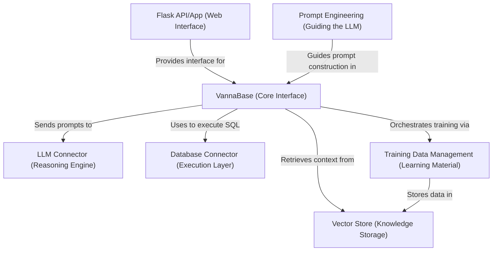

# Tutorial: ssadata

This project, *Vanna*, acts as an **AI assistant** that helps users query databases using *natural language*.
It takes a user's question, finds relevant information about the database structure (**DDL**) and past examples (**Question-SQL pairs**) from a *Vector Store*, and uses a *Large Language Model* (**LLM**) guided by *Prompt Engineering* to generate a **SQL query**.
This query can then be executed against the actual database via a *Database Connector*, and the results can be optionally visualized or displayed through a *Flask Web Interface*. The system learns and improves as more training data is added.

**Source Repository:** [None](None)

## Chapters

1. [Flask API/App (Web Interface)
](01_flask_api_app__web_interface__.md)
2. [VannaBase (Core Interface)
](02_vannabase__core_interface__.md)
3. [LLM Connector (Reasoning Engine)
](03_llm_connector__reasoning_engine__.md)
4. [Prompt Engineering (Guiding the LLM)
](04_prompt_engineering__guiding_the_llm__.md)
5. [Vector Store (Knowledge Storage)
](05_vector_store__knowledge_storage__.md)
6. [Database Connector (Execution Layer)
](06_database_connector__execution_layer__.md)
7. [Training Data Management (Learning Material)
](07_training_data_management__learning_material__.md)

---

Generated by [AI Codebase Knowledge Builder](https://github.com/The-Pocket/Tutorial-Codebase-Knowledge)