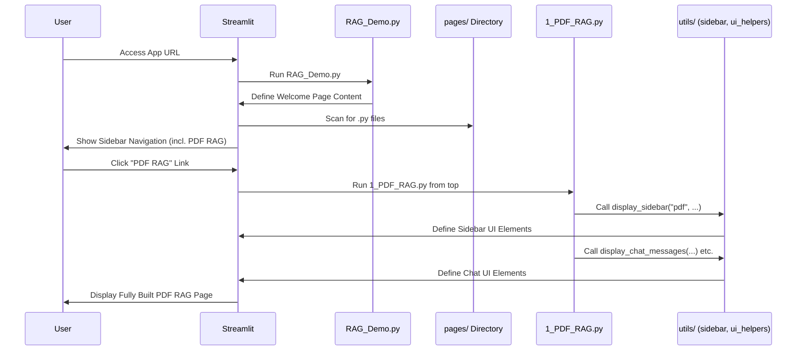

# Chapter 1: Streamlit Application Structure

Welcome to the `st_rag_demo` tutorial! This project helps you chat with different kinds of data like PDFs, spreadsheets (CSVs), and databases (SQLite). But before we dive into the cool chat features, let's understand how the application itself is put together. Think of it like exploring a new building – you need to know where the entrance is and how the rooms are laid out.

## Why Structure Matters: Building Our App House

Imagine building a house. You wouldn't just pile up bricks randomly, right? You'd have a plan: an entrance, different rooms for different purposes (kitchen, bedroom, living room), and maybe some standard parts like windows and doors that look the same throughout the house.

Building a web application is similar! We need a clear structure so that:

1.  **Users know where to go:** It's easy to find different features (like chatting with PDFs vs. chatting with databases).
2.  **Developers stay organized:** It's easier to build, fix, and add new features when code is neatly arranged.
3.  **We don't repeat ourselves:** We can reuse common parts (like navigation menus or chat windows) across different sections of the app.

In `st_rag_demo`, we use the **Streamlit** library to build the user interface (the part you see and interact with in your web browser). Streamlit has a neat way of organizing apps, especially ones with multiple sections or "pages".

## Key Parts of Our App House

Our `st_rag_demo` application structure is like a building with these key parts:

1.  **The Main Entrance (`src/RAG_Demo.py`):** This is the first thing you see when you "enter" the application. It welcomes you and sets up the basic layout.
2.  **The Rooms (`src/pages/` directory):** This special folder contains different Python files, each representing a separate "room" or page in our application. Each room is dedicated to a specific task:
    *   `1_PDF_RAG.py`: The room for chatting with PDF files.
    *   `2_CSV_RAG.py`: The room for chatting with CSV spreadsheet files.
    *   `3_SQLite_RAG.py`: The room for chatting with SQLite database files.
    *   `4_RAG_Debugging.py`: A special room with tools for developers to check how the app is working.
3.  **Reusable Building Blocks (`src/utils/` directory):** This folder contains code for common elements used across different rooms, like standard windows or doors in our house analogy.
    *   `sidebar.py`: Defines the navigation menu (the sidebar) you see on the left.
    *   `ui_helpers.py`: Contains functions to create common interface parts, like displaying the chat conversation.

Let's look at each part more closely.

### 1. The Main Entrance (`src/RAG_Demo.py`)

This is the starting point. When you run the Streamlit application, this script runs first.

```python
# src/RAG_Demo.py
import streamlit as st
from dotenv import load_dotenv
import os

# Load settings (like API keys)
load_dotenv()
# ... (API key check removed for simplicity)

# Set basic page appearance (like the title in the browser tab)
st.set_page_config(
    page_title="Advanced RAG Chatbot",
    page_icon="📄", # The little icon in the browser tab
    layout="wide"
)

# Show the main title on the page
st.title("📄 Advanced RAG Chatbot")
st.subheader("Chat with your Documents, Databases and Visualize Data")

# Display some welcome text using Markdown
st.markdown("""
### Welcome to the Advanced RAG Chatbot!

This application demonstrates how to chat with different data sources.
Select a page from the sidebar to get started!
""")

# Add some info to the sidebar
st.sidebar.header("About")
st.sidebar.info("This app uses Streamlit, LangChain, and OpenAI.")
```

**Explanation:**

*   `import streamlit as st`: This line brings in the Streamlit library.
*   `st.set_page_config(...)`: Configures basic settings like the title that appears in your browser tab and the page icon.
*   `st.title(...)`, `st.subheader(...)`, `st.markdown(...)`: These commands display text content on the main page – our welcome mat!
*   `st.sidebar.header(...)`, `st.sidebar.info(...)`: These add content to the sidebar that appears on the left.

This script essentially sets up the "lobby" of our application.

### 2. The Rooms (`src/pages/` directory)

This is where Streamlit does something magical! Any Python (`.py`) file you put inside a folder named `pages` automatically becomes a separate page in your application. Streamlit even creates the navigation links in the sidebar for you.

Our `src` folder looks something like this:

```
src/
├── RAG_Demo.py         # <--- Main Entrance
├── pages/              # <--- Folder for other pages (Rooms)
│   ├── 1_PDF_RAG.py    # <--- PDF Chat Room
│   ├── 2_CSV_RAG.py    # <--- CSV Chat Room
│   ├── 3_SQLite_RAG.py # <--- SQLite Chat Room
│   └── 4_RAG_Debugging.py # <-- Debugging Room
└── utils/              # <--- Reusable Building Blocks
    ├── sidebar.py
    └── ui_helpers.py
    └── ... (other utility files)
```

Streamlit sees `1_PDF_RAG.py` and creates a link called "PDF RAG" in the sidebar. It sees `2_CSV_RAG.py` and creates a "CSV RAG" link, and so on. The numbers (`1_`, `2_`) control the order they appear in the sidebar.

Here's a simplified look inside one of these "room" files:

```python
# src/pages/1_PDF_RAG.py
import streamlit as st
# We import functions from our reusable blocks
from utils.sidebar import display_sidebar
from utils.ui_helpers import display_chat_messages, handle_chat_input
# ... (other imports needed for PDF chatting)

st.set_page_config(page_title="PDF RAG", page_icon="📄")
st.title("📄 PDF Document RAG")
st.subheader("Chat with your PDF documents")

# --- Sidebar ---
# Call the reusable function to build the sidebar for PDF uploads
# display_sidebar("pdf", ...) # Simplified - actual call has more arguments

# --- Main Chat Area ---
st.markdown("Upload PDFs via the sidebar and ask questions below.")

# Display existing chat messages using a helper function
# display_chat_messages(...)

# Handle new user input using a helper function
# handle_chat_input(...)
```

**Explanation:**

*   Each page file (like `1_PDF_RAG.py`) also uses `st.title` etc. to define its *own* content.
*   Crucially, it *imports* and *uses* functions from our `utils` directory (like `display_sidebar`, `display_chat_messages`). This is how we reuse the common building blocks.

When you click the "PDF RAG" link in the sidebar, Streamlit stops running `RAG_Demo.py` and starts running `pages/1_PDF_RAG.py` instead, showing you the content defined in that file.

### 3. Reusable Building Blocks (`src/utils/` directory)

Imagine if every room in your house needed a unique type of window and door. It would be inefficient! Similarly, our different chat pages (PDF, CSV, SQL) share common UI elements:

*   A sidebar to upload files and configure settings.
*   A main area to display the chat conversation.
*   An input box to type questions.

Instead of writing the code for these elements in *each* page file (`1_PDF_RAG.py`, `2_CSV_RAG.py`, etc.), we write it once in helper files inside the `utils/` directory and then simply call those functions from the page files.

```python
# src/utils/sidebar.py (Simplified)
import streamlit as st

# Function to display the sidebar content
def display_sidebar(app_type, chatbot_key, messages_key, session_id_key, chatbot_class, file_types=None):
    """Displays common sidebar elements, customized by app_type."""
    with st.sidebar:
        st.header(f"Upload {app_type.upper()} Files")
        uploaded_files = st.file_uploader("Upload files", type=file_types, accept_multiple_files=True)
        # ... (logic to handle file processing button) ...

        st.header("Model Selection")
        model_name = st.selectbox("Select OpenAI Model", ["gpt-3.5-turbo", ...])
        # ... (logic to handle model changes) ...

        # ... (other common sidebar sections like RAG config, History) ...
```

```python
# src/utils/ui_helpers.py (Simplified)
import streamlit as st

# Function to display all the chat messages
def display_chat_messages(messages_key):
    """Loops through messages in session state and displays them."""
    # Get the list of messages (we'll learn about session_state later)
    messages = st.session_state.get(messages_key, [])
    for message in messages:
        # Use Streamlit's chat container
        with st.chat_message(message["role"]): # "user" or "assistant"
            st.markdown(message["content"])
            # ... (optional: display extra info like timestamps or data) ...

# Function to handle the user typing a message
def handle_chat_input(app_type, chatbot_key, messages_key, session_id_key, placeholder):
    """Displays the chat input box and processes the message when entered."""
    if prompt := st.chat_input(placeholder):
        # Add the user's message to the history
        # ... (code to add message to st.session_state[messages_key]) ...

        # Display the user's message immediately
        with st.chat_message("user"):
            st.markdown(prompt)

        # Trigger the chatbot to generate a response
        # ... (code to call the chatbot and display its response) ...
        # This involves concepts from other chapters like [Chatbot Model Hierarchy](02_chatbot_model_hierarchy_.md)
```

**Explanation:**

*   Files like `sidebar.py` and `ui_helpers.py` contain functions that build specific parts of the UI.
*   Page scripts (like `1_PDF_RAG.py`) import these functions and call them.
*   This keeps the page scripts cleaner and focused on the specific logic for *that* page (e.g., how to handle PDF processing), while the common UI logic lives in `utils`.

## How It All Works Together: A User's Journey

Let's trace what happens when you use the app:

1.  **You open the app's web address.** Your browser talks to Streamlit.
2.  **Streamlit runs `src/RAG_Demo.py`.** It shows the main welcome page.
3.  **Streamlit finds the `src/pages/` directory.** It reads the filenames (`1_PDF_RAG.py`, etc.) and automatically creates navigation links ("PDF RAG", "CSV RAG", ...) in the sidebar.
4.  **You click the "PDF RAG" link.**
5.  **Streamlit stops running `RAG_Demo.py` and runs `src/pages/1_PDF_RAG.py` instead.**
6.  **`1_PDF_RAG.py` runs its code:**
    *   It calls `display_sidebar(...)` from `utils/sidebar.py` to show the PDF-specific upload options and settings in the sidebar.
    *   It calls `display_chat_messages(...)` from `utils/ui_helpers.py` to show any previous chat messages for this session.
    *   It calls `handle_chat_input(...)` from `utils/ui_helpers.py` to show the text box where you can type your question.
7.  **Streamlit displays the fully constructed "PDF RAG" page in your browser.**

Here's a diagram showing this flow:



This structure, enabled by Streamlit's multi-page app feature and our use of a `utils` directory, makes the application organized and easier to manage.

## Conclusion

We've seen how the `st_rag_demo` application is structured like a well-planned building.

*   `RAG_Demo.py` is the main entrance.
*   The `pages/` directory holds the different rooms (PDF Chat, CSV Chat, etc.).
*   The `utils/` directory provides reusable components like standard windows and doors (`sidebar.py`, `ui_helpers.py`).

This organization helps both users navigate the app and developers manage the code. Streamlit's automatic page creation based on the `pages/` directory is a key feature that makes this structure easy to implement.

Now that we understand the *layout* of our application house, we're ready to look inside the rooms and understand the *brains* behind the chat functionality. In the next chapter, we'll explore how the different chatbot models are organized.

**Next:** [Chapter 2: Chatbot Model Hierarchy](02_chatbot_model_hierarchy_.md)

---

Generated by [AI Codebase Knowledge Builder](https://github.com/The-Pocket/Tutorial-Codebase-Knowledge)