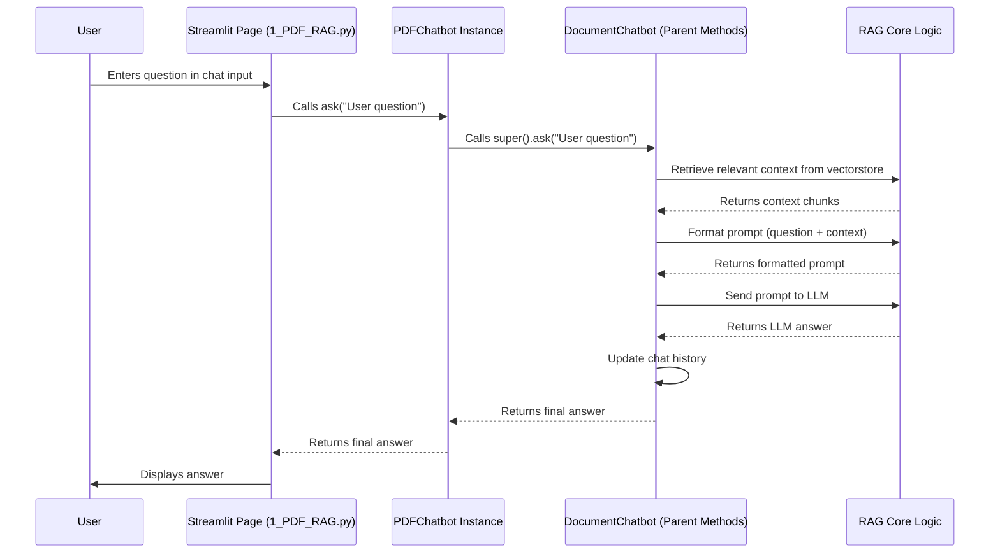

# Chapter 2: Chatbot Model Hierarchy

In [Chapter 1: Streamlit Application Structure](01_streamlit_application_structure_.md), we saw how the different pages of our `st_rag_demo` app are laid out, like rooms in a house. Now, let's peek inside those rooms and understand the "brains" behind the chat functionality. How does the app know how to talk about PDFs differently than it talks about CSV spreadsheets or SQL databases?

## The Problem: Talking to Different Data Types

Imagine you want to ask questions about different documents: a PDF report, a CSV spreadsheet of sales data, and a SQLite database of customer information. While the basic idea of "asking a question and getting an answer" is the same, the *way* the computer needs to handle each file type is quite different:

*   **PDFs:** Need to extract text from pages.
*   **CSVs:** Need to understand rows, columns, and potentially numbers for calculations.
*   **SQLite:** Need to understand database tables, columns, and maybe even generate SQL queries.

If we wrote completely separate code for each file type, we'd repeat a lot of the common logic, like how to talk to the underlying Language Model (LLM) or how to manage the chat history. This would be inefficient and hard to maintain.

## The Solution: A Family of Specialized Assistants

To solve this, `st_rag_demo` uses a **Chatbot Model Hierarchy**. Think of it like a family business run by specialized assistants:

1.  **The General Manager (`DocumentChatbot`):** This is the parent assistant. They know the fundamental skills needed for *any* chat task: how to interact with the powerful Language Model (like OpenAI's GPT), how to set up the basics for retrieving relevant information, and how to remember the conversation. However, they don't know the specifics of handling *any particular* file type.
2.  **The Specialists (`PDFChatbot`, `CSVChatbot`, `SQLiteChatbot`):** These are the children assistants. Each one inherits *all* the general skills from their parent (`DocumentChatbot`). On top of that, each child learns a specific specialization:
    *   `PDFChatbot` learns how to read and process text from PDF files.
    *   `CSVChatbot` learns how to read and understand data from CSV spreadsheets.
    *   `SQLiteChatbot` learns how to interact with SQLite databases, including understanding tables and schemas.

This "inheritance" is a key concept in programming called **Object-Oriented Programming**. It allows us to:

*   **Reuse Code:** The common chat logic is written only once in the parent `DocumentChatbot`.
*   **Specialize:** Each child chatbot adds only the specific code needed for its data type.
*   **Organize:** The code is neatly structured, making it easier to understand and extend (e.g., adding a `WordDocChatbot` later).

Let's look at the code structure that represents this family.

## The Parent: `DocumentChatbot` - The Generalist

The `DocumentChatbot` class acts as the blueprint for all our chatbots. It handles tasks common to all of them.

```python
# src/models/document_chatbot.py (Simplified)

# Import necessary libraries (like the LLM)
from langchain_openai import ChatOpenAI, OpenAIEmbeddings
# ... other imports

class DocumentChatbot:
    """Base class (Parent) for document chatbots"""

    def __init__(self, api_key=None, model_name="gpt-3.5-turbo"):
        """Sets up the basic tools needed by ALL chatbots."""
        # Store the API key needed to talk to the AI model
        self.api_key = api_key # ... (or get from environment)
        if not self.api_key:
            raise ValueError("OpenAI API key is required")

        # Initialize the Language Model (LLM) - the 'brain'
        self.llm = ChatOpenAI(
            model=model_name,
            openai_api_key=self.api_key,
            temperature=0.2 # Controls creativity (low = factual)
        )

        # Initialize Embeddings - tool to understand text meaning
        self.embeddings = OpenAIEmbeddings(openai_api_key=self.api_key)

        # Basic setup for storing documents and chat history
        self.documents = []
        self.chat_history = []
        self.vectorstore = None # Placeholder for retrieved info
        # ... other common setup ...

    def ask(self, question, return_context=False):
        """
        Basic way to ask a question.
        Child classes will often customize (override) this.
        """
        if not self.vectorstore:
            return "Please upload and process documents first."

        # --- This is where common RAG logic happens ---
        # 1. Retrieve relevant info using the vectorstore
        #    (More on this in [Chapter 4: RAG Core Logic](04_rag_core_logic_.md))
        # 2. Format a prompt for the LLM with the question and context
        # 3. Send the prompt to self.llm
        # 4. Get the answer
        # 5. Update self.chat_history
        # --- Simplified Placeholder ---
        context = "Placeholder: relevant context retrieved from documents"
        prompt = f"Context: {context}\n\nQuestion: {question}\n\nAnswer:"
        response = self.llm.invoke(prompt) # Talk to the AI
        answer = response.content
        self.chat_history.append(("human", question))
        self.chat_history.append(("ai", answer))
        # ... (more sophisticated logic exists here) ...
        return answer # Or maybe a dictionary with more info

    # ... other common methods like clear() ...
```

**Explanation:**

*   `class DocumentChatbot:` defines the parent blueprint.
*   `__init__`: This special method runs when you create a `DocumentChatbot` (or any of its children). It sets up the `llm` (the language model) and `embeddings` (tools for understanding text meaning), which *all* child chatbots will need.
*   `ask`: This method defines a *basic* way to answer a question using the stored documents. It involves finding relevant info (retrieval) and asking the LLM. Child classes might use this directly, or provide their own enhanced version.

## The Children: Specialists Inheriting Skills

Now let's look at a specialist, the `PDFChatbot`. It *inherits* from `DocumentChatbot`.

```python
# src/models/pdf_chatbot.py (Simplified)

# Import the parent class
from .document_chatbot import DocumentChatbot
# Import tools specific to PDFs
from langchain_community.document_loaders import PyPDFLoader
# ... other imports

# Notice '(DocumentChatbot)' - this means it inherits!
class PDFChatbot(DocumentChatbot):
    """Chatbot specialized for PDF document processing and Q&A"""

    def __init__(self, api_key=None, model_name="gpt-3.5-turbo"):
        """Initialize PDF chatbot."""
        # *** CRITICAL STEP: Call the parent's __init__ ***
        # This runs the setup code from DocumentChatbot first!
        super().__init__(api_key=api_key, model_name=model_name)
        # Now PDFChatbot is ready with LLM, embeddings etc.
        # No PDF-specific setup needed right at initialization.

    def process_pdf(self, file):
        """Process a PDF file and add its content to documents."""
        try:
            # Use a temporary file to handle the upload
            # ... (code to save uploaded file temporarily) ...
            tmp_path = "..." # Path to temporary PDF file

            # Use a PDF-specific tool to load the text
            loader = PyPDFLoader(tmp_path)
            pdf_docs = loader.load() # Gets text page by page

            # Store the loaded documents (using the self.documents list
            # inherited from the parent)
            self.documents.extend(pdf_docs)

            # ... (code to cleanup temporary file) ...
            return len(pdf_docs) # Return number of pages processed
        except Exception as e:
            # ... (error handling) ...
            return 0

    def ask(self, question, return_context=False):
        """Ask a question specifically about the processed PDFs."""
        if not self.documents: # Check if PDFs were processed
             return "Please process PDF files first."

        # For simple PDF Q&A, we can rely entirely on the
        # parent's 'ask' method to handle the RAG process.
        # 'super()' refers to the parent class (DocumentChatbot)
        return super().ask(question, return_context=return_context)

    # clear() method is inherited automatically, no need to rewrite!
```

**Explanation:**

*   `class PDFChatbot(DocumentChatbot):`: The `(DocumentChatbot)` part signifies that `PDFChatbot` is a child of `DocumentChatbot`. It automatically gets all the methods and attributes (like `self.llm`, `self.embeddings`, `self.documents`, `self.chat_history`, `ask`, `clear`) from the parent.
*   `super().__init__(...)`: Inside the `PDFChatbot`'s `__init__`, this line is crucial. It calls the `__init__` method of the parent (`DocumentChatbot`), ensuring the general setup (LLM, embeddings) is done.
*   `process_pdf`: This method is *specific* to `PDFChatbot`. It contains the logic for opening and reading PDF files using `PyPDFLoader`. It adds the extracted content to `self.documents`, which was inherited from the parent.
*   `ask`: In this simplified version, the `PDFChatbot`'s `ask` method simply calls the parent's `ask` method using `super().ask(...)`. This means it relies on the general RAG logic defined in `DocumentChatbot` to answer questions based on the PDF documents it processed earlier. (In more complex cases, a child might add extra steps before or after calling the parent's `ask`).

The `CSVChatbot` and `SQLiteChatbot` classes follow the same pattern: they inherit from `DocumentChatbot`, call `super().__init__()`, and add their own specific processing methods (`process_csv`, `process_sqlite`) and potentially customized `ask` methods. For example, the `SQLiteChatbot` has a much more complex `ask` method because it needs to decide whether to generate a SQL query or use the standard RAG approach, which we'll explore in [Chapter 3: Text-to-SQL Generation & Execution](03_text_to_sql_generation___execution_.md).

## How the App Uses the Hierarchy

When you navigate to the "PDF RAG" page in the Streamlit application (handled by `src/pages/1_PDF_RAG.py`), the code on that page specifically creates an instance of the `PDFChatbot`:

```python
# Simplified snippet from src/pages/1_PDF_RAG.py

import streamlit as st
# Import the specific chatbot class needed for this page
from models.pdf_chatbot import PDFChatbot

# Get the API key (e.g., from user input or environment)
api_key = st.secrets["OPENAI_API_KEY"]

# --- Initialize or get the chatbot instance ---
# (Streamlit uses st.session_state to remember things across reruns)
if "pdf_chatbot" not in st.session_state:
    # Create an instance of the SPECIALIZED PDF chatbot
    st.session_state.pdf_chatbot = PDFChatbot(api_key=api_key)

# Get the chatbot instance for this session
chatbot = st.session_state.pdf_chatbot

# --- File Upload ---
uploaded_files = st.file_uploader("Upload PDF files", type="pdf", ...)
if uploaded_files:
    # Use the chatbot's PDF-specific method
    chatbot.process_pdf(uploaded_files[0]) # Process the first file
    chatbot.build_vectorstore() # A method likely in the parent

# --- Chat Input ---
if prompt := st.chat_input("Ask about the PDF..."):
    # Use the chatbot's 'ask' method
    # This will eventually call the parent's 'ask' or use custom logic
    response = chatbot.ask(prompt)
    st.chat_message("assistant").write(response)
```

**Explanation:**

*   The PDF page imports `PDFChatbot`, not the generic `DocumentChatbot`.
*   It creates an instance `PDFChatbot(...)`. Thanks to inheritance, this instance has both the general LLM interaction capabilities *and* the specific `process_pdf` method.
*   When a file is uploaded, it calls `chatbot.process_pdf(...)`.
*   When a question is asked, it calls `chatbot.ask(...)`.

Similarly, `2_CSV_RAG.py` creates and uses a `CSVChatbot` instance, and `3_SQLite_RAG.py` uses a `SQLiteChatbot` instance. This structure allows each page to work with the appropriately specialized assistant.

## Under the Hood: A Call Sequence

Let's trace what happens when you ask a question on the PDF page, focusing on the interaction between the child and parent classes:



**Explanation:**

1.  The user types a question on the PDF page.
2.  The Streamlit page code calls the `ask` method on the `PDFChatbot` instance it created.
3.  The `PDFChatbot`'s `ask` method (in our simple example) immediately calls the `ask` method of its parent (`DocumentChatbot`) using `super().ask()`.
4.  The `DocumentChatbot`'s `ask` method takes over, performing the general RAG steps: retrieving context, formatting the prompt, calling the LLM, and updating history. (These steps are covered in more detail in [Chapter 4: RAG Core Logic](04_rag_core_logic_.md)).
5.  The final answer travels back up the chain to the Streamlit page and is displayed to the user.

This shows how the child (`PDFChatbot`) leverages the reusable logic built into the parent (`DocumentChatbot`).

## Conclusion

The Chatbot Model Hierarchy, using a parent `DocumentChatbot` and specialized children like `PDFChatbot`, `CSVChatbot`, and `SQLiteChatbot`, is a powerful way to structure our code. It promotes:

*   **Reusability:** Common logic (LLM interaction, basic RAG setup) is written once in the parent.
*   **Specialization:** Each child adds only the code needed for its specific data type.
*   **Maintainability:** Code is organized and easier to update or extend.

Understanding this hierarchy helps clarify how `st_rag_demo` can handle different data sources effectively without excessive code duplication. We saw how the children inherit general skills and add their own specializations.

One of the most interesting specializations is how the `SQLiteChatbot` handles questions – sometimes it needs to write and execute SQL code directly. Let's dive into that next.

**Next:** [Chapter 3: Text-to-SQL Generation & Execution](03_text_to_sql_generation___execution_.md)

---

Generated by [AI Codebase Knowledge Builder](https://github.com/The-Pocket/Tutorial-Codebase-Knowledge)