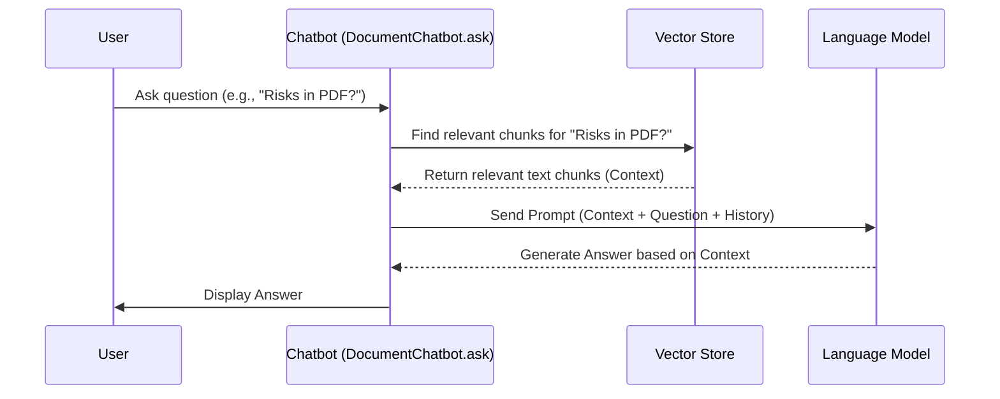

# Chapter 4: RAG Core Logic

In [Chapter 3: Text-to-SQL Generation & Execution](03_text_to_sql_generation___execution_.md), we saw how the `SQLiteChatbot` can translate your English questions into SQL queries to talk to databases. But what about chatting with text-based files like PDFs or CSVs? Or asking more general questions about your data? How does the chatbot answer questions based on the *specific content* of the documents you upload, rather than just its general knowledge?

This is where the core magic of **Retrieval-Augmented Generation (RAG)** comes in.

## The Problem: Answering Questions About *Your* Stuff

Imagine a super-smart assistant (a Large Language Model or LLM, like GPT). It knows a *lot* about the world from all the books and websites it was trained on. But if you ask it, "What were the main findings in the specific PDF report I just uploaded?", it won't know! Its general knowledge doesn't include *your* private documents.

How can we make the assistant knowledgeable about the specific documents *you* provide?

## The Solution: The RAG Librarian

Think of the RAG process like asking a helpful librarian (the LLM) a question. Instead of just answering from their general memory, they follow these steps:

1.  **Retrieve (Find Relevant Books/Pages):** When you ask your question (e.g., "What did the PDF report say about Q3 sales?"), the librarian doesn't answer immediately. First, they quickly search through the specific books *you* gave them (your uploaded documents). They use a special index (a **vector store**, which we'll cover in [Chapter 5: Data Ingestion & Vectorization](05_data_ingestion___vectorization_.md)) to find the exact pages or paragraphs (we call these **chunks**) that seem most relevant to your question.
2.  **Augment (Add Specific Info to the Request):** The librarian takes these relevant snippets of text they found and puts them right alongside your original question. They essentially prepare a note for themselves saying: "Okay, based on these specific relevant passages from the user's documents, answer this question: 'What did the PDF report say about Q3 sales?'"
3.  **Generate (Compose the Answer):** Now, the librarian (the LLM) reads the relevant snippets (the context) and your question. Using *both* this specific information *and* their general knowledge and language skills, they compose a detailed, context-aware answer for you.

This **Retrieve -> Augment -> Generate** loop is the heart of RAG. It allows the chatbot to give answers grounded in the specific information contained within your uploaded documents.

## Where RAG Lives: The `DocumentChatbot`

This core RAG logic is primarily implemented in the `ask` method of our base `DocumentChatbot` class (from `src/models/document_chatbot.py`). Remember from [Chapter 2: Chatbot Model Hierarchy](02_chatbot_model_hierarchy_.md) that `PDFChatbot` and `CSVChatbot` inherit from `DocumentChatbot`? This means they automatically get this powerful RAG capability!

When you use the PDF or CSV chat pages, and the chatbot needs to answer based on the document content, it uses this inherited RAG process. (The `SQLiteChatbot` also uses this for non-SQL questions).

Using it is simple. The Streamlit page just calls the chatbot's `ask` method:

```python
# Simplified example from a Streamlit page (e.g., 1_PDF_RAG.py)

# Assume 'chatbot' is an instance of PDFChatbot
user_question = "What was the conclusion of the uploaded report?"

# Call the ask method - RAG happens inside!
response = chatbot.ask(user_question)

# Display the answer generated by the RAG process
st.chat_message("assistant").write(response)
```

**Explanation:**

*   The page gets the user's question.
*   It calls `chatbot.ask(...)`. Under the hood, the `DocumentChatbot`'s `ask` method (or an override that calls it) performs the Retrieve, Augment, and Generate steps.
*   The final, context-aware answer is returned and displayed.

## Under the Hood: How RAG Works Step-by-Step

Let's walk through the RAG process when you ask a question like "What are the risks mentioned in the project plan PDF?":

1.  **Question Received:** Your question arrives at the `ask` method in `DocumentChatbot`.
2.  **Find Relevant Chunks (Retrieve):**
    *   The chatbot uses the `vectorstore` (which holds processed information from your PDF). More on how this is built in [Chapter 5: Data Ingestion & Vectorization](05_data_ingestion___vectorization_.md).
    *   It asks the `vectorstore`: "Find me the text chunks most similar in meaning to the question 'What are the risks mentioned in the project plan PDF?'".
    *   The `vectorstore` returns a few text snippets (chunks) from the PDF that discuss risks.
3.  **Prepare the LLM Request (Augment):**
    *   The chatbot constructs a detailed prompt (instruction) for the LLM. This prompt includes:
        *   Your original question: "What are the risks mentioned in the project plan PDF?"
        *   The relevant text chunks retrieved in the previous step (the "context").
        *   Optionally, recent messages from the conversation history (see [Chapter 6: Chat History Persistence](06_chat_history_persistence_.md)).
        *   Instructions like "Answer the user's question based *only* on the provided context."
4.  **Ask the LLM (Generate):**
    *   The chatbot sends this augmented prompt to the LLM (e.g., OpenAI's GPT).
5.  **Receive and Return Answer:**
    *   The LLM reads the context and the question, generates an answer based *primarily* on the provided PDF snippets, and sends it back.
    *   The chatbot receives this answer and returns it to the Streamlit page to be displayed to you.

Here's a diagram illustrating this flow:



## Diving Deeper: The Code

Let's look at a simplified version of the `ask` method in `src/models/document_chatbot.py` where this happens:

```python
# Simplified from src/models/document_chatbot.py

class DocumentChatbot:
    # ... (init, other methods) ...

    def ask(self, question, return_context=False):
        """Ask a question using the RAG process."""
        if not self.vectorstore:
            return "Please upload and process documents first."

        # --- 1. Retrieve ---
        # Get the tool to retrieve relevant chunks from the vector store
        # 'k' determines how many chunks to get (configurable in debug mode)
        k_value = st.session_state.get('k_value', 5) # Default to 5 chunks
        retriever = self.vectorstore.as_retriever(search_kwargs={"k": k_value})

        # Find documents relevant to the 'question'
        retrieved_docs = retriever.invoke(question)

        # Prepare the context string from the retrieved documents
        retrieved_context = "\n\n---\n\n".join(
            [doc.page_content for doc in retrieved_docs]
        )
        # (Store context for debugging - see [Chapter 8])
        self.last_retrieved_context = retrieved_context

        # --- 2. Augment ---
        # Create the detailed prompt for the LLM
        system_prompt = f"""You are a helpful assistant.
Use the following context from the uploaded files to answer the question.
If you don't know, say so.

Context:
{retrieved_context}
"""
        # Prepare message list including history (see [Chapter 6])
        messages = [{"role": "system", "content": system_prompt}]
        # ... (add chat history messages here) ...
        messages.append({"role": "user", "content": question})

        # (Store prompt for debugging - see [Chapter 8])
        self.last_formatted_prompt = system_prompt # Simplified

        # --- 3. Generate ---
        # Send the augmented prompt to the LLM
        llm_response = self.llm.invoke(messages)
        answer = llm_response.content

        # Update chat history (see [Chapter 6])
        self.chat_history.append(("human", question))
        self.chat_history.append(("ai", answer))

        # Return the answer (and optionally context for debugging)
        if return_context:
            return {"answer": answer, "retrieved_context": retrieved_context}
        else:
            return answer
```

**Explanation:**

1.  **Retrieve:**
    *   `self.vectorstore.as_retriever(...)`: Creates a retriever object from our vector store. This object knows how to search the store. The `k` value tells it how many relevant chunks to fetch. (You can adjust `k` using the [RAG Debugging Tools](08_rag_debugging_tools_.md)).
    *   `retriever.invoke(question)`: Performs the search in the vector store using the user's question and gets back a list of `Document` objects (`retrieved_docs`).
    *   The code then formats the `page_content` of these documents into a single `retrieved_context` string.
2.  **Augment:**
    *   A `system_prompt` is created. This is a crucial instruction for the LLM, telling it how to behave and providing the `retrieved_context`.
    *   A list of `messages` is prepared, including the system prompt, potentially the chat history (covered in [Chapter 6: Chat History Persistence](06_chat_history_persistence_.md)), and finally the user's `question`.
3.  **Generate:**
    *   `self.llm.invoke(messages)`: Sends the complete, augmented list of messages to the LLM.
    *   `llm_response.content`: Extracts the text answer generated by the LLM.
    *   The chat history is updated, and the answer is returned.

This RAG process ensures the chatbot doesn't just make things up; it bases its answers on the actual content of your documents, providing much more relevant and accurate responses.

## Conclusion

We've learned about the core RAG (Retrieval-Augmented Generation) logic, the engine that allows `st_rag_demo` to answer questions based on the specific content of your uploaded text documents (like PDFs and CSVs). It follows a simple but powerful three-step process:

1.  **Retrieve:** Find relevant text snippets from your documents using a vector store.
2.  **Augment:** Add these snippets (context) to the user's question to create a detailed prompt for the LLM.
3.  **Generate:** Ask the LLM to answer the question using the provided context.

This RAG loop lives primarily in the base `DocumentChatbot` class and is inherited by the specialized chatbots, making them context-aware.

But how do your documents get into that searchable `vectorstore` in the first place? That's the process of **Ingestion and Vectorization**, which we'll explore next.

**Next:** [Chapter 5: Data Ingestion & Vectorization](05_data_ingestion___vectorization_.md)

---

Generated by [AI Codebase Knowledge Builder](https://github.com/The-Pocket/Tutorial-Codebase-Knowledge)