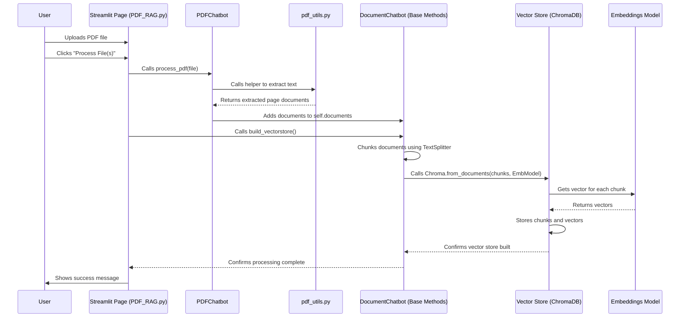

# Chapter 5: Data Ingestion & Vectorization

In [Chapter 4: RAG Core Logic](04_rag_core_logic_.md), we learned how the chatbot uses Retrieval-Augmented Generation (RAG) to find relevant information from your documents to answer your questions. But how does the chatbot learn about your documents in the first place? If you upload a PDF report, how does it get processed so the RAG system can search through it?

This chapter covers **Data Ingestion & Vectorization** – the essential process of feeding your data to the application and transforming it into a format the RAG system can understand.

## The Problem: Making Your Data Searchable

Imagine you have a long PDF report. The RAG system needs to quickly find the specific paragraphs related to your question, "What were the Q3 sales figures?". Just having the PDF file isn't enough; the computer needs a way to efficiently search *inside* the text.

If you just gave the raw PDF to the Language Model (LLM), it would be like asking someone to find a specific sentence in a huge library without any index or catalog – very slow and inefficient!

## The Solution: A Digital Librarian Indexing Your Documents

Data Ingestion and Vectorization is like hiring a super-fast digital librarian to prepare your documents for quick searching:

1.  **Ingestion (Receiving the Document):** You give the librarian your document (e.g., upload a PDF file through the app's sidebar).
2.  **Processing (Reading the Document):** The librarian uses special tools depending on the document type. For a PDF, they use a tool (like `pdf_utils.py` in our project) to carefully extract all the text from each page. For a CSV spreadsheet, they use a different tool (`csv_chatbot.py`) to read the rows and columns.
3.  **Chunking (Breaking it Down):** Reading the entire document at once is often too much. So, the librarian breaks the extracted text (or database schema info) into smaller, manageable paragraphs or sections called **chunks**. This is like dividing a long book into chapters or even paragraphs.
4.  **Vectorization (Creating "Meaning Coordinates"):** This is the clever part! For each chunk of text, the librarian uses a special tool called an **embeddings model** (like `OpenAIEmbeddings`). This model reads the chunk and converts its meaning into a list of numbers, called a **vector**. Think of this vector as a unique "meaning coordinate" in a vast library space – chunks with similar meanings will have coordinates close to each other.
5.  **Storing (Indexing the Coordinates):** Finally, the librarian stores all these text chunks along with their vector coordinates in a special database called a **vector store** (we use `ChromaDB`). This store is optimized for finding vectors (and their associated text chunks) that are "close" to a given query vector.

Now, when you ask a question later (as described in [Chapter 4: RAG Core Logic](04_rag_core_logic_.md)), the RAG system converts your *question* into a vector and quickly asks the vector store: "Find me the text chunks whose vectors are closest to this question vector!"

## How It Looks in the App

Using this feature is straightforward:

1.  **Navigate:** Go to the specific page for your data type (e.g., "PDF RAG", "CSV RAG").
2.  **Upload:** Use the sidebar's file uploader to select one or more files.
3.  **Process:** Click the "Process File(s)" button that appears in the sidebar.

That's it! Behind the scenes, when you click "Process File(s)", the application kicks off the Ingestion, Processing, Chunking, Vectorization, and Storing steps for the files you uploaded. You'll usually see a confirmation message once it's done.

## Under the Hood: The Step-by-Step Flow

Let's trace what happens internally when you upload and process a PDF file:

1.  **Upload:** You select `report.pdf` in the Streamlit sidebar on the PDF RAG page.
2.  **Button Click:** You click "Process File(s)".
3.  **Chatbot Call:** The Streamlit page code (`1_PDF_RAG.py`) calls the `process_pdf` method of the `PDFChatbot` instance.
4.  **PDF Utility:** The `PDFChatbot`'s `process_pdf` method uses a helper function from `src/utils/pdf_utils.py` to save the uploaded file temporarily and extract the text using a PDF library (`PyPDFLoader`). This returns a list of "documents" (one per page, usually).
5.  **Document Storage:** The `PDFChatbot` adds these extracted page documents to its internal list (`self.documents`).
6.  **Vector Store Build:** The Streamlit page then likely calls the `build_vectorstore` method (inherited from `DocumentChatbot`).
7.  **Chunking:** Inside `build_vectorstore`, the `RecursiveCharacterTextSplitter` takes the page documents and splits them into smaller text chunks based on configured size and overlap.
8.  **Embedding & Storing:** The `build_vectorstore` method takes these chunks and sends them to `Chroma.from_documents`. This function:
    *   Uses the `OpenAIEmbeddings` model to calculate the vector (numerical representation) for each chunk.
    *   Stores each chunk and its corresponding vector together in the `ChromaDB` vector store.

Here's a diagram showing this flow:



## Diving Deeper: Code Examples

Let's look at simplified code snippets to see these steps in action.

**1. Upload and Processing Trigger (in `src/pages/1_PDF_RAG.py`)**

This code handles the file upload in the sidebar and calls the chatbot's processing methods when the button is clicked.

```python
# Simplified from src/pages/1_PDF_RAG.py
import streamlit as st
from models.pdf_chatbot import PDFChatbot # Import the right chatbot

# (Assume chatbot instance 'st.session_state.pdf_chatbot' exists)
chatbot = st.session_state.pdf_chatbot

# --- Sidebar ---
with st.sidebar:
    uploaded_files = st.file_uploader("Upload PDF files", type="pdf", ...)

    if st.button("Process File(s)") and uploaded_files:
        with st.spinner("Processing PDF(s)..."):
            for file in uploaded_files:
                # Call the chatbot's specific PDF processing method
                num_pages = chatbot.process_pdf(file)
                st.success(f"Processed '{file.name}' ({num_pages} pages)")

            # Call the method to build the vector store
            if chatbot.build_vectorstore():
                st.success("Vector store built successfully!")
            else:
                st.warning("Could not build vector store. No documents?")
```

**Explanation:**

*   `st.file_uploader` creates the upload widget.
*   When the "Process File(s)" button is clicked, the code loops through uploaded files.
*   `chatbot.process_pdf(file)` tells the `PDFChatbot` to handle the ingestion and text extraction for that specific file.
*   `chatbot.build_vectorstore()` triggers the chunking, vectorization, and storage steps for *all* documents processed so far.

**2. PDF Processing (in `src/models/pdf_chatbot.py`)**

This method uses helper functions to extract text.

```python
# Simplified from src/models/pdf_chatbot.py
from utils.pdf_utils import process_pdf_file, cleanup_temp_file # Import helpers
from .document_chatbot import DocumentChatbot

class PDFChatbot(DocumentChatbot):
    # ... (init) ...

    def process_pdf(self, file):
        """Process a PDF file and add its content to documents."""
        pdf_docs, tmp_path = process_pdf_file(file) # Use helper

        if pdf_docs:
            # Add extracted page documents to the list inherited from parent
            self.documents.extend(pdf_docs)
            # ... (add metadata) ...

        cleanup_temp_file(tmp_path) # Delete temporary file
        return len(pdf_docs) # Return number of pages
```

**Explanation:**

*   It calls `process_pdf_file` (from `pdf_utils.py`) to do the heavy lifting of reading the PDF.
*   It adds the result (`pdf_docs`) to `self.documents`, a list managed by the parent `DocumentChatbot`.

**3. PDF Text Extraction (in `src/utils/pdf_utils.py`)**

This helper function uses a specific library to read the PDF.

```python
# Simplified from src/utils/pdf_utils.py
import tempfile
import os
from langchain_community.document_loaders import PyPDFLoader # PDF library

def process_pdf_file(file):
    """Process a PDF file and return extracted document pages."""
    tmp_path = None
    try:
        # Save uploaded file temporarily to disk
        with tempfile.NamedTemporaryFile(delete=False, suffix='.pdf') as tmp_file:
            tmp_file.write(file.getvalue())
            tmp_path = tmp_file.name

        # Use PyPDFLoader to load text from the temporary file
        loader = PyPDFLoader(tmp_path)
        pdf_docs = loader.load() # Extracts text page by page

        return pdf_docs, tmp_path
    except Exception as e:
        # ... (error handling) ...
        return [], tmp_path # Return empty list on error
```

**Explanation:**

*   It saves the uploaded file data to a temporary file because `PyPDFLoader` needs a file path.
*   `PyPDFLoader(tmp_path).load()` is the core function that reads the PDF and returns the text, usually as a list of `Document` objects (one per page).

**4. Chunking, Vectorizing, Storing (in `src/models/document_chatbot.py`)**

This method, part of the base `DocumentChatbot` and inherited by `PDFChatbot`, handles the final steps.

```python
# Simplified from src/models/document_chatbot.py
from langchain_text_splitters import RecursiveCharacterTextSplitter
from langchain_community.vectorstores import Chroma
# (Assume self.embeddings is initialized OpenAIEmbeddings)

class DocumentChatbot:
    # ... (init sets up self.embeddings, self.text_splitter) ...

    def build_vectorstore(self):
        """Build the vector store from the processed documents."""
        if not self.documents:
            return False # Can't build if no documents were processed

        # 1. Chunking: Split the documents (from self.documents)
        # self.text_splitter is configured in __init__ (e.g., chunk size 1000)
        splits = self.text_splitter.split_documents(self.documents)

        if not splits:
            return False # No chunks generated

        try:
            # 2. Embedding & Storing: Create ChromaDB vector store
            # This function does both embedding and storing
            self.vectorstore = Chroma.from_documents(
                documents=splits,       # The text chunks
                embedding=self.embeddings, # The tool to create vectors
                persist_directory=self.persist_directory # Where to save it
            )
            # ... (persist the store to disk) ...
            return True
        except Exception as e:
            # ... (error handling) ...
            return False

    # ... (other methods) ...
```

**Explanation:**

*   **Chunking:** `self.text_splitter.split_documents(self.documents)` takes the large page documents and breaks them into smaller `splits` based on the splitter's settings (like target chunk size and overlap).
*   **Embedding & Storing:** `Chroma.from_documents(...)` is the key function here. It iterates through each `split` (chunk):
    *   It calls `self.embeddings` (our `OpenAIEmbeddings` instance) to convert the chunk's text into a numerical vector.
    *   It saves the original text chunk and its corresponding vector together in the ChromaDB database specified by `persist_directory`.
*   `self.vectorstore` now holds the reference to this ready-to-search database.

This entire process ensures that when you later ask a question, the RAG system has access to your document's content, broken down and indexed by meaning, ready for efficient retrieval. The same core logic applies to CSV files (using `CSVChatbot` and CSV-specific processing) and SQLite databases (using `SQLiteChatbot` to process schema information).

## Conclusion

Data Ingestion and Vectorization is the crucial first step that allows the chatbot to learn about *your* specific data. We saw how the application takes an uploaded file (like a PDF), uses specialized tools to process it, breaks the content into smaller **chunks**, converts each chunk's meaning into a numerical **vector** using an **embeddings** model, and stores these vectors in a **vector store** (ChromaDB).

This indexed store allows the [Chapter 4: RAG Core Logic](04_rag_core_logic_.md) to quickly find the most relevant pieces of information from your documents when answering your questions.

Now that the chatbot can learn from your documents, how does it remember the conversation you're having? Let's explore that in the next chapter.

**Next:** [Chapter 6: Chat History Persistence](06_chat_history_persistence_.md)

---

Generated by [AI Codebase Knowledge Builder](https://github.com/The-Pocket/Tutorial-Codebase-Knowledge)