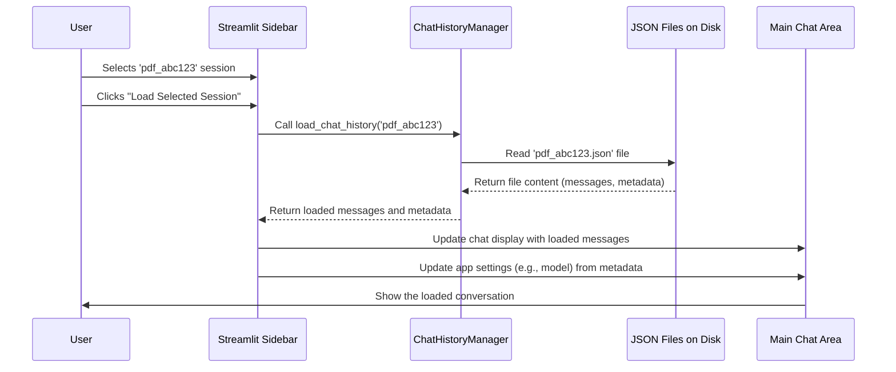

# Chapter 6: Chat History Persistence

In [Chapter 5: Data Ingestion & Vectorization](05_data_ingestion___vectorization_.md), we saw how the application learns about the documents you upload. But what happens to the conversation you have with the chatbot? If you close the application or switch to chat with a different type of document, will your current chat be lost?

## The Problem: A Forgetful Assistant

Imagine having a really helpful conversation with the chatbot, asking several questions about your PDF report. You find some interesting insights, but then you need to close your computer. When you open the app again later, the chat window is empty! All your previous questions and the chatbot's answers are gone. That's frustrating, right? It's like talking to an assistant who has no memory of your previous discussions.

## The Solution: Giving the App a Memory

To solve this, `st_rag_demo` has a system for **Chat History Persistence**. Think of it like giving the application a notebook to write down every conversation. This system ensures that your chats aren't lost when you close the app or navigate away.

The main component responsible for this is the `ChatHistoryManager`. It acts like the application's dedicated memory keeper.

## What Gets Remembered?

When a chat is saved, the `ChatHistoryManager` doesn't just store the questions and answers. It also records important context, including:

1.  **Messages:** The full back-and-forth conversation between you and the assistant.
2.  **AI Model:** Which specific AI model (like "gpt-3.5-turbo" or "gpt-4o-mini") was used for the chat.
3.  **RAG Settings:** Technical details like the number of chunks retrieved (`k_value`) or the chunk size used during [Data Ingestion & Vectorization](05_data_ingestion___vectorization_.md). (These are useful for debugging, covered in [Chapter 8: RAG Debugging Tools](08_rag_debugging_tools_.md)).
4.  **Files Processed:** A list of the documents (PDFs, CSVs, or database files) that were part of this chat session.

All this information is saved together in a structured text file format called **JSON** on your computer's disk. Each saved chat session gets its own unique JSON file.

## How It Looks in the App: Loading Past Chats

You can interact with the saved chat history directly through the sidebar:

1.  **Find History:** In the sidebar, look for the "Chat History" section.
2.  **See Saved Chats:** It lists available saved sessions for the current chat type (PDF, CSV, or SQLite). You might see details like the session ID, number of messages, and the AI model used.
3.  **Load a Chat:** Select a session from the dropdown list.
4.  **View Details (Optional):** You can often expand a "Session Details" section to see the saved model, RAG settings, and processed files.
5.  **Click Load:** Press the "Load Selected Session" button.
6.  **Resume:** The main chat area will now display the loaded conversation, and you can continue chatting right where you left off!

You can also simply "View" a past chat without loading it into the active session, using the "👁️ View Chat History" button.

## Under the Hood: The `ChatHistoryManager`

The `ChatHistoryManager` (found in `src/models/chat_history_manager.py`) is the workhorse behind the scenes. It handles three main tasks:

1.  **Saving:** When you finish a chat or navigate away (thanks to the `AutoSave` helper), the manager takes the current messages and metadata and writes them to a unique JSON file.
2.  **Listing:** It can scan the designated history folder on your disk to find all the saved JSON files for a specific chat type (e.g., all saved PDF chats) and present them in the sidebar list.
3.  **Loading:** When you select a session to load, the manager reads the corresponding JSON file, extracts the messages and metadata, and updates the application's current state so the chat appears in the main window.

Let's imagine you select a previous PDF chat session named `pdf_abc123` from the sidebar and click "Load Selected Session":



This shows how the `ChatHistoryManager` acts as an intermediary between the user interface (sidebar) and the stored files on disk.

## Diving Deeper: Code Examples

Let's look at simplified code snippets to understand how the `ChatHistoryManager` works.

**1. Saving a Chat (`src/models/chat_history_manager.py`)**

This method takes the chat data and saves it as a JSON file.

```python
# Simplified from src/models/chat_history_manager.py
import json
import os
from datetime import datetime

class ChatHistoryManager:
    # ... (init sets self.history_dir) ...

    def save_chat_history(self, messages, rag_type, session_id, metadata=None):
        """Save chat history to disk with metadata."""
        if not messages: # Don't save empty chats
            return None

        # Define filename like 'pdf_abc123.json'
        filename = f"{session_id}.json"
        filepath = os.path.join(self.history_dir, filename)

        # Prepare the data to be saved
        history_data = {
            "session_id": session_id,
            "rag_type": rag_type, # 'pdf', 'csv', 'sqlite'
            "last_updated": datetime.now().isoformat(),
            "message_count": len(messages),
            "metadata": metadata or {}, # Model, RAG settings, files
            "messages": messages # The actual conversation
        }

        # Write the data to the JSON file
        try:
            with open(filepath, 'w', encoding='utf-8') as f:
                json.dump(history_data, f, indent=2) # indent=2 makes it readable
            return filepath # Return path to saved file
        except Exception as e:
            print(f"Error saving history: {e}")
            return None
```

**Explanation:**

*   It receives the list of `messages`, the `rag_type` (e.g., 'pdf'), a unique `session_id`, and optional `metadata` (like model name, settings).
*   It creates a dictionary `history_data` containing all this information.
*   It uses Python's built-in `json.dump()` function to write this dictionary into a file (e.g., `chat_history/pdf_abc123.json`) in a human-readable JSON format.

**2. Loading a Chat (`src/models/chat_history_manager.py`)**

This method reads a specific JSON file based on the session ID.

```python
# Simplified from src/models/chat_history_manager.py
import json
import os

class ChatHistoryManager:
    # ... (init) ...

    def load_chat_history(self, session_id):
        """Load chat history from disk."""
        filepath = os.path.join(self.history_dir, f"{session_id}.json")

        if os.path.exists(filepath):
            try:
                # Read the JSON file
                with open(filepath, 'r', encoding='utf-8') as f:
                    history_data = json.load(f)
                # Return the messages and the metadata
                return history_data.get("messages", []), history_data.get("metadata", None)
            except Exception as e:
                print(f"Error loading history: {e}")
                return [], None # Return empty on error
        else:
            return [], None # Return empty if file not found
```

**Explanation:**

*   It takes the `session_id` of the chat you want to load.
*   It constructs the expected file path (e.g., `chat_history/pdf_abc123.json`).
*   If the file exists, it uses `json.load()` to read the data from the file back into a Python dictionary.
*   It returns the list of `messages` and the `metadata` found in the file.

**3. Listing Saved Chats (`src/models/chat_history_manager.py`)**

This method finds all saved JSON files in the history directory.

```python
# Simplified from src/models/chat_history_manager.py
import os
import json

class ChatHistoryManager:
    # ... (init) ...

    def list_sessions(self, rag_type=None):
        """List available chat sessions, optionally filtered by type."""
        sessions = []
        for filename in os.listdir(self.history_dir):
            if filename.endswith('.json'):
                # Optionally filter: e.g., only show 'pdf_*.json' if rag_type='pdf'
                if rag_type and not filename.startswith(rag_type + "_"):
                    continue

                filepath = os.path.join(self.history_dir, filename)
                try:
                    # Try to read basic info without loading full messages
                    with open(filepath, 'r', encoding='utf-8') as f:
                        data = json.load(f)
                    session_info = {
                        "session_id": data.get("session_id"),
                        "rag_type": data.get("rag_type"),
                        "last_updated": data.get("last_updated"),
                        "message_count": data.get("message_count", 0),
                        "metadata": data.get("metadata", {}) # Include metadata
                    }
                    sessions.append(session_info)
                except Exception as e:
                    print(f"Error reading session info from {filename}: {e}")

        # Sort sessions, newest first
        sessions.sort(key=lambda x: x.get("last_updated", ""), reverse=True)
        return sessions
```

**Explanation:**

*   It looks inside the `self.history_dir` folder.
*   For each file ending in `.json`, it tries to load it.
*   It extracts key information like the `session_id`, `rag_type`, `message_count`, and `metadata`.
*   It returns a list of these information dictionaries, typically sorted so the most recent chats appear first in the sidebar dropdown.

**4. Sidebar Interaction (`src/utils/sidebar.py`)**

The sidebar uses the `ChatHistoryManager` to display and load sessions.

```python
# Simplified from src/utils/sidebar.py
import streamlit as st
# Assume history_manager is available (e.g., st.session_state.history_manager)
# Assume session_id_key = 'pdf_session_id', messages_key = 'pdf_messages'

def handle_chat_history(app_type, session_id_key, messages_key, chatbot_key):
    """Handle chat history management in the sidebar"""
    history_manager = st.session_state.history_manager
    sessions = history_manager.list_sessions(app_type) # Get list of saved chats

    if sessions:
        st.write(f"You have {len(sessions)} saved chat sessions")
        # Create display names like "pdf_abc123 (10 msgs, gpt-3.5-turbo)"
        session_options = ["Current Session"] + [
            f"{s['session_id']} ({s['message_count']} msgs, {s['metadata'].get('model_name', '?')})"
            for s in sessions
        ]
        selected_display_name = st.selectbox("Select session", session_options)

        if selected_display_name != "Current Session":
            session_id_to_load = selected_display_name.split(" ")[0] # Get ID

            # Button to load the selected session
            if st.button("Load Selected Session"):
                messages, metadata = history_manager.load_chat_history(session_id_to_load)
                if messages:
                    # Update the current session state with loaded data
                    st.session_state[session_id_key] = session_id_to_load
                    st.session_state[messages_key] = messages
                    # ... (code to update model/RAG settings from metadata) ...
                    st.success(f"Loaded session: {session_id_to_load}")
                    st.rerun() # Refresh the page to show loaded chat
                else:
                    st.error("Failed to load session.")

            # Button to just view the history
            if st.button("👁️ View Chat History"):
                # Tell the app to switch to history view mode
                view_chat_history(session_id_to_load) # Function from ui_helpers.py
```

**Explanation:**

*   It calls `history_manager.list_sessions()` to get the available chats for the current `app_type` (e.g., 'pdf').
*   It displays these sessions in a dropdown (`st.selectbox`).
*   When the user clicks "Load Selected Session", it extracts the `session_id`, calls `history_manager.load_chat_history()`, and updates the application's state (`st.session_state`) with the loaded messages and settings.
*   `st.rerun()` tells Streamlit to redraw the page, showing the loaded chat.
*   The "View Chat History" button triggers a separate view mode handled by functions in `src/utils/ui_helpers.py`.

## Keeping Things Safe: The `AutoSave` Helper

What if you forget to explicitly save, or you quickly switch from the PDF chat page to the CSV chat page? To prevent accidental data loss, the application uses a small helper called `AutoSave` (from `src/models/auto_save.py`).

This helper tries to detect when you navigate away from a page. If it detects navigation, it quickly tells the `ChatHistoryManager` to save the *current* state of *all* active chat sessions before the page changes.

```python
# Simplified concept from src/models/auto_save.py
import streamlit as st
import time

class AutoSave:
    def __init__(self, history_manager):
        self.history_manager = history_manager
        self.last_saved = time.time()

    def check_and_save(self, force=False):
        """Check if save is needed (time-based or forced)."""
        # (Logic to save only periodically or when forced)
        # ...
        # Find all active sessions in st.session_state and save them
        saved = self.history_manager.save_all_sessions(st.session_state)
        # ...
        return saved

    # setup_auto_save uses some Streamlit tricks to detect navigation
    # and call check_and_save(force=True)
```

**Explanation:**

*   The `AutoSave` class works with the `ChatHistoryManager`.
*   Its main job is to call `history_manager.save_all_sessions()` at the right time, especially when it thinks you're leaving a page.
*   This provides a safety net, reducing the chance of losing your work if you navigate quickly between different parts of the application.

## Conclusion

Chat History Persistence is a crucial feature for a good user experience. It transforms the chatbot from a forgetful assistant into one that remembers your conversations.

We learned that:

*   The `ChatHistoryManager` is responsible for saving conversations (messages, model, settings, files) to JSON files.
*   You can easily load past conversations from the sidebar.
*   The `AutoSave` helper provides a safety net against accidental data loss during navigation.

This "memory" makes the application much more practical, allowing you to pause and resume complex interactions with your data.

Now that we can chat with databases ([Chapter 3](03_text_to_sql_generation___execution_.md)), documents ([Chapter 4](04_rag_core_logic_.md)), and remember our conversations, what about visualizing the data we get back, especially from databases or CSVs? Let's explore that next.

**Next:** [Chapter 7: Data Visualization Generation](07_data_visualization_generation_.md)

---

Generated by [AI Codebase Knowledge Builder](https://github.com/The-Pocket/Tutorial-Codebase-Knowledge)