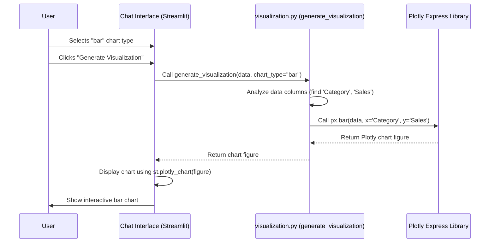

# Chapter 7: Data Visualization Generation

In [Chapter 6: Chat History Persistence](06_chat_history_persistence_.md), we learned how the application remembers your conversations. Now, let's talk about making the *answers* themselves easier to understand, especially when they involve data!

## The Problem: Tables Can Be Boring (and Hard to Read!)

Imagine you're using the SQLite chat page ([Chapter 3: Text-to-SQL Generation & Execution](03_text_to_sql_generation___execution_.md)) and you ask, "Show me the sales figures for each product category". The chatbot might run a query and give you back a table like this:

| Category   | Sales |
| :--------- | ----: |
| Electronics| 15000 |
| Clothing   | 8500  |
| Home Goods | 11200 |
| Books      | 4300  |
| ...        | ...   |

This table has the information, but it's hard to quickly see which category has the highest sales or compare them easily. Wouldn't it be better if you could see this as a picture, like a bar chart?

## The Solution: An Automatic Chart Builder!

That's exactly what **Data Visualization Generation** does! Think of it as a helpful feature built into the app that can automatically turn data tables (usually from SQL queries or maybe CSV analysis) into charts.

When the chatbot gives you an answer that includes a table of data, this feature kicks in:

1.  **It Offers Choices:** Right below the data table, you'll often see options to visualize the data. This might include a dropdown menu where you can pick the type of chart you want (like a bar chart, line chart, pie chart, or scatter plot).
2.  **You Click:** You choose a chart type (e.g., "bar") and click a button like "Generate Visualization".
3.  **It Draws the Chart:** The application uses a powerful library called **Plotly** to draw an interactive chart based on your data and the type you selected.
4.  **You See the Insight:** The chart appears right there in the chat interface, making it much easier to understand the patterns and trends in your data.

This feature helps you go from raw numbers to visual insights quickly, without needing to copy the data into a separate spreadsheet program.

## How It Looks in the App

Let's revisit our example. You ask about sales by category, and the chatbot shows the table. Here's what you might see next:

```
[Chatbot]: I executed the query and found these sales figures:

          Category   Sales
    ---------------- -----
     Electronics   15000
        Clothing    8500
      Home Goods   11200
           Books    4300

[Below the table, Streamlit UI elements appear:]

Visualization Type: [Dropdown: bar | line | scatter | pie | table]
[Button: Generate Visualization]
```

You select "bar" from the dropdown and click the button. A moment later, a bar chart showing the sales for each category appears below the button. Much clearer!

## Under the Hood: How the Chart Gets Made

What happens when you click that "Generate Visualization" button?

1.  **Data Ready:** The application already has the query results stored as a data structure called a pandas DataFrame (think of it as a smart table).
2.  **User Choice:** It knows you selected "bar" chart.
3.  **Call the Helper:** The app calls a special function, let's call it `generate_visualization` (found in `src/utils/visualization.py`), passing it the DataFrame and your chosen chart type ("bar").
4.  **Analyze Data:** Inside `generate_visualization`, the code looks at the columns in the DataFrame. It tries to figure out which columns contain text (like "Category") and which contain numbers (like "Sales").
5.  **Pick the Right Plotly Tool:** Based on the chart type ("bar") and the column types it found, it chooses the right function from the Plotly Express library (often shortened to `px`). In this case, it would likely use `px.bar()`.
6.  **Create the Chart:** It calls the Plotly function, telling it which column to use for the bars' labels (x-axis: "Category") and which column determines the bars' height (y-axis: "Sales"). Plotly creates the chart figure.
7.  **Display the Chart:** The `generate_visualization` function returns the Plotly chart figure back to the main application code. The application then uses Streamlit's `st.plotly_chart()` function to display the interactive chart in the web interface.

Here's a simplified diagram of that flow:



## Diving Deeper: Code Examples

Let's peek at the code that makes this happen.

**1. Showing the Visualization Options (in `src/utils/ui_helpers.py` or page file like `src/pages/3_SQLite_RAG.py`)**

After displaying a data table (`st.dataframe(data)`), the code adds the controls:

```python
# Simplified from UI code showing results

# Assume 'data' is a pandas DataFrame with query results
if data is not None and not data.empty:
    st.dataframe(data) # Show the table

    # --- Visualization Controls ---
    viz_options = ["bar", "line", "scatter", "pie", "table"]
    # Create a unique key based on message time to avoid conflicts
    msg_id = f"viz_{hash(str(message.get('timestamp', '')))}"

    selected_viz = st.selectbox(
        "Visualization Type",
        viz_options,
        key=f"select_{msg_id}" # Unique key for selectbox
    )

    if st.button("Generate Visualization", key=f"button_{msg_id}"): # Unique key for button
        # Import the helper function
        from utils.visualization import generate_visualization

        # Call the function to create the chart
        fig = generate_visualization(data, chart_type=selected_viz)

        # Display the chart using Streamlit if it's valid
        if isinstance(fig, go.Figure): # go is Plotly's graph objects module
            st.plotly_chart(fig, use_container_width=True)
        else:
            st.warning(fig) # Show error message if generation failed
```

**Explanation:**

*   It first displays the data using `st.dataframe`.
*   It creates a dropdown (`st.selectbox`) with chart types. We use a `key` based on the message timestamp to make sure each visualization section in the chat history has its *own* independent controls.
*   When the `st.button` is clicked:
    *   It calls `generate_visualization` from our utility file, passing the data and the user's selected chart type.
    *   It checks if the returned `fig` is a valid Plotly figure.
    *   If yes, `st.plotly_chart(fig)` displays it interactively.
    *   If no (e.g., an error message was returned), it shows a warning.

**2. Generating the Chart (in `src/utils/visualization.py`)**

This is where the core logic resides.

```python
# Simplified from src/utils/visualization.py
import pandas as pd
import plotly.express as px # Import Plotly Express
import plotly.graph_objects as go # Import base Plotly objects

def generate_visualization(data, chart_type="auto", x_column=None, y_column=None):
    """Generate a Plotly visualization based on data and chart type"""
    if data.empty:
        return "No data to visualize"

    try:
        # --- Identify Column Types (Simplified) ---
        numeric_cols = data.select_dtypes(include=['number']).columns.tolist()
        categorical_cols = data.select_dtypes(exclude=['number']).columns.tolist()

        # --- Auto-Select Columns (If not provided) ---
        # (Simplified: Assume first categorical is X, first numeric is Y)
        if x_column is None and categorical_cols:
            x_column = categorical_cols[0]
        if y_column is None and numeric_cols:
            y_column = numeric_cols[0]

        # --- Create Chart Based on Type ---
        if chart_type == "bar" and x_column and y_column:
            fig = px.bar(data, x=x_column, y=y_column, title=f"{y_column} by {x_column}")
            return fig
        elif chart_type == "line" and x_column and y_column:
            fig = px.line(data, x=x_column, y=y_column, title=f"{y_column} over {x_column}")
            return fig
        elif chart_type == "scatter" and len(numeric_cols) >= 2:
            x_scatter = numeric_cols[0]
            y_scatter = numeric_cols[1]
            fig = px.scatter(data, x=x_scatter, y=y_scatter, title=f"{y_scatter} vs {x_scatter}")
            return fig
        # ... (elif for pie, etc.) ...
        else:
            # Default or fallback (e.g., show table or simple message)
            return "Could not generate the selected chart type with this data."

    except Exception as e:
        return f"Error generating visualization: {str(e)}" # Return error message
```

**Explanation:**

*   The function takes the data (DataFrame) and desired `chart_type`.
*   It identifies numeric and categorical columns (this helps choose axes).
*   It uses `if/elif` statements to check the `chart_type`.
*   For each type, it calls the corresponding Plotly Express function (like `px.bar`, `px.line`, `px.scatter`) with the data and appropriate column names for `x` and `y` axes.
*   It includes basic error handling (`try...except`) and returns either the Plotly `fig` object or an error message string.

### Smart Suggestions

You might have noticed the `chart_type="auto"` option mentioned earlier. The `generate_visualization` function can have extra logic (not shown in the simplified code above) to *guess* a good chart type if you select "auto".

It might look at the number of columns, their types, and the number of rows:

*   One text column, one number column? Suggest `bar`.
*   Two number columns? Suggest `scatter`.
*   A date/time column and a number column? Suggest `line`.

This makes it even easier to get a useful visual quickly.

## Conclusion

Data Visualization Generation is a powerful feature that turns potentially complex data tables into easy-to-understand charts.

*   It works automatically when query results (like from SQL or CSV analysis) contain tabular data.
*   It uses the **Plotly** library to create interactive charts (bar, line, scatter, pie, etc.).
*   It makes exploring data within the chat interface much more intuitive.

By presenting data visually, this feature helps you gain insights more quickly and effectively.

We've now covered the main user-facing features: chatting with different data sources, remembering conversations, and visualizing results. But what happens when things don't work as expected? How can developers peek under the hood to fix problems? That's where the debugging tools come in handy.

**Next:** [Chapter 8: RAG Debugging Tools](08_rag_debugging_tools_.md)

---

Generated by [AI Codebase Knowledge Builder](https://github.com/The-Pocket/Tutorial-Codebase-Knowledge)