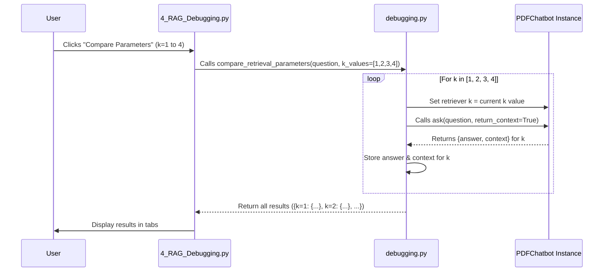

# Chapter 8: RAG Debugging Tools

In [Chapter 7: Data Visualization Generation](07_data_visualization_generation_.md), we saw how the application can turn data into helpful charts. But what happens when the chatbot's answers aren't quite right, or you want to understand *why* it gave a specific response? Sometimes, even smart assistants need a check-up!

## The Problem: When the Magic Isn't Working

Imagine you ask the PDF chatbot, "What were the key risks identified in the project plan?". Instead of a clear answer, it gives you something vague or talks about the wrong section of the document. How do you figure out what went wrong? Did it look at the wrong parts of the PDF? Was the information not clear enough in the document?

Without tools to peek inside the process, fixing these issues is like trying to fix a car engine with the hood closed – mostly guesswork!

## The Solution: Diagnostic Tools for Your Chatbot

This is where the **RAG Debugging Tools** come in. Think of them like a doctor's instruments (a stethoscope, an X-ray machine) but for your RAG chatbot. They help you diagnose problems and understand how the RAG process is working internally.

These tools are built using functions in the `src/utils/debugging.py` file and presented on a dedicated page in the Streamlit app: "RAG Debugging" (found in `src/pages/4_RAG_Debugging.py`).

This page lets you:

1.  **See Retrieved Chunks:** Look directly at the exact pieces of text (chunks) the RAG system pulled from your documents to answer a specific question.
2.  **Compare Parameters:** Experiment with settings, like changing the number of chunks (`k`) retrieved, and see how it affects the context and the final answer.
3.  **Analyze Chunks:** Examine the characteristics of the chunks stored in your vector database – how many are there? How long are they? Are they being split up reasonably?
4.  **Run Evaluations:** Use a set of test questions to automatically check the chatbot's performance and see metrics like how many chunks were retrieved on average.

These tools help you troubleshoot why the chatbot gives certain answers and fine-tune its performance for better results.

## How to Use the Debugging Tools: A Check-Up Scenario

Let's go back to our problem: the chatbot gave a weird answer about project risks in a PDF. Here's how you might use the debugging tools:

1.  **Navigate:** Go to the "RAG Debugging" page from the sidebar in the app.
2.  **Select Chatbot:** In the sidebar of the debugging page, make sure "pdf" is selected as the RAG type. (Ensure you've already processed the relevant PDF on the "PDF RAG" page).
3.  **Check Single Query:**
    *   Go to the "Single Query Test" tab in the main area.
    *   Enter your question: "What were the key risks identified in the project plan?".
    *   Click "Run Test Query".
    *   Now, look at the results:
        *   The "Answer" tab shows what the chatbot generated.
        *   The **"Retrieved Context"** tab is crucial! It shows the exact text chunks from the PDF that the RAG system found relevant. Read through them. Are they actually about project risks, or did the system grab unrelated paragraphs? This is often the source of strange answers.
4.  **Compare Parameters (e.g., 'k'):**
    *   Maybe retrieving more (or fewer) chunks would help. Go to the "Parameter Comparison" tab.
    *   In the sidebar, enter the same question in the "Test Question" box.
    *   Click the "Compare Parameters" button in the sidebar. This runs the query multiple times with different `k` values (e.g., k=1, k=2, k=3, k=4).
    *   Back in the "Parameter Comparison" tab, you'll see tabs for each `k` value. Compare the "Retrieved Context" and "Answer" for each `k`. Does a different `k` value lead to a better, more relevant context and answer? You can also see a chart comparing context lengths.
5.  **Analyze Chunks:**
    *   If the retrieved context still looks odd, maybe the way the document was split into chunks is the problem.
    *   Click the "Analyze Documents" button in the sidebar.
    *   Go to the "Document Analysis" tab. Here you can see:
        *   Total number of chunks.
        *   Average, minimum, and maximum chunk length.
        *   A histogram showing the distribution of chunk lengths.
        *   A table listing individual chunks (with previews).
    *   Are the chunks too small or too large? Are they cutting off important sentences? This might point to needing different settings during [Data Ingestion & Vectorization](05_data_ingestion___vectorization_.md).

By using these tools, you can systematically investigate the RAG process and pinpoint where things might be going wrong, moving from guesswork to informed debugging.

## Under the Hood: How the Tools Work

The "RAG Debugging" page (`src/pages/4_RAG_Debugging.py`) orchestrates the process, calling helper functions from `src/utils/debugging.py` to perform the actual analysis.

**1. Comparing Parameters (like 'k'):**

When you click "Compare Parameters":

*   The Streamlit page tells the `compare_retrieval_parameters` function your question and the range of `k` values to test.
*   The function loops through each `k` value.
*   Inside the loop, it temporarily sets the chatbot's retrieval setting to the current `k`.
*   It calls the chatbot's standard `ask` method (from [Chapter 4: RAG Core Logic](04_rag_core_logic_.md)) with your question, making sure to ask for the context back (`return_context=True`).
*   It stores the retrieved context and the generated answer for that specific `k`.
*   After the loop, it resets the `k` value and returns all the collected results to the Streamlit page for display.



**2. Analyzing Document Chunks:**

When you click "Analyze Documents":

*   The Streamlit page calls the `analyze_document_chunks` function.
*   This function accesses the chatbot's `vectorstore` (the database holding the chunks and their vector representations, created in [Chapter 5: Data Ingestion & Vectorization](05_data_ingestion___vectorization_.md)).
*   It retrieves all the stored document chunks (text content and any metadata like source file or page number).
*   It uses the `pandas` library to put this information into a table (DataFrame).
*   It calculates statistics (counts, lengths) from the DataFrame.
*   It uses the `plotly` library to generate histograms and charts based on the statistics.
*   It returns these statistics and charts to the Streamlit page for display.

**3. Running Evaluation:**

When you click "Run Evaluation":

*   The Streamlit page first calls `generate_test_questions` (which currently provides a predefined list, but could be smarter).
*   It then calls `run_rag_evaluation` with the chatbot and the list of test questions.
*   This function loops through each test question.
*   For each question, it calls the chatbot's `ask` method (asking for context).
*   It collects the answer, the retrieved context, and calculates basic metrics (like number of chunks, context length).
*   It returns all the results (answers, contexts, metrics for each question) to the Streamlit page.

## Diving Deeper: Code Examples

Let's look at simplified snippets.

**1. Triggering Parameter Comparison (in `src/pages/4_RAG_Debugging.py`)**

This shows how the button click calls the utility function.

```python
# Simplified from src/pages/4_RAG_Debugging.py

# (In the sidebar section)
if st.button("Compare Parameters"):
    if has_docs: # Check if documents were processed
        with st.spinner("Comparing retrieval parameters..."):
            k_values_to_test = list(range(1, 5)) # e.g., test k=1, 2, 3, 4
            # Call the helper function from debugging utils
            results = compare_retrieval_parameters(
                chatbot, # The current chatbot instance
                st.session_state.debug_question, # The test question
                k_values=k_values_to_test
            )
            # Store results in session state to display them
            st.session_state.retrieval_results = results
            st.rerun() # Refresh page to show results
    else:
        st.error("Please load documents first.")
```

**Explanation:**

*   When the button is clicked, it defines which `k_values` to test.
*   It calls `compare_retrieval_parameters` from the `debugging` utilities, passing the chatbot, the question, and the list of k's.
*   The returned `results` are stored in `st.session_state`, and `st.rerun()` makes Streamlit redraw the page, allowing the main area to display these results.

**2. Comparing Parameters Logic (in `src/utils/debugging.py`)**

This shows the core loop inside the helper function.

```python
# Simplified from src/utils/debugging.py

def compare_retrieval_parameters(chatbot, question, k_values):
    """Compare retrieval with different k values."""
    results = {"question": question, "comparisons": []}
    comparison_data = {"type": "k_value", "values": [], "contexts": [], "answers": []}

    # Store the original k setting
    original_k = st.session_state.k_value

    for k in k_values:
        # Temporarily set the k value for this iteration
        st.session_state.k_value = k
        # Ask the question, getting context back
        response = chatbot.ask(question, return_context=True)

        # Store the context and answer for this k
        if isinstance(response, dict):
            comparison_data["values"].append(k)
            comparison_data["contexts"].append(response.get("retrieved_context", ""))
            comparison_data["answers"].append(response.get("answer", ""))
        # ... (handle cases where response isn't a dict) ...

    # Restore the original k setting
    st.session_state.k_value = original_k
    results["comparisons"].append(comparison_data)
    return results
```

**Explanation:**

*   It initializes dictionaries to store the results.
*   It saves the current `k_value` so it can be restored later.
*   It loops through the requested `k_values`.
*   Inside the loop, it updates `st.session_state.k_value` (which the chatbot's `ask` method reads) and calls `chatbot.ask`.
*   It extracts the context and answer from the response and appends them to lists.
*   Finally, it restores the original `k_value` and returns the collected results.

**3. Analyzing Chunks Logic (in `src/utils/debugging.py`)**

This shows how chunk data might be retrieved and processed.

```python
# Simplified from src/utils/debugging.py
import pandas as pd

def analyze_document_chunks(chatbot):
    """Analyze document chunks in the vectorstore."""
    if not hasattr(chatbot, 'vectorstore') or not chatbot.vectorstore:
        st.warning("No vectorstore available.")
        return

    try:
        # --- Get Chunks (Method depends on vector store type) ---
        # Example: Assuming vectorstore has a 'get' method returning docs
        all_docs_data = chatbot.vectorstore.get(include=['documents', 'metadatas'])
        doc_contents = all_docs_data.get('documents', [])
        doc_metadata = all_docs_data.get('metadatas', [])
        # ---

        # Create a list of dictionaries for DataFrame
        chunk_data = []
        for i, content in enumerate(doc_contents):
            meta = doc_metadata[i] if i < len(doc_metadata) else {}
            chunk_data.append({
                "Chunk ID": i,
                "Content Length": len(content),
                "Source": meta.get("source", "Unknown"),
                # ... other relevant metadata ...
            })

        # Create Pandas DataFrame for analysis
        chunk_df = pd.DataFrame(chunk_data)

        # --- Display Stats & Charts (using chunk_df) ---
        st.metric("Total Chunks", len(chunk_df))
        st.metric("Avg. Chunk Length", f"{chunk_df['Content Length'].mean():.1f}")
        # ... (display histogram using plotly) ...
        st.dataframe(chunk_df) # Show the table of chunks
        # ---

    except Exception as e:
        st.error(f"Error analyzing chunks: {e}")
```

**Explanation:**

*   It accesses the chatbot's `vectorstore`.
*   It calls a method (like `.get()`) to retrieve the stored chunk content and metadata. The exact method depends on the vector store library (e.g., ChromaDB, FAISS).
*   It organizes this data into a list suitable for creating a pandas `DataFrame`.
*   It uses the DataFrame to easily calculate statistics (`.mean()`, etc.) and display the data in a table (`st.dataframe`). Plotly would be used here to create charts from the `chunk_df`.

## Conclusion

The RAG Debugging Tools are your essential toolkit for understanding and improving your chatbot's performance. When answers seem off, these tools let you:

*   **Inspect** the retrieved context to see if the right information was found.
*   **Compare** how different parameters (like `k`) change the results.
*   **Analyze** the underlying document chunks for potential issues.
*   **Evaluate** performance using automated tests.

By providing transparency into the RAG process, these tools empower you to diagnose problems effectively and build a more reliable and accurate chatbot.

This chapter concludes our journey through the `st_rag_demo` project. We've explored the [Streamlit Application Structure](01_streamlit_application_structure_.md), the [Chatbot Model Hierarchy](02_chatbot_model_hierarchy_.md), specialized features like [Text-to-SQL](03_text_to_sql_generation___execution_.md) and [Data Visualization](07_data_visualization_generation_.md), the core [RAG Logic](04_rag_core_logic_.md), how data gets processed via [Ingestion & Vectorization](05_data_ingestion___vectorization_.md), how conversations are saved with [Chat History Persistence](06_chat_history_persistence_.md), and finally, how to troubleshoot with the [RAG Debugging Tools](08_rag_debugging_tools_.md). We hope this tutorial has provided a clear understanding of how the different pieces fit together to create a versatile RAG application!

---

Generated by [AI Codebase Knowledge Builder](https://github.com/The-Pocket/Tutorial-Codebase-Knowledge)