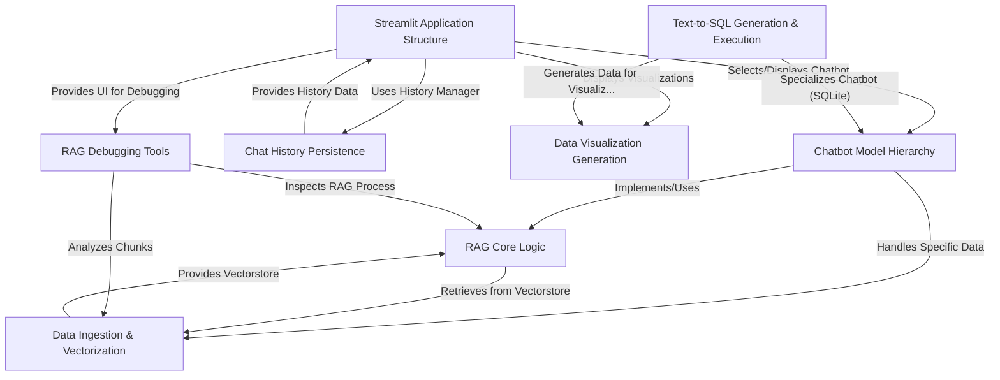

# Tutorial: st_rag_demo

This project is a **Streamlit web application** that lets you *chat* with different types of data.
You can upload PDFs, CSV files, or SQLite databases. The app uses a technique called **Retrieval Augmented Generation (RAG)** to understand your data and answer your questions accurately.
It can also generate *SQL queries* from plain English for databases, create **visualizations** like charts from the data, and includes tools to help *debug* how the RAG process works.

**Source Repository:** [None](None)

## Chapters

1. [Streamlit Application Structure
](01_streamlit_application_structure_.md)
2. [Chatbot Model Hierarchy
](02_chatbot_model_hierarchy_.md)
3. [Text-to-SQL Generation & Execution
](03_text_to_sql_generation___execution_.md)
4. [RAG Core Logic
](04_rag_core_logic_.md)
5. [Data Ingestion & Vectorization
](05_data_ingestion___vectorization_.md)
6. [Chat History Persistence
](06_chat_history_persistence_.md)
7. [Data Visualization Generation
](07_data_visualization_generation_.md)
8. [RAG Debugging Tools
](08_rag_debugging_tools_.md)

---

Generated by [AI Codebase Knowledge Builder](https://github.com/The-Pocket/Tutorial-Codebase-Knowledge)